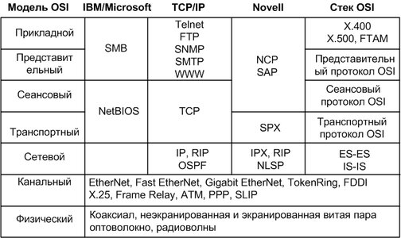

# Инфокоммуникационные системы и сети. Билеты

Предупреждаю, что информация не полная!
Подбробности для каждого билета можно посмотреть в прикреплённой ссылке или же перейдя по этой и выбрав нужную лекцию из списка
[full lectures](lecture_list)

## 1 Эволюция вычислительных сетей [1.1.1](lectures/1/1/1)

 
  

  
Концепция вычислительных сетей является логическим результатом эволюции компьютерной технологии. Первые компьютеры 50-х годов - большие, громоздкие и дорогие - предназначались для очень небольшого числа избранных пользователей. Часто эти монстры занимали целые здания. Такие компьютеры не были предназначены для интерактивной работы пользователя, а использовались в режиме пакетной обработки. 
  

  
  
Системы пакетной обработки(50e)->Многотерминальные системы(~60e)->Первые локальные сети(~70e)->Утвердились стандартные технологии объединения компьютеров в сеть(~80e)

  
подробнее:

  <ul>
    <li> <b>Системы пакетной обработки</b>    
    Системы пакетной обработки, как правило, строились на базе мэйнфрейма - мощного и надежного компьютера универсального назначения пакетный режим - это самый эффективный режим использования вычислительной мощности, так как он позволяет выполнить в единицу времени больше пользовательских задач.
    Пользователи подготавливали перфокарты, содержащие данные и программы и передавали их в вычислительный центр. Вводили их в комьютер специально обученные люди - операторы. Распечатанные результаты пользователь обычно получал уже на следующий день. 
    </li>
    <li> <b>Многотерминальные системы</b>
    В таких системах компьютер отдавался в распоряжение сразу нескольким пользователям. Каждый пользователь получал в свое распоряжение терминал, с помощью которого он мог вести диалог с компьютером.
    </li>
    <li> <b>Появление глобальных сетей</b>
    Началось все с решения более простой задачи - доступа к компьютеру с терминалов, удаленных от него на многие сотни, а то и тысячи километров.
    </li>
    <li> <b>Первые локальные сети</b> - В начале 70-x произошел технический прорыв в области производства компьютерных компонентов - появились большие интегральные схемы. Их сравнительно невысокая стоимость и высокие функциональные возможности привели к созданию мини-компьютеров, которые стали реальными конкурентами мэйнфреймов. Закон Гроша(?) перестал соответствовать действительности, тк десяток мини-компов выполнял нек. задачи (как правило, хорошо распараллеливаемые) быстрее одного мэйнфрема, а стоимость такой мини-комп. системы была меньше.</li>
    <li> <b>Создание стандартных технологий локальных сетей</b>
    В середине 80-х годов положение дел в локальных сетях стало кардинально меняться. Утвердились стандартные технологии объединения компьютеров в сеть - Ethernet, Arcnet, Token Ring. Доступ к разделяемым ресурсам стал гораздо удобнее. Пользователь мог просто просматривать списки имеющихся ресурсов, а не запоминать их идентификаторы или имена. А возможность реализовать все эти удобства разработчики локальных сетей получили в результате появления качественных кабельных линий связи, на которых даже сетевые адаптеры первого поколения обеспечивали скорость передачи данных до 10 Мбит/с.
    </li>
    <li> <b>Современные тенденции</b>
    В них стала обрабатываться несвойственная ранее вычислительным сетям информация - голос, видеоизображения, рисунки Сложность передачи такой мультимедийной информации по сети связана с ее чувствительностью к задержкам при передаче пакетов Сегодня эти проблемы решаются различными способами, в том числе и с помощьюспециально рассчитанной на передачу различных типов трафика технологии АТМ(?).
    </li>
  </ul>
  

## 2 Вычислительные сети - частный случай распределённых систем. [1.1.2](lectures/1/1/2)

 
  

  
Компьютерные сети относятся к распределенным (или децентрализованным) вычислительным системам. Поскольку основным признаком распределенной вычислительной системы является наличие нескольких центров обработки данных, то наряду с компьютерными сетями к распределенным системам относят также мультипроцессорные компьютеры и многомашинные вычислительные комплексы. 
  

## 3 Основные программные и аппаратные компоненты сети [1.1.3](lectures/1/1/3)

 
  

  

  Компьютерная сеть - это сложный комплекс взаимосвязанных и согласованно функционирующих программных и аппаратных компонентов.
  

  Изучение сети в целом предполагает знание принципов работы ее отдельных элементов: 
  <ul>
    <li> компьютеров; </li>
    <li> коммуникационного оборудования; </li>
    <li> операционных систем; </li>
    <li> сетевых приложений. </li>
  </ul>
  

  Весь комплекс программно-аппаратных средств сети может быть описан многослойной моделью:
  <ul>
    <li>В основе любой сети лежит аппаратный слой стандартизованных компьютерных платформ, т.е. система конечного пользователя сети, в качестве которого может выступать компьютер или терминальное устройство.
    </li>
    <li>Второй слой - это коммуникационное оборудование. Хотя компьютеры и являются центральными элементами обработки данных в сетях, в последнее время не менее важную роль стали играть коммуникационные устройства.
    </li>
    <li>Третьим слоем, образующим программную платформу сети, являются операционные системы (ОС). От того, какие концепции управления локальными и распределенными ресурсами положены в основу сетевой ОС, зависит эффективность работы всей сети.
    </li>
    <li>Самым верхним слоем сетевых средств являются различные сетевые приложения, такие как сетевые базы данных, почтовые системы, средства архивирования данных, системы автоматизации коллективной работы и др 
    </li>
  </ul>

## 4 Связь компьютера с периферийными устройствами [1.2.1](lectures/1/2/1)

 
  

  

  Для обмена данными между компьютером и периферийным устройством (ПУ) в компьютере предусмотрен внешний интерфейс.
  

  

  Интерфейс реализуется со стороны компьютера совокупностью аппаратных и программных средств: контроллером ПУ и специальной программой, управляющей этим контроллером, которую часто называют драйвером соответствующего периферийного устройства.
  

  

  Со стороны ПУ интерфейс чаще всего реализуется аппаратным устройством управления, хотя встречаются и программно-управляемые периферийные устройства.
  

  

  Программа, выполняемая процессором, может обмениваться данными с помощью команд ввода/вывода с любыми модулями, подключенными к внутренней шине компьютера, в том числе и с контроллерами ПУ.
  

## 5 Проблемы физической передачи данных [1.2.3](lectures/1/2/3)

 
  

  

  Важной проблемой передачи данных является проблема затухания сигналов. Проходя определенное конечное расстояние, сигналы ослабевают до такой степени, что не могут быть правильно восприняты устройствами. В связи с этим для любой физической среды передачи существует ограничение на максимальное расстояние передачи данных
  

  

  Еще одной проблемой, которую нужно решать при передаче сигналов, является проблема взаимной синхронизации передатчика одного компьютера с приемником другого.
  Проблема синхронизации при связи компьютеров может решаться разными способами, как с помощью обмена специальными тактовыми синхроимпульсами по отдельной линии, так и с помощью периодической синхронизации заранее обусловленными кодами или импульсами характерной формы, отличающейся от формы импульсов данных. 
  

  На способ передачи сигналов влияет и количество проводов в линиях связи между компьютерами. Для сокращения стоимости линий связи в сетях обычно стремятся к сокращению количества проводов и из-за этого используют не параллельную передачу всех бит одного байта или даже нескольких байт, как это делается внутри компьютера, а последовательную, побитную передачу, требующую всего одной пары проводов.
  

## 6 Объединение нескольких компьютеров [1.2.4](lectures/1/2/4)

 
  

  

  В самом простом случае взаимодействие компьютеров может быть реализовано с помощью тех же самых средств, которые используются для взаимодействия компьютера с периферией, например, через последовательный интерфейс RS-232C
  

  

  Выбор топологии электрических связей существенно влияет на многие характеристики сети. Например, наличие резервных связей повышает надежность сети и делает возможным балансирование загрузки отдельных каналов. Простота присоединения новых узлов, свойственная некоторым топологиям, делает сеть легко расширяемой.
  

  <ul>
    <li>Полносвязная</li>
    <li>Звезда</li>
    <li>Общая шина</li>
    <li>Ячеистая</li>
    <li>Кольцо</li>
    <li>Смешанная</li>
  </ul>

## 7 Ethernet - пример стандартного решения сетевых проблем [1.2.5](lectures/1/2/5)

 
  

  

  Основной принцип, положенный в основу Ethernet, - случайный метод доступа к разделяемой среде передачи данных. В качестве такой среды может использоваться толстый или тонкий коаксиальный кабель, витая пара, оптоволокно или радиоволны.
  

  

  В стандарте Ethernet строго зафиксирована топология электрических связей
  

  

  Компьютеры подключаются к разделяемой среде в соответствии с типовой структурой «общая шина». С помощью разделяемой во времени шины любые два компьютера могут обмениваться данными. Сеть Ethernet устроена так, что при попадании кадра в разделяемую среду передачи данных все сетевые адаптеры одновременно начинают принимать этот кадр. Главным достоинством сетей Ethernet, благодаря которому они стали такими популярными, является их экономичность.
  

## 8 Структуризация как средство построения больших сетей [1.2.6](lectures/1/2/6)

 
  

  

  В сетях с небольшим (10-30) количеством компьютеров чаще всего используется одна из типовых топологий - общая шина, кольцо, звезда или полносвязная сеть.
  

  

  Все перечисленные топологии обладают свойством однородности, то есть все компьютеры в такой сети имеют одинаковые права в отношении доступа к другим компьютерам (за исключением центрального компьютера при соединении звезда).
  

  

  Однако при построении больших сетей однородная структура связей превращается из преимущества в недостаток. В таких сетях использование типовых структур порождает различные ограничения, важнейшими из которых являются:
  

  <ul>
    <li>ограничения на длину связи между узлами;</li>
    <li>ограничения на количество узлов в сети;</li>
    <li>ограничения на интенсивность трафика, порождаемого узлами сети.</li>
  </ul>

## 9 Многоуровневый подход. Протокол. Интерфейс. Стек протоколов [1.3.1](lectures/1/3/1)

 
  

  

  Так как организация сетевого взаимодействия очень сложная задача, для её решения используется универсальный прем - <i>декомпозиция</i>, то есть разбиение одной сложной задачи не несколько более простых задач - модулей.
  

  
При многоуровневом подходе:

  <ul>
    <li>Всё множество модулей разбивают на группы и упорядочивают по уровням, образующим иерархию</li>
    <li>Модули одного уровня для выполнения своих задач обращаются с запросами только к модулям непосредственно примыкающего нижележащего уровня</li>
    <li>Работает принцип инкапсуляции - уровень предоставляет сервис, скрываю детали реализации</li>
  </ul>
  
Определения:

  <ul>
    <li><b>Протокол</b> - это правила определяющие взаимодействие между системами в рамках одного уровня</li>
    <li><b>Интерфейс</b> - это набор функций, которы нижележащий уровень предоставляет вышележащему</li>
    <li><b>Стек протоколов</b> - это набор протоколов разных уровней, достаточный для организации взаимодействия систем</li>
  </ul>

## 10 Модель OSI [1.3.2](lectures/1/3/2)

 
  

  

  Эта модель называется моделью взаимодействия открытых систем (Open System Interconnection, OSI) или моделью OSI. Модель OSI определяет различные уровни взаимодействия систем, дает им стандартные имена и указывает, какие функции должен выполнять каждый уровень.
  

  

  В модели OSI средства взаимодействия делятся на семь уровней: прикладной, представительный, сеансовый, транспортный, сетевой, канальный и физический. Каждый уровень имеет дело с одним определенным аспектом взаимодействия сетевых устройств.
  

  

  Модель OSI описывает только системные средства взаимодействия, реализуемые операционной системой, системными утилитами, системными аппаратными средствами. Модель не включает средства взаимодействия приложений конечных пользователей. Свои собственные протоколы взаимодействия приложения реализуют, обращаясь к системным средствам. Поэтому необходимо различать уровень взаимодействия приложений и прикладной уровень.
  

## 11 Уровни OSI [1.3.3](lectures/1/3/3)

 
  

  

  В модели OSI средства взаимодействия делятся на семь уровней: прикладной, представительный, сеансовый, транспортный, сетевой, канальный и физический. Каждый уровень имеет дело с одним определенным аспектом взаимодействия сетевых устройств.
  

  
Все уровни с самого нижнего уровня:

  <ol>
    <li><b>Физический</b> 
    Отвечает за обмен физическими сигналами между физическими устройствами, "железом". Компьютерное железо не понимает, что такое картинка или что на ней изображено, железу картинка понятна только в виде набора нулей и единиц, то есть бит. 
    <i>Устройства физического уровня оперируют битами.</i> 
    Они передаются по проводам (например, через оптоволокно) или без проводов (например, через Bluetooth или IRDA, Wi-Fi, GSM, 4G и так далее).</li>
    <li><b>Канальный</b> 
    Решает проблему адресации при передаче информации. Канальный уровень получает биты и превращает их в кадры. Задача здесь — сформировать кадры с адресом отправителя и получателя, после чего отправить их по сети. На втором уровне OSI работают коммутаторы, их задача — передать сформированные кадры от одного устройства к другому, используя в качестве адресов только физические MAC-адреса.</li>
    <li><b>Сетевой</b> 
    На этом уровне появляется новое понятие — маршрутизация. Для этой задачи были созданы устройства третьего уровня — маршрутизаторы (их еще называют роутерами). Маршрутизаторы получают MAC-адрес от коммутаторов с предыдущего уровня и занимаются построением маршрута от одного устройства к другому с учетом всех потенциальных неполадок в сети. Активно используется протокол ARP. С помощью него 64-битные MAC-адреса преобразуются в 32-битные IP-адреса и наоборот, тем самым обеспечивается инкапсуляция и декапсуляция данных.
    </li>
    <li><b>Транспортный</b> 
    Главной задачей является транспортировка пакетов. Естественно, при транспортировке возможны потери, но некоторые типы данных более чувствительны к потерям, чем другие.
    </li>
    <li>
      <b>Сеансовый</b> 
      

      Сеансовый уровень отвечает за поддержку сеанса или сессии связи. Пятый уровень оказывает услугу следующему: управляет взаимодействием между приложениями, открывает возможности синхронизации задач, завершения сеанса, обмена информации.
      

      

      Службы сеансового уровня зачастую применяются в средах приложений, требующих удаленного вызова процедур, т.е. чтобы запрашивать выполнение действий на удаленных компьютерах или независимых системах на одном устройстве
      

      

      Примером работы пятого уровня может служить видеозвонок по сети. Во время видеосвязи необходимо, чтобы два потока данных (аудио и видео) шли синхронно. Когда к разговору двоих человек прибавится третий — получится уже конференция. Задача пятого уровня — сделать так, чтобы собеседники могли понять, кто сейчас говорит.
      

    </li>
    <li>
    <b>Уровень представления</b>
    

    Занимается тем, что представляет данные (которые все еще являются PDU) в понятном человеку и машине виде. Например, когда одно устройство умеет отображать текст только в кодировке ASCII, а другое только в UTF-8, перевод текста из одной кодировки в другую происходит на шестом уровне.
    
    
    

    Также этот уровень также занимается представлением картинок, а также видео-аудио. Помимо перечисленного, уровень занимается шифрованием данных, когда при передаче их необходимо защитить.
    

    </li>
    <li>
    <b>Прикладной</b> 
    
Прикладной уровень — это то, с чем взаимодействуют пользователи, своего рода графический интерфейс всей модели OSI, с другими он взаимодействует по минимуму.

    
Все услуги, получаемые седьмым уровнем от других, используются для доставки данных до пользователя. Протоколам данного уровня не требуется обеспечивать маршрутизацию или гарантировать доставку данных, когда об этом уже позаботились предыдущие шесть. Задача прикладного уровня — использовать свои протоколы, чтобы пользователь увидел данные в понятном ему виде.

    </li>
  </ol>

## 12 Понятие открытая система [1.3.4](lectures/1/3/4)

 
  

  

  Проще говоря: открытая система - эта система, которую можно расширять (как я понял).
  

  

  В широком смысле открытой системой может быть названа любая система (компьютер, вычислительная сеть, ОС, программный пакет, другие аппаратные и программные продукты), которая построена в соответствии с открытыми спецификациями.
  

  

  Использование при разработке систем открытых спецификаций позволяет третьим сторонам разрабатывать для этих систем различные аппаратные или программные средства расширения и модификации, а также создавать программно-аппаратные комплексы из продуктов разных производителей.
  

  

  Для реальных систем полная открытость является недостижимым идеалом. Как правило, даже в системах, называемых открытыми, этому определению соответствуют лишь некоторые части, поддерживающие внешние интерфейсы.
  

## 13 Источники стандартов [1.3.5](lectures/1/3/5)

 
  

  

  ISO, IEEE, W3C...
  

  

  В законе РФ о техническом регулировании говорится, что разработчиком стандарта может быть любое лицо, но, как правило, стандарты разрабатываются рабочими группами
(техническими комитетами), в состав которых на добровольной основе могут включаться
представители органов исполнительной власти, научных, коммерческих и некоммерческих
организаций, общественных объединений. Одним из основных принципов стандартизации
является ориентация на тех лиц, кто в наибольшей степени заинтересован в существовании
стандартов. Поэтому очень часто разработчиками стандартов являются компании и организации, много и успешно работающие в той области, для которой они предлагают стандарты.
  

  

  В зависимости от статуса организаций различают следующие виды стандартов:
  

  <ul>
    <li><b><i>стандарты отдельных фирм</i></b>, например, стек протоколов SNA компании IBM или графический интерфейс OPEN LOOK для Unix-систем компании Sun;</li>
    <li><b><i>стандарты специальных комитетов и объединений</i></b> — создаются несколькими компаниями, например, стандарты технологии ATM, разрабатываемые специально созданным
объединением ATM Forum, которое насчитывает около 100 коллективных участников,
или стандарты союза Fast Ethernet Alliance, касающиеся технологии 100 Мбит Ethernet;</li>
    <li><b><i>национальные стандарты</i></b>, например, стандарт FDDI, представляющий один из многочисленных стандартов института ANSI, или стандарты безопасности для операционных
систем, разработанные центром NCSC Министерства обороны США;</li>
    <li><b><i>международные стандарты</i></b>, например, модель и стек коммуникационных протоколов
Международной организации по стандартизации (ISO), многочисленные стандарты
Международного союза электросвязи (ITU), в том числе стандарты на сети с коммутацией пакетов Х.25, сети Frame Relay, ISDN, модемы и многие другие.</li>
  </ul>
  
  

  Некоторые стандарты, непрерывно развиваясь, могут переходить из одной категории
в другую. В частности, фирменные стандарты на продукцию, получившую широкое распространение, обычно становятся международными стандартами де-факто, так как вынуждают производителей из разных стран следовать фирменным стандартам, чтобы обеспечить совместимость своих изделий с этими популярными продуктами. Например, из-за
феноменального успеха персонального компьютера компании IBM фирменный стандарт
на архитектуру IBM ГС стал международным стандартом де-факто.
  

  

  Более того, ввиду широкого распространения некоторые фирменные стандарты становятся основой для национальных и международных стандартов де-юре. Например, стандарт
Ethernet, первоначально разработанный компаниями Digital Equipment, Intel и Xerox,
через некоторое время и в несколько измененном виде был принят как национальный
Глава 4. Стандартизация и классификация сетей 121
стандарт IEEE 802.3, а затем организация ISO утвердила его в качестве международного
стандарта ISO 8802.3.
  

## 14 Стандартные стоки коммуникационных протоколов [1.3.6](lectures/1/3/6)

 
  

  

  Стек протоколов – это иерархически организованный набор протоколов, <b>достаточный</b> для организации взаимодействия узлов в сети.
  

  

  В настоящее время в сетях используется большое количество стеков коммуникационных протоколов. Некоторые из них: TCP/IP, OSI, IPX/SPX, NetBIOS/SMB
  

  

## 15 Особенности локальных, глобальных, городских сетей [1.4.1](lectures/1/4/1)

 
  

  

    К локальным сетям - Local Area Networks (LAN) - относят сети компьютеров,
  сосредоточенные на небольшой территории (обычно в радиусе не более 1-2
  км). В общем случае локальная сеть представляет собой коммуникационную
  систему, принадлежащую одной организации. Из-за коротких расстояний в
  локальных сетях имеется возможность использования относительно дорогих
  высококачественных линий связи, которые позволяют, применяя простые
  методы передачи данных, достигать высоких скоростей обмена данными
  порядка 100 Мбит/с. В связи с этим услуги, предоставляемые локальными
  сетями, отличаются широким разнообразием и обычно предусматривают
  реализацию в режиме on-line.
  

  

    Глобальные сети - Wide Area Networks (WAN) - объединяют территориально
  рассредоточенные компьютеры, которые могут находиться в различных
  городах и странах. Так как прокладка высококачественных линий связи на
  большие расстояния обходится очень дорого, в глобальных сетях часто
  используются уже существующие линии связи, изначально предназначенные
  совсем для других целей. Например, многие глобальные сети строятся на
  основе телефонных и телеграфных каналов общего назначения. Из-за низких
  скоростей таких линий связи в глобальных сетях (десятки килобит в секунду)
  набор предоставляемых услуг обычно ограничивается передачей файлов,
  преимущественно не в оперативном, а в фоновом режиме, с использованием
  электронной почты. Для устойчивой передачи дискретных данных по
  некачественным линиям связи применяются методы и оборудование,
  существенно отличающиеся от методов и оборудования, характерных для
  локальных сетей. Как правило, здесь применяются сложные процедуры
  контроля и восстановления данных, так как наиболее типичный режим 
  передачи данных по территориальному каналу связи связан со
  значительными искажениями сигналов.
  

  

    Городские сети - Metropolitan Area Networks (MAN) - являются менее
  распространенным типом сетей. Эти сети появились сравнительно недавно.
  Они предназначены для обслуживания территории крупного города -
  мегаполиса. В то время как локальные сети наилучшим образом подходят
  для разделения ресурсов на коротких расстояниях и широковещательных
  передач, а глобальные сети обеспечивают работу на больших расстояниях, но
  с ограниченной скоростью и небогатым набором услуг, сети мегаполисов
  занимают некоторое промежуточное положение. Они используют цифровые
  магистральные линии связи, часто оптоволоконные, со скоростями от 45
  Мбит/с, и предназначены для связи локальных сетей в масштабах города и
  соединения локальных сетей с глобальными. Эти сети первоначально были
  разработаны для передачи данных, но сейчас они поддерживают и такие
  услуги, как видеоконференции и интегральную передачу голоса и текста.
  Развитие технологии сетей мегаполисов осуществлялось местными
  телефонными компаниями. Исторически сложилось так, что местные
  телефонные компании всегда обладали слабыми техническими
  возможностями и из-за этого не могли привлечь крупных клиентов. Чтобы
  преодолеть свою отсталость и занять достойное место в мире локальных и
  глобальных сетей, местные предприятия связи занялись разработкой сетей на
  основе самых современных технологий.
  

## 16 Отличия локальных сетей от глобальных [1.4.2](lectures/1/4/2)

 
  

  

    Глобальные сети отличаются от локальных тем, что глобальные сети
  рассчитаны на неограниченное число абонентов на большой географической
  территории.
  

  

    В глобальных сетях намного более важно не качество связи, а сам факт её
  существования. Правда, в настоящий момент уже нельзя провести четкий и
  однозначный раздел между локальными и глобальными сетями. Большинство
  локальных сетей имеют выход в глобальную сеть, но характер переданной
  информации, принципы организации обмена, режимы доступа к ресурсам
  внутри локальной сети, как правило, сильно отличаются от тех, что приняты
  в глобальной сети. И хотя все компьютеры локальной сети в данном случае
  включены также и в глобальную сеть, специфику локальной сети это не
  отменяет. Возможность выхода в глобальную сеть остается всего лишь
  одним из ресурсов, поделенным пользователями локальной сети.
  

## 17 Сети отделов и кампусов [1.5.1](lectures/1/5/1), [1.5.2](lectures/1/5/2)

 
  

  

    Сети отделов — это сети, которые используются сравнительно небольшой
  группой сотрудников, работающих в одном отделе предприятия. Эти
  сотрудники решают некоторые общие задачи, например ведут бухгалтерский
  учет или занимаются маркетингом. Считается, что отдел может насчитывать
  до 100-150 сотрудников. Главной целью сети отдела является разделение
  локальных ресурсов, таких как приложения, данные, лазерные принтеры и
  модемы. Обычно сети отделов имеют один или два файловых сервера и не
  более тридцати пользователей. Сети отделов обычно не разделяются на
  подсети. В этих сетях локализуется большая часть трафика предприятия.
  Сети отделов обычно создаются на основе какой-либо одной сетевой
  технологии - Ethernet, Token Ring. Для такой сети характерен один или,
  максимум, два типа операционных систем. Чаще всего — это сеть с
  выделенным сервером, например NetWare, хотя небольшое количество
  пользователей делает возможным использование одноранговых сетевых ОС,
  таких, например, как Windows 95.
  

  

    Сети кампусов получили свое название от английского слова campus -
  студенческий городок. Именно на территории университетских городков
  часто возникала необходимость объединения нескольких мелких сетей в
  одну большую сеть. Сейчас это название не связывают со студенческими
  городками, а используют для обозначения сетей любых предприятий и
  организаций.
  

  

    Главными особенностями сетей кампусов являются следующие. Сети этого
  типа объединяют множество сетей различных отделов одного предприятия в
  пределах отдельного здания или в пределах одной территории, покрывающей
  площадь в несколько квадратных километров. При этом глобальные
  соединения в сетях кампусов не используются. Службы такой сети включают
  взаимодействие между сетями отделов, доступ к общим базам данных
  предприятия, доступ к общим факс-серверам, высокоскоростным модемам и
  высокоскоростным принтерам. В результате сотрудники каждого отдела
  предприятия получают доступ к некоторьм файлам и ресурсам сетей других
  отделов. Важной службой, предоставляемой сетями кампусов, стал доступ к
  корпоративным базам данных независимо от того, на каких типах
  компьютеров они располагаются.
  

## 18 Корпоративные сети [1.5.3](lectures/1/5/3)

 
  

  

    Корпоративные сети называют также сетями масштаба предприятия, что
  соответствует дословному переводу термина «enterprise-wide networks»,
  используемого в англоязычной литературе для обозначения этого типа сетей.
  Сети масштаба предприятия (корпоративные сети) объединяют большое 
  количество компьютеров на всех территориях отдельного предприятия. Они
  могут быть сложно связаны и покрывать город, регион или даже континент.
  Число пользователей и компьютеров может измеряться тысячами, а число
  серверов - сотнями, расстояния между сетями отдельных территорий могут
  оказаться такими, что становится необходимым использование глобальных
  связей. Для соединения удаленных локальных сетей и отдельных
  компьютеров в корпоративной сети применяются разнообразные
  телекоммуникационные средства, в том числе телефонные каналы,
  радиоканалы, спутниковая связь. Корпоративную сеть можно представить в
  виде «островков локальных сетей», плавающих в телекоммуникационной
  среде.
  

## 19 Производительность, надёжность и безопастность. [1.6.1](lectures/1/6/1), [1.6.2](lectures/1/6/2)

 
  

  <b>Производительность</b>- <i>характеристика сети, позволяющая оценить, насколько быстро информация передающей рабочей станции достигнет до приемной рабочей станции.</i>
  

    Потенциально высокая производительность - это свойство обеспечивается возможностью распараллеливания работ между несколькими компьютерами сети. К сожалению, эту возможность не всегда удается реализовать. Существует несколько основных характеристик производительности сети:
  

  <ul>
    <li>время реакции;</li>
    <li>пропускная способность - отражает объем данных, переданных сетью или ее частью в единицу времени.;</li>
    <li>задержка передачи и вариация задержки передачи.</li>
  </ul>
  
Средняя пропускная способность вычисляется путем деления общего объема переданных данных на время их передачи, причем выбирается достаточно длительный промежуток времени - час, день или неделя.

  
Мгновенная пропускная способность отличается от средней тем, что для усреднения выбирается очень маленький промежуток времени - например, 10 мс или 1 с.

  
Максимальная пропускная способность - это наибольшая мгновенная пропускная способность, зафиксированная в течение периода наблюдения.
 

  <b>Надёжность</b> - характеризует <i>помехустойчивость сети</i>
  

    одной из характерных характеристик надежности является вероятность доставки пакета узлу назначения без искажений. Наряду с этой характеристикой могут использоваться и другие показатели: вероятность потери пакета (по любой из причин - из- за переполнения буфера маршрутизатора, из-за несовпадения контрольной суммы, из-за отсутствия работоспособного пути к узлу назначения и т. д.), вероятность искажения отдельного бита передаваемых данных, отношение потерянных пакетов к доставленным.
  

  
  
  Важно различать несколько аспектов надежности. Для технических
  устройств используются такие показатели надежности, как среднее время
  наработки на отказ, вероятность отказа, интенсивность отказов. Однако эти
  показатели пригодны для оценки надежности простых элементов и
  устройств, которые могут находиться только в двух состояниях -
  работоспособном или неработоспособном. Сложные системы, состоящие из
  многих элементов, кроме состояний работоспособности и
  неработоспособности, могут иметь и другие промежуточные состояния,
  которые эти характеристики не учитывают. В связи с этим для оценки
  надежности сложных систем применяется другой набор характеристик.
  
 
  <b>безопасность</b> (security) - есть <i>способность системы защитить данные от несанкционированного доступа. 
  </i>
  

  В распределенной системе это сделать гораздо сложнее, чем в
  централизованной. В сетях сообщения передаются по линиям связи, часто
  проходящим через общедоступные помещения, в которых могут быть
  установлены средства прослушивания линий. Другим уязвимым местом 
  могут быть оставленные без присмотра персональные компьютеры. Кроме
  того, всегда имеется потенциальная угроза взлома защиты сети от
  неавторизованных пользователей, если сеть имеет выходы в глобальные сети
  общего пользования.
  

## 20 Расширяемость и масштабируемость [1.6.3](lectures/1/6/3)

 
  

  
  <b>Расширяемость</b> (extensibility) означает <i>возможность сравнительно легкого
  добавления отдельных элементов сети (пользователей, компьютеров,
  приложений, служб), наращивания длины сегментов сети и замены
  существующей аппаратуры более мощной. </i>
  

  При этом принципиально важно, что легкость расширения системы иногда может обеспечиваться в некоторых
  весьма ограниченных пределах. Например, локальная сеть Ethernet,
  построенная на основе одного сегмента толстого коаксиального кабеля,
  обладает хорошей расширяемостью, в том смысле, что позволяет легко
  подключать новые станции. Однако такая сеть имеет ограничение на число
  станций - их число не должно превышать 30-40. Хотя сеть допускает
  физическое подключение к сегменту и большего числа станций (до 100), но
  при этом чаще всего резко снижается производительность сети.
  

  

    Наличие такого ограничения и является признаком плохой
  масштабируемости системы при хорошей расширяемости.
  
 
  <b>Масштабируемость</b> (scalability) означает, что сеть позволяет наращивать
  количество узлов(соед. сети) и протяженность связей в очень широких пределах, при
  этом производительность сети не ухудшается.
  

  Для обеспечения масштабируемости сети приходится применять дополнительное
  коммуникационное оборудование и специальным образом структурировать
  сеть. Например, хорошей масштабируемостью обладает многосегментная
  сеть, построенная с использованием коммутаторов и маршрутизаторов и
  имеющая иерархическую структуру связей. Такая сеть может включать
  несколько тысяч компьютеров и при этом обеспечивать каждому
  пользователю сети нужное качество обслуживания.
  

## 21 Прозрачность [1.6.5](lectures/1/6/5)

 
  

  

    Прозрачность (transparency) сети достигается в том случае, когда сеть
  представляется пользователям не как множество отдельных компьютеров,
  связанных между собой сложной системой кабелей, а как единая
  традиционная вычислительная машина с системой разделения времени.
  Известный лозунг компании Sun Microsystems:
  

  

  «Сеть — это компьютер» - говорит именно о такой прозрачной сети.
  

  

    Прозрачность может быть достигнута на двух различных уровнях - на уровне
  пользователя и на уровне программиста. На уровне пользователя
  прозрачность означает, что для работы с удаленными ресурсами он
  использует те же команды и привычные ему процедуры, что и для работы с
  локальными ресурсами. На программном уровне прозрачность заключается в
  том, что приложению для доступа к удаленным ресурсам требуются те же
  вызовы, что и для доступа к локальным ресурсам.
  

## 22 Поддержка разных видов трафика [1.6.5](lectures/1/6/5)

 
  

  

    Главной особенностью трафика, образующегося при динамической передаче
  голоса или изображения, является наличие жестких требований к
  синхронности передаваемых сообщений. В то же время трафик
  компьютерных данных характеризуется крайне неравномерной
  интенсивностью поступления сообщений в сеть при отсутствии жестких
  требований к синхронности доставки этих сообщений. Особую сложность
  представляет совмещение в одной сети традиционного компьютерного и
  мультимедийного трафика. Передача исключительно мультимедийного
  трафика компьютерной сетью хотя и связана с определенными сложностями,
  но вызывает меньшие трудности. А вот случай сосуществования двух типов
  трафика с противоположными требованиями к качеству обслуживания
  является намного более сложной задачей.
  

## 23 Управляемость и совместимость [1.6.6](lectures/1/6/6), [1.6.7](lectures/1/6/7)

 
  

  

    Управляемость сети подразумевает возможность централизованно
  контролировать состояние основных элементов сети, выявлять и разрешать
  проблемы, возникающие при работе сети, выполнять анализ
  производительности и планировать развитие сети. В идеале средства
  управления сетями представляют собой систему, осуществляющую
  наблюдение, контроль и управление каждым элементом сети - от простейших
  до самых сложных устройств, при этом такая система рассматривает сеть как
  единое целое, а не как разрозненный набор отдельных устройств
  

  

    Совместимость или интегрируемость означает, что сеть способна включать в
  себя самое разнообразное программное и аппаратное обеспечение, то есть в
  ней могут сосуществовать различные операционные системы,
  поддерживающие разные стеки коммуникационных протоколов, и работать
  аппаратные средства и приложения от разных производителей. Сеть,
  состоящая из разнотипных элементов, называется неоднородной или
  гетерогенной, а если гетерогенная сеть работает без проблем, то она является
  интегрированной. Основной путь построения интегрированных сетей -
  использование модулей, выполненных в соответствии с открытыми
  стандартами и спецификациями.
  

## 24 Типы линий связи [2.1](lectures/2/1)

 
  

  

    Линия связи состоит в общем случае из физической среды, по которой
  передаются электрические информационные сигналы, аппаратуры передачи
  данных и промежуточной аппаратуры.
  

  

    В зависимости от среды передачи данных линии связи разделяются на
  следующие:
  

  <ul>
    <li>проводные(воздушные);</li>
    <li>кабельные (медные и волоконно-оптические);</li>
    <li>радиоканалы наземной и спутниковой связи.</li>
  </ul>
  

    Проводные (воздушные) линии связи представляют собой провода без какихлибо изолирующих 
  или экранирующих оплеток, проложенные между
  столбами и висящие в воздухе. По таким линиям связи традиционно
  передаются телефонные или телеграфные сигналы, но при отсутствии других
  возможностей эти линии используются и для передачи компьютерных
  данных. Скоростные качества и помехозащищенность этих линий оставляют
  желать много лучшего. Сегодня проводные линии связи быстро вытесняются
  кабельными.
  

  

    Кабельные линии представляют собой достаточно сложную конструкцию.
  Кабель состоит из проводников, заключенных в несколько слоев изоляции:
  электрической, электромагнитной, механической, а также, возможно,
  климатической. Кроме того, кабель может быть оснащен разъемами,
  позволяющими быстро выполнять присоединение к нему различного
  оборудования. В компьютерных сетях применяются три основных типа
  кабеля: кабели на основе скрученных пар медных проводов, коаксиальные
  кабели с медной жилой, а также волоконно-оптические кабели,
  

  

    Радиоканалы наземной и спутниковой связи образуются с помощью
  передатчика и приемника радиоволн. Существует большое количество
  различных типов радиоканалов, отличающихся как используемым частотным
  диапазоном, так и дальностью канала Диапазоны коротких, средних и
  длинных волн, называемые также диапазонами амплитудной модуляции по
  типу используемого в них метода модуляции сигнала, обеспечивают
  дальнюю связь, но при невысокой скорости передачи данных. Более
  скоростными являются каналы, работающие на диапазонах ультракоротких
  волн (УКВ), для которых характерна частотная модуляция, а также 
  диапазонах сверхвысоких частот. В диапазоне СВЧ (свыше 4 ГГц) сигналы
  уже не отражаются ионосферой Земли и для устойчивой связи требуется
  наличие прямой видимости между передатчиком и приемником. Поэтому
  такие частоты используют либо спутниковые каналы, либо радиорелейные
  каналы, где это условие выполняется.
  

## 25 Аппаратура линий связи [2.2](lectures/2/2)

 
  

  

    Аппаратура передачи данных (АПД или DCE - Data Circuit terminating
  Equipment) непосредственно связывает компьютеры или локальные сети
  пользователя с линией связи и является, таким образом, пограничным
  оборудованием. Традиционно аппаратуру передачи данных включают в
  состав линии связи. Примерами DCE являются модемы, терминальные
  адаптеры сетей ISDN, оптические модемы, устройства подключения к
  цифровым каналам. Обычно DCE работает на физическом уровне, отвечая за
  передачу и прием сигнала нужной формы и мощности в физическую среду.
  

  

    Аппаратура пользователя линии связи, вырабатывающая данные для
  передачи по линии связи и подключаемая непосредственно к аппаратуре
  передачи данных, обобщенно носит название оконечное оборудование
  данных (ООД или DTE - Data Terminal Equipment).
  

  

    Промежуточная аппаратура обычно используется на линиях связи большой
  протяженности. Промежуточная аппаратура решает две основные задачи:
  

  <ul>
    <li>улучшение качества сигнала;</li>
    <li>создание постоянного составного канала связи между двумя
абонентами сети.</li>
  </ul>

## 26 Характеристика линий связи [2.3](lectures/2/3)

 
  

  

  Типы характеристик и способы их определения.
  

  

  К основным характеристикам линий связи относятся
  

  <ul>
    <li>амплитудно-частотная характеристика;</li>
    <li>полоса пропускания;</li>
    <li>затухание;</li>
    <li>помехоустойчивость;</li>
    <li>перекрестные наводки на ближнем конце линии;</li>
    <li>пропускная способность;</li>
    <li>достоверность передачи данных;</li>
    <li>удельная стоимость.</li>  
  </ul>
  

    Для определения характеристик линии связи часто используют анализ ее
  реакций на некоторые эталонные воздействия. Такой подход позволяет
  достаточно просто и однотипно определять характеристики линий связи
  любой природы, не прибегая к сложным теоретическим исследованиям.
  Чаще всего в качестве эталонных сигналов для исследования реакций линий
  связи используются синусоидальные сигналы различных частот. Это связано
  с тем, что сигналы этого типа часто встречаются в технике и с их помощью
  можно представить любую функцию времени - как непрерывный процесс
  колебаний звука, так и прямоугольные импульсы, генерируемые
  компьютером.
  

## 27 Стандарты кабелей [2.4](lectures/2/4)

 
  

  

    Кабель — это достаточно сложное изделие, состоящее из проводников, слоев
  экрана и изоляции. В некоторых случаях в состав кабеля входят разъемы, с
  помощью которых кабели присоединяются к оборудованию. Кроме этого,
  для обеспечения быстрой перекоммутации кабелей и оборудования
  используются различные электромеханические устройства, называемые
  кроссовыми секциями, кроссовыми коробками или шкафами.
  

  

    В компьютерных сетях применяются кабели, удовлетворяющие
  определенным стандартам, что позволяет строить кабельную систему сети из
  кабелей и соединительных устройств разных производителей.
  

  

    В стандартах кабелей оговаривается достаточно много характеристик, из
  которых наиболее важные перечислены ниже:
  

  <ul>
    <li>Затухание - измеряется в децибелах на метр для определенной частоты или диапазона частот сигнала. У каждого устройства передачи данных имеется своя мощность, сигнал поступающий по кабелю за каждую единицу пройденого пути ослабевает поэтому на каждом определлон отрезке пути ставят усилители сигнала</li>
    <li>Перекрестные наводки на ближнем конце (Near End Cross Talk, NEXT) Измеряются в децибелах для определенной частоты сигнала.;</li>
    <li>Импеданс (волновое сопротивление) — это полное (активное и реактивное) сопротивление в электрической цепи. Импеданс измеряется в Омах;</li>
    <li>Активное сопротивление - это сопротивление постоянному току в электрической цепи. В отличие от импеданса активное сопротивление не зависит от частоты и возрастает с увеличением длины кабеля;</li>
    <li>Емкость - свойство металлических проводников накапливать энергию.;</li>
    <li>Уровень внешнего электромагнитного излучения или электрический шум;</li>
    <li>Диаметр или площадь сечения проводника.</li>  
  </ul>

## 28 Определение защищенной информационной системы (?)

 
  

  

  В разработке.
  

## 29 Технология и инструменты обеспечения безопасности информации [3.2](lectures/3/2)

 
  

  

  В разработке.
  

## 30 От чего надо защищаться в первую очередь [3.1](lectures/3/1)

 
  

  <h3>типы вредоносного ПО</h3>
  

    1) вирусы (Virus, Worm) и всевозможные виды практически
  бесполезной информации (обычно рекламы), принудительно рассылаемой
  абонентам электронной почты (Spam). 
  По различным данным в 2013 году
  вирусным атакам было подвержено от 80 до 85 процентов компаний во всем
  мире.
  

  

    2) "троянский конь"- (Trojan Horse), которые могут быть незаметно для владельца установлены на
  его компьютер и также незаметно функционировать на нем. Простые
  варианты "троянского коня" выполняют какую-либо одну функцию —
  например, кражу паролей, но есть и более "продвинутые" экземпляры, 
  которые реализуют широкий спектр функций
  для удаленного управления компьютером, включая просмотр содержимого
  каталогов, перехват всех вводимых с клавиатуры команд, кражу или
  искажение данных и информации, изменение файлов и содержания полей баз
  данных.
  

  

    3)Другим распространенным типом атак являются действия, направленные на
  выведение из строя того или иного узла сети. Эти атаки получили название
  "отказ в обслуживании" (Denial of Service — DoS), и на сегодняшний день
  известно более сотни различных вариантов этих действий. Выше отмечалось,
  что выведение из строя узла сети на несколько часов может привести к очень
  серьезным последствиям. Например, выведение из строя сервера платежной системы банка приведет к
  невозможности осуществления платежей и, как следствие, к большим
  прямым и косвенным финансовым и рейтинговым потерям
  

  <ol>
    <li>Trojan Horses (трояны)</li>
    <li>Worms (черви) - это  разно-видность программ, которые распро-страняют  свои  копии  с  компьютера на компьютер. Червь может копиро-вать  себя  без  какого-либо  вмеша-тельства  человека,  и  ему  не  нужно прикрепляться  к  программе,  чтобы нанести ущерб.</li>
    <li>Adware (рекламное ПО)</li>
    <li>Cryptojacking («чёрные криптова-лютчики» – злонамеренный май-нинг криптовалюты) - это  несанкциониро-ванное  использование  чужого  ком-пьютера  для  добычи  криптовалю-ты.</li>
    <li>Spyware (шпионское ПО) - Эти  вредоносные  программы  пред-назначены  для  слежки  и  сбора  ин-формации о пользователе.</li>
    <li>Ransomware (програм-мы-шифровальщики, программы-вымогатели) - Это  тип  вредоносного  ПО,  которое может  мешать  пользователям  входить в систему или данные, а также удалять или распространять данные, если платёж не оплачен.</li>
    <li>Malvertising (вредоносная реклама) - Само  понятие  состоит  из  двух  ан-глийских  слов  advertising  –  рекла-ма  и  malware  –  вредоносная  программа. Как  правило,  malvertising  возника-ет  в  том  случае,  когда  киберпре-ступники  покупают  размещение рекламы  на  известном  сайте  и  по-казывают  внешне  вполне  нормаль-ные рекламные объявления, но вну-три  них  скрыт  вредоносный  код. Такое  может  случиться  в  силу  то-го,  что  крупные  веб-сайты  исполь-зуют  стороннее  ПО  и/или  внешних поставщиков  для  показа  реклам-ных объявлений. Конечно, эти внеш-ние  поставщики  пытаются  отсеять вредоносную рекламу, однако злоу-мышленники постоянно находят об-ходные лазейки, которые позволяют им показывать свои рекламные объ-явления  со  встроенным  вредонос-ным кодом.
      <h5>Профилактика:</h5>
      
Лучше всего не нажимать на ре-кламные объявления, независимо от того, насколько надёжным вы-глядит посещаемый сайт.
      Чтобы обеспечить безопасность вашего устройства, установите на него антивирус.
      

    </li>
    <li>Backdoor - это  секретный  метод обхода  стандартной  аутентифика-ции  или  шифрования  в  компьютер-ной системе, встроенном устройстве или других частях компьютера.Backdoor   обычно   используются для  получения  уделённого  доступа к компьютеру или получения досту-па к зашифрованным файлам
    <h5>Профилактика:</h5>
    
Для  предотвращения  этого  вредо-носного ПО необходимо установить эффективный антивирус.

    </li>
    <li>Rootkits (руткиты) - kомбинация  вредонос-ных  программ,  которые  предна-значены  для  предоставления  не-законного  доступа  к  компьютеру. Обычно  скрывают  своё  существо-вание  или  появление  другого  про-граммного обеспечения</li>
  </ol>
  
  

  <h3>Как надо защищаться?</h3>
  <h4>Пользователям:</h4>
  <ol>
    <li>проверять на вирусы все диски CD-RW, ZIP-диски, побывавшие на другом компьютере, все приобретенные не в фирменных магазинах CD и флешки;</li>
    <li>использовать антивирусные программы известных проверенных фирм, регулярно (в идеале — ежедневно) обновлять их базы;</li>
    <li>не выгружать резидентную часть (монитор) антивирусной программы из оперативной памяти компьютера;</li>
    <li>использовать только программы и данные, полученные из надежных источников — чаще всего вирусами бывают заражены пиратские копии программ;</li>
    <li>никогда не открывать файлы, прикрепленные к электронным письмам, пришедшим от неизвестных отправителей, и не заходить на сайты, рекламируемые через спам-рассылки;</li>
  </ol>
  

  <h4>требования к хорошей антивирусной программе.</h4>
  <ol>
    <li>обеспечивать эффективную защиту в режиме реального времени — резидентная часть (монитор) программы должна постоянно находиться в оперативной памяти компьютера и производить проверку всех файловых операций (при создании, редактировании, копировании файлов, запуске их на исполнение), сообщений электронной почты, данных и программ, получаемых из Internet;</li>
    <li>позволять проверять все содержимое локальных дисков “по требованию”, запуская проверку вручную или автоматически по расписанию или привключении компьютера;</li>
    <li>защищать компьютер даже от неизвестных вирусов — программа должна включать в себя технологии поиска неизвестных вирусов, основанные на принципах эвристического анализа;</li>
    <li>уметь проверять и лечить архивированные файлы;</li>
    <li>давать возможность регулярно (желательно ежедневно) обновлять антивирусные базы (через Internet, с дискет или CD).</li>
  </ol>
  

# BPwin questions

[Pohilko's book](book.html)

## 31 CASE-технология моделирования процессов

 
  

  

  CASE (Computer Aided Software Engineering в первоначальной (исходной)
  трактовке и Computer Aided System Engineering, получившей распространение в последние
  годы)
  

  

  Набор инструментов и методов программной инженерии для проектирования программного обеспечения, который помогает обеспечить высокое качество программ, отсутствие ошибок и простоту в обслуживании программных продуктов. Также под CASE понимают совокупность методов и средств проектирования информационных систем с использованием CASE-инструментов.
  

  

  Основной целью CASE-технологии является разграничение процесса проектирования программных продуктов от процесса кодирования и последующих этапов разработки, максимально автоматизировать процесс разработки. Для выполнения поставленной цели CASE-технологии используют два принципиально разных подхода к проектированию: структурный и объектно-ориентированный.
  

## 32 Структурное моделирование ПО BPwin

 
  

  

  BPWin поддерживает три методологии моделирования:
  

  <ul>
    <li>функциональное моделирование (IDEF0);</li>
    <li>описание бизнеc-процесcов (IDEF3);</li>
    <li>диаграммы потоков данных (DFD).</li> 
  </ul>
  

  Поддержкой трех методологий моделирования в одной программе BPWin
объединяет три ключевых подхода к моделированию бизнес–процессов, что
вполне удовлетворяет потребности как системных аналитиков, так и
специалистов технологов.
  

  

  <b>Функциональное моделирование (IDEF0).</b>
  Функциональное моделирование является технологией анализа системы в
целом как набора связанных между собой действий или функций. Действия
системы анализируются независимо от объекта (ob), который обеспечивает
их исполнение. Моделировать деловой процесс можно исходя из различных
перспектив и временных рамок. Например, Вы можете смоделировать
процесс заказа услуг клиентом так, как Вы видите его в идеале, а не так, как
это происходит в настоящее время.
  

  

  Диаграммы потоков данных (DFD) моделируют системы как
взаимосвязанный набор действий, которые обрабатывают данные в
"хранилище" как внутри, так и вне границ моделируемой системы.
Диаграммы потоков данных обычно применяются при моделировании
информационных систем. Стрелки в DFD показывают, как объекты (данные)
фактически взаимодействуют между собой. Это представление,
объединяющее хранимые в системе данные и внешние для системы объекты,
дает DFD-моделям большую гибкость для отображения физических
характеристик системы, таких, как проблемы обмена данными, разработка
схем их хранения и обработки.
  

  

  Методология IDEF3 - это методология моделирования, предназначенная для
обеспечения структурированного подхода к описанию бизнес-процесса как
упорядоченной последовательности событий одновременно с описанием
любых участвующих в бизнес-процессе объектов и относящихся к ним
правил. Создание диаграмм потоков работ - техника, хорошо подходящая для
сбора данных о системе и применяющаяся как часть структурного подхода к
анализу и проектированию системы. В отличие от других методов
моделирования бизнес-процессов, IDEF3 требует строгого использования
синтаксиса и семантики во избежание получения неполного или
противоречивого описания системы.
  

  

  

  ICOM-стрелки
  условное графическое обозначение(блок)
          | control |
----------|---------|-----
  ->input | процесс | ->output
          |mechanizm|
  

## 33 Стандарт IDEF0

 
  

  

  Основу методологии IDEF0 составляет графический язык описания бизнеспроцессов. Модель в нотации IDEF0 представляет собой совокупность
иерархически упорядоченных и взаимосвязанных диаграмм. Каждая
диаграмма является единицей описания системы и располагается на
отдельном листе. Модель может содержать четыре типа диаграмм:
  

  <ul>
    <li>контекстную диаграмму (в каждой модели может быть только одна
контекстная диаграмма); </li>
    <li>диаграммы декомпозиции;</li>
    <li>диаграммы дерева узлов; </li> 
    <li>диаграммы только для экспозиции (FEO).</li> 
  </ul>
  

  Контекстная диаграмма является вершиной древовидной структуры
диаграмм и представляет собой самое общее описание системы и ее
взаимодействия с внешней средой. После описания системы в целом
проводится разбиение ее на крупные фрагменты. Этот процесс называется
функциональной декомпозицией, а диаграммы, которые описывают каждый
фрагмент и взаимодействие фрагментов, называются диаграммами
декомпозиции. После декомпозиции контекстной диаграммы проводится
декомпозиция каждого большого фрагмента системы на более мелкие и так
далее, до достижения нужного уровня подробности описания. После каждого
сеанса декомпозиции проводятся сеансы экспертизы – эксперты предметной
области указывают на соответствие реальных бизнес-процессов созданным
диаграммам. Найденные несоответствия исправляются, и только после
прохождения экспертизы без замечаний можно приступать к следующему
сеансу декомпозиции. Так достигается соответствие модели реальным
бизнес-процессам на любом и каждом уровне модели. Синтаксис описания
системы в целом и каждого ее фрагмента одинаков во всей модели.
Диаграмма дерева узлов показывает иерархическую зависимость работ, но не
взаимосвязи между работами. 
  

  

  Диаграмм дерева узлов может быть в модели сколь угодно много, поскольку
дерево может быть построено на произвольную глубину и не обязательно с
корня. 
  

  

  Диаграммы для экспозиции (FEO) строятся для иллюстрации отдельных
фрагментов модели, для иллюстрации альтернативной точки зрения либо для
специальных целей.
  

## 34 Порядок создания контекстной диаграммы

 
  

  

  В учебнике написано страница 7
  

## 35 Порядок создания диаграммы декомпозиции

 
  

  

  В учебнике написано страница 15
  

## 36 Создание диаграммы узлов

 
  

  

  В учебнике написано страница 22
  

## 37 Порядок моделирования учебного процесса

 
  

  

  Сначала делаем блоки для 3х курсов обучения.
  Соединяем их стрелками в порядке следования.
  ... 
  

<i>Readme created by Kuznetsov Nikita</i> 
<i>theme: jekyll-theme-hacker</i> 
<i>literature: Виктор Олифер, Наталья Олифер - Комрьютерные сети:принципы,технологии,протоколы</i>
