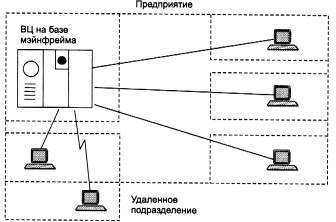
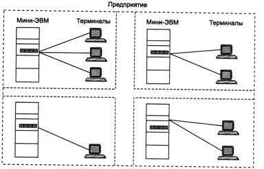
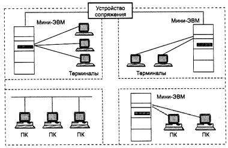

# 1.1.1 Эволюция вычислительных систем

Концепция вычислительных сетей является логическим результатом эволюции компьютерной технологии. Первые компьютеры 50-х годов - большие, громоздкие и дорогие - предназначались для очень небольшого числа избранных пользователей. Часто эти монстры занимали целые здания. Такие компьютеры не были предназначены для интерактивной работы пользователя, а использовались в режиме пакетной обработки.

**Системы пакетной обработки**

Системы пакетной обработки, как правило, строились на базе мэйнфрейма - мощного и надежного компьютера универсального назначения. Пользователи подготавливали перфокарты, содержащие данные и команды программ, и передавали их в вычислительный центр. Операторы вводили эти карты в компьютер, а распечатанные результаты пользователи получали обычно только на следующий день (рис1.1.)

**Рис.1.1.** Централизованная система на базе мэйнфрейма

Таким образом, одна неверно набитая карта означала как минимум суточную задержку.

Конечно, для пользователей интерактивный режим работы, при котором можно с терминала оперативно руководить процессом обработки своих данных, был бы гораздо удобней. Но интересами пользователей на первых этапах развития вычислительных систем в значительной степени пренебрегали, поскольку пакетный режим - это самый эффективный режим использования вычислительной мощности, так как он позволяет выполнить в единицу времени больше пользовательских задач, чем любые другие режимы. Во главу угла ставилась эффективность работы самого дорогого устройства вычислительной машины - процессора, в ущерб эффективности работы использующих его специалистов.

**Многотерминальные системы - прообраз сети**

По мере удешевления процессоров в начале 60-х годов появились новые способы организации вычислительного процесса, которые позволили учесть интересы пользователей. Начали развиваться интерактивные многотерминальные системы разделения времени (рис. 1.2) В таких системах компьютер отдавался в распоряжение сразу нескольким пользователям. Каждый пользователь получал в свое распоряжение терминал, с помощью которого он мог вести диалог с компьютером. Причем время реакции вычислительной системы было достаточно мало для того, чтобы пользователю была не слишком заметна параллельная работа с компьютером и других пользователей.

Разделяя таким образом компьютер, пользователи получили возможность за сравнительно небольшую плату пользоваться преимуществами компьютеризации.

**Рис. 1.2.** Многотерминальная система - прообраз вычислительной сети

Терминалы, выйдя за пределы вычислительного центра, рассредоточились по всему предприятию. И хотя вычислительная мощность оставалась полностью централизованной, некоторые функции - такие как ввод и вывод данных - стали распределенными. Такие многотерминальные централизованные системы внешне уже были очень похожи на локальные вычислительные сети. Действительно, рядовой пользователь работу за терминалом мэйнфрейма воспринимал примерно так же, как сейчас он воспринимает работу за подключенным к сети персональным компьютером. Пользователь мог получить доступ к общим файлам и периферийным устройствам, при этом у него поддерживалась полная иллюзия единоличного владения компьютером, так как он мог запустить нужную ему программу в любой момент и почти сразу же получить результат. (Некоторые, далекие от вычислительной техники пользователи даже были уверены, что все вычисления выполняются внутри их дисплея.)

Таким образом, многотерминальные системы, работающие в режиме разделения времени, стали первым шагом на пути создания локальных вычислительных сетей. Но до появления локальных сетей нужно было пройти еще большой путь, так как многотерминальные системы, хотя и имели внешние черты распределенных систем, все еще сохраняли централизованный характер обработки данных. С другой стороны, и потребность предприятий в создании локальных сетей в это время еще не созрела - в одном здании просто нечего было объединять в сеть, так как из-за высокой стоимости вычислительной техники предприятия не могли себе позволить роскошь приобретения нескольких компьютеров. В этот период был справедлив так называемый «закон Гроша», который эмпирически отражал уровень технологии того времени. В соответствии с этим законом производительность компьютера была пропорциональна квадрату его стоимости, отсюда следовало, что за одну и ту же сумму было выгоднее купить одну мощную машину, чем две менее мощных - их суммарная мощность оказывалась намного ниже мощности дорогой машины.

**Появление глобальных сетей**

Тем не менее, потребность в соединении компьютеров, находящихся на большом расстоянии друг от друга, к этому времени вполне назрела. Началось все с решения более простой задачи - доступа к компьютеру с терминалов, удаленных от него на многие сотни, а то и тысячи километров. Терминалы соединялись с компьютерами через телефонные сети с помощью модемов. Такие сети позволяли многочисленным пользователям получать удаленный доступ к разделяемым ресурсам нескольких мощных компьютеров класса суперЭВМ. Затем появились системы, в которых наряду с удаленными соединениями типа терминал-компьютер были реализованы и удаленные связи типа компьютер-компьютер.

Компьютеры получили возможность обмениваться данными в автоматическом режиме, что, собственно, и является базовым механизмом любой вычислительной сети. Используя этот механизм, в первых сетях были реализованы службы обмена файлами, синхронизации баз данных, электронной почты и другие, ставшие теперь традиционными сетевые службы.

Таким образом, хронологически первыми появились глобальные вычислительные сети. Именно при построении глобальных сетей были впервые предложены и отработаны многие основные идеи и концепции современных вычислительных сетей. Такие, например, как многоуровневое построение коммуникационных протоколов, технология коммутации пакетов, маршрутизация пакетов в составных сетях.

**Первые локальные сети**

В начале 70-х годов произошел технологический прорыв в области производства компьютерных компонентов - появились большие интегральные схемы. Их сравнительно невысокая стоимость и высокие функциональные возможности привели к созданию мини- компьютеров, которые стали реальными конкурентами мэйнфреймов. Закон Гроша перестал соответствовать действительности, так как десяток мини-компьютеров выполнял некоторые задачи (как правило, хорошо распараллеливаемые) быстрее одного мэйнфрейма, а стоимость такой мини-компьютерной системы была меньше.

Даже небольшие подразделения предприятий получили возможность покупать для себя компьютеры. Мини-компьютеры выполняли задачи управления технологическим оборудованием, складом и другие задачи уровня подразделения предприятия. Таким образом, появилась концепция распределения компьютерных ресурсов по всему предприятию. Однако при этом все компьютеры одной организации по-прежнему продолжали работать автономно (рис. 1.3).

**Рис. 1.3.** Автономное использование нескольких мини-компьютеров на одном предприятии.

Но шло время, потребности пользователей вычислительной техники росли, им стало недостаточно собственных компьютеров, им уже хотелось получить возможность обмена данными с другими близко расположенными компьютерами. В ответ на эту потребность предприятия и организации стали соединять свои мини-компьютеры вместе и разрабатывать программное обеспечение, необходимое для их взаимодействия. В результате появились первые локальные вычислительные сети (рис. 1.4.).

**Рис. 1.4.** Различные типы связей в первых локальных сетях

Они еще во многом отличались от современных локальных сетей, в первую очередь

- своими устройствами сопряжения. На первых порах для соединения компьютеров друг с другом использовались самые разнообразные нестандартные устройства со своим способом представления данных на линиях связи, своими типами кабелей и т. п. Эти устройства могли соединять только те типы компьютеров, для которых были разработаны,
- например, мини-компьютеры PDP-11 с мэйнфреймом IBM 360 или компьютеры «Наири» с компьютерами «Днепр». Такая ситуация создала большой простор для творчества студентов - названия многих курсовых и дипломных проектов начинались тогда со слов «Устройство сопряжения...».

**Создание стандартных технологий локальных сетей**

В середине 80-х годов положение дел в локальных сетях стало кардинально меняться. Утвердились стандартные технологии объединения компьютеров в сеть - Ethernet, Arcnet, Token Ring. Мощным стимулом для их развития послужили персональные компьютеры. Эти массовые продукты явились идеальными элементами для построения сетей - с одной стороны, они были достаточно мощными для работы сетевого программного обеспечения, а с другой - явно нуждались в объединении своей вычислительной мощности для решения сложных задач, а также разделения дорогих периферийных устройств и дисковых массивов. Поэтому персональные компьютеры стали преобладать в локальных сетях, причем не только в качестве клиентских компьютеров, но и в качестве центров хранения и обработки данных, то есть сетевых серверов, потеснив с этих привычных ролей мини-компьютеры и мэйнфреймы.

Стандартные сетевые технологии превратили процесс построения локальной сети из искусства в рутинную работу. Для создания сети достаточно было приобрести сетевые адаптеры соответствующего стандарта, например Ethernet, стандартный кабель, присоединить адаптеры к кабелю стандартными разъемами и установить на компьютер одну из популярных сетевых операционных систем, например, NetWare. После этого сеть начинала работать и присоединение каждого нового компьютера не вызывало никаких проблем - естественно, если на нем был установлен сетевой адаптер той же технологии.

Локальные сети в сравнении с глобальными сетями внесли много нового в способы организации работы пользователей. Доступ к разделяемым ресурсам стал гораздо удобнее - пользователь мог просто просматривать списки имеющихся ресурсов, а не запоминать их идентификаторы или имена. После соединения с удаленным ресурсом можно было работать с ним с помощью уже знакомых пользователю по работе с локальными ресурсами команд. Последствием и одновременно движущей силой такого прогресса стало появление огромного числа непрофессиональных пользователей, которым совершенно не нужно было изучать специальные (и достаточно сложные) команды для сетевой работы. А возможность реализовать все эти удобства разработчики локальных сетей получили в результате появления качественных кабельных линий связи, на которых даже сетевые адаптеры первого поколения обеспечивали скорость передачи данных до 10 Мбит/с. 

Конечно, о таких скоростях разработчики глобальных сетей не могли даже мечтать - им приходилось пользоваться теми каналами связи, которые были в наличии, так как прокладка новых кабельных систем для вычислительных сетей протяженностью в тысячи километров потребовала бы колоссальных капитальных вложений. А «под рукой» были только телефонные каналы связи, плохо приспособленные для высокоскоростной передачи дискретных данных - скорость в 1200 бит/с была для них хорошим достижением. Поэтому экономное расходование пропускной способности каналов связи часто являлось основным критерием эффективности методов передачи данных в глобальных сетях. В этих условиях различные процедуры прозрачного доступа к удаленным ресурсам, стандартные для локальных сетей, для глобальных сетей долго оставались непозволительной роскошью.

**Современные тенденции**

Сегодня вычислительные сети продолжают развиваться, причем достаточно быстро. Разрыв между локальными и глобальными сетями постоянно сокращается во многом из-за появления высокоскоростных территориальных каналов связи, не уступающих по качеству кабельным системам локальных сетей. В глобальных сетях появляются службы доступа к ресурсам, такие же удобные и прозрачные, как и службы локальных сетей. Подобные примеры в большом количестве демонстрирует самая популярная глобальная сеть - Internet.

Изменяются и локальные сети. Вместо соединяющего компьютеры пассивного кабеля в них в большом количестве появилось разнообразное коммуникационное оборудование - коммутаторы, маршрутизаторы, шлюзы. Благодаря такому оборудованию появилась возможность построения больших корпоративных сетей, насчитывающих тысячи компьютеров и имеющих сложную структуру. Возродился интерес к крупным компьютерам - в основном из-за того, что после спада эйфории по поводу легкости работы с персональными компьютерами выяснилось, что системы, состоящие из сотен серверов, обслуживать сложнее, чем несколько больших компьютеров. Поэтому на новом витке эволюционной спирали мэйнфреймы стали возвращаться в корпоративные вычислительные системы, но уже как полноправные сетевые узлы, поддерживающие Ethernet или Token Ring, а также стек протоколов TCP/IP, ставший благодаря Internet сетевым стандартом де-факто.

Проявилась еще одна очень важная тенденция, затрагивающая в равной степени как локальные, так и глобальные сети. В них стала обрабатываться несвойственная ранее вычислительным сетям информация - голос, видеоизображения, рисунки. Это потребовало внесения изменений в работу протоколов, сетевых операционных систем и коммуникационного оборудования. Сложность передачи такой мультимедийной информации по сети связана с ее чувствительностью к задержкам при передаче пакетов данных - задержки обычно приводят к искажению такой информации в конечных узлах сети. Так как традиционные службы вычислительных сетей - такие как передача файлов или электронная почта - создают малочувствительный к задержкам трафик и все элементы сетей разрабатывались в расчете на него, то появление трафика реального времени привело к большим проблемам.

Сегодня эти проблемы решаются различными способами, в том числе и с помощью специально рассчитанной на передачу различных типов трафика технологии АТМ, Однако, несмотря на значительные усилия, предпринимаемые в этом направлении, до приемлемого решения проблемы пока далеко, и в этой области предстоит еще много сделать, чтобы достичь заветной цели - слияния технологий не только локальных и глобальных сетей, но и технологий любых информационных сетей - вычислительных, телефонных, телевизионных и т. п. Хотя сегодня эта идея многим кажется утопией, серьезные специалисты считают, что предпосылки для такого синтеза уже существуют, и их мнения расходятся только в оценке примерных сроков такого объединения - называются сроки от 10 до 25 лет. Причем считается, что основой для объединения послужит технология коммутации пакетов, применяемая сегодня в вычислительных сетях, а не технология коммутации каналов, используемая в телефонии, что, наверно, должно повысить интерес к сетям этого типа.
