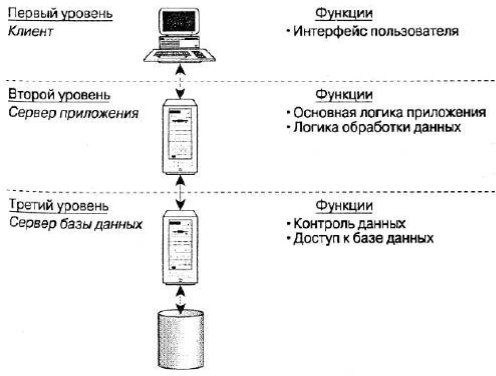

Компьютерные сети относятся к распределенным (или децентрализованным) вычислительным системам. Поскольку основным признаком распределенной вычислительной системы является наличие нескольких центров обработки данных, то наряду с компьютерными сетями к распределенным системам относят также мультипроцессорные компьютеры и многомашинные вычислительные комплексы.

# **Мультипроцессорные компьютеры**

В мультипроцессорных компьютерах имеется несколько процессоров, каждый из которых может относительно независимо от остальных выполнять свою программу. В мультипроцессоре существует общая для всех процессоров операционная система, которая оперативно распределяет вычислительную нагрузку между процессорами.

Взаимодействие между отдельными процессорами организуется наиболее простым способом - через общую оперативную память.

Сам по себе процессорный блок не является законченным компьютером и поэтому не может выполнять программы без остальных блоков мультипроцессорного компьютера

\- памяти и периферийных устройств. Все периферийные устройства являются для всех процессоров мультипроцессорной системы общими. Территориальную распределенность мультипроцессор не поддерживает - все его блоки располагаются в одном или нескольких близко расположенных конструктивах, как и у обычного компьютера.

Основное достоинство мультипроцессора - его высокая производительность, которая достигается за счет параллельной работы нескольких процессоров. Так как при наличии общей памяти взаимодействие процессоров происходит очень быстро, мультипроцессоры могут эффективно выполнять даже приложения с высокой степенью связи по данным.

Еще одним важным свойством мультипроцессорных систем является отказоустойчивость, то есть способность к продолжению работы при отказах некоторых элементов, например процессоров или блоков памяти. При этом производительность, естественно, снижается, но не до нуля, как в обычных системах, в которых отсутствует избыточность.

# **Многомашинные системы**

*Многомашинная система* - это вычислительный комплекс, включающий в себя несколько компьютеров (каждый из которых работает под управлением собственной операционной системы), а также программные и аппаратные средства связи компьютеров, которые обеспечивают работу всех компьютеров комплекса как единого целого.

Работа любой многомашинной системы определяется двумя главными компонентами: высокоскоростным механизмом связи процессоров и системным программным обеспечением, которое предоставляет пользователям и приложениям прозрачный доступ к ресурсам всех компьютеров, входящих в комплекс. В состав средств связи входят программные модули, которые занимаются распределением вычислительной нагрузки, синхронизацией вычислений и реконфигурацией системы. Если происходит отказ одного из компьютеров комплекса, его задачи могут быть автоматически переназначены и выполнены на другом компьютере. Если в состав многомашинной системы входят несколько контроллеров внешних устройств, то в случае отказа одного из них, другие контроллеры автоматически подхватывают его работу. Таким образом, достигается высокая отказоустойчивость комплекса в целом.

Помимо повышения отказоустойчивости, многомашинные системы позволяют достичь высокой производительности за счет организации параллельных вычислений. По сравнению с мультипроцессорными системами возможности параллельной обработки в многомашинных системах ограничены: эффективность распараллеливания резко снижается, если параллельно выполняемые задачи тесно связаны между собой по данным. Это объясняется тем, что связь между компьютерами многомашинной системы менее тесная, чем между процессорами в мультипроцессорной системе, так как основной обмен данными осуществляется через общие многовходовые периферийные устройства.

Говорят, что в отличие от мультипроцессоров, где используются сильные программные и аппаратные связи, в многомашинных системах аппаратные и программные связи между обрабатывающими устройствами являются более слабыми. Территориальная распределенность в многомашинных комплексах не обеспечивается, так как расстояния между компьютерами определяются длиной связи между процессорным блоком и дисковой подсистемой.

# **Вычислительные сети**

В *вычислительных сетях* программные и аппаратные связи являются еще более слабыми, а автономность обрабатывающих блоков проявляется в наибольшей степени - основными элементами сети являются стандартные компьютеры, не имеющие ни общих блоков памяти, ни общих периферийных устройств. Связь между компьютерами осуществляется с помощью специальных периферийных устройств - сетевых адаптеров, соединенных относительно протяженными каналами связи. Каждый компьютер работает под управлением собственной операционной системы, а какая-либо «общая» операционная система, распределяющая работу между компьютерами сети, отсутствует. Взаимодействие между компьютерами сети происходит за счет передачи сообщений через сетевые адаптеры и каналы связи. С помощью этих сообщений один компьютер обычно запрашивает доступ к локальным ресурсам другого компьютера. Такими ресурсами могут быть как данные, хранящиеся на диске, так и разнообразные периферийные устройства - принтеры, модемы, факс-аппараты и т. д. Разделение локальных ресурсов каждого компьютера между всеми пользователями сети - основная цель создания вычислительной сети.

Каким же образом сказывается на пользователе тот факт, что его компьютер подключен к сети? Прежде всего, он может пользоваться не только файлами, дисками, принтерами и другими ресурсами своего компьютера, но аналогичными ресурсами других компьютеров, подключенных к той же сети. Правда, для этого недостаточно снабдить компьютеры сетевыми адаптерами и соединить их кабельной системой. Необходимы еще некоторые добавления к операционным системам этих компьютеров. На тех компьютерах, ресурсы которых должны быть доступны всем пользователям сети, необходимо добавить модули, которые постоянно будут находиться в режиме ожидания запросов, поступающих по сети от других компьютеров. Обычно такие модули называются программными *серверами (server)*, так как их главная задача - обслуживать (serve) запросы на доступ к ресурсам своего компьютера. На компьютерах, пользователи которых хотят получать доступ к ресурсам других компьютеров, также нужно добавить к операционной системе некоторые специальные программные модули, которые должны вырабатывать запросы на доступ к удаленным ресурсам и передавать их по сети на нужный компьютер. Такие модули обычно называют программными *клиентами (client)*. Собственно же сетевые адаптеры и каналы связи решают в сети достаточно простую задачу - они передают сообщения с запросами и ответами от одного компьютера к другому, а основную работу по организации совместного использования ресурсов выполняют клиентские и серверные части операционных систем.

Пара модулей «клиент - сервер» обеспечивает совместный доступ пользователей к определенному типу ресурсов, например к файлам. В этом случае говорят, что пользователь имеет дело с файловой *службой (service)*. Обычно сетевая операционная система поддерживает несколько видов сетевых служб для своих пользователей - файловую службу, службу печати, службу электронной почты, службу удаленного доступа и т. п.

Термины «клиент» и «сервер» используются не только для обозначения программных модулей, но и компьютеров, подключенных к сети. Если компьютер предоставляет свои ресурсы другим компьютерам сети, то он называется сервером, а если он их потребляет - клиентом. Иногда один и тот же компьютер может одновременно играть роли и сервера, и клиента.

# **Двухуровневая архитектура «клиент-сервер»**

Рассмотрим двухуровневую архитектуру «клиент-сервер» на примере работы с БД. В контексте базы данных клиент управляет пользовательским интерфейсом и логикой приложения, действуя как рабочая станция, на которой выполняются приложения баз данных. Клиент принимает от пользователя запрос, проверяет синтаксис и генерирует запрос к базе данных на языке SQL или другом языке базы данных, который соответствует логике приложения. Затем он передает сообщение серверу, ожидает поступления ответа и форматирует полученные данные для представления их пользователю. Сервер принимает и обрабатывает запросы к базе данных, а затем передает полученные результаты обратно клиенту. Такая обработка включает проверку полномочий клиента, обеспечение требований целостности, а также выполнение запроса и обновление данных. Помимо этого поддерживается управление параллельностью и восстановлением. Двухуровневая архитектура «клиент-сервер» показана на рис. 1.6.

Рис. 1.6: Двухуровневая архитектура «клиент-сервер».

Архитектура клиент-сервер обладает рядом преимуществ:

- обеспечивается *более широкий доступ* к существующим базам данных;
- *повышается общая производительность системы*: поскольку клиенты и сервер находятся на разных компьютерах, их процессоры способны выполнять приложения параллельно. При этом настройка производительности компьютера с сервером упрощается, если на нем выполняется только работа с базой данных;
- *стоимость аппаратного обеспечения снижается:* достаточно мощный компьютер с большим устройством хранения нужен только серверу для хранения и управления базой данных;
- *сокращаются коммуникационные расходы:* приложения выполняют часть операций на клиентских компьютерах и посылают через сеть только запросы к базам данных, что позволяет существенно сократить объем пересылаемых по сети данных.

# **Трехуровневая архитектура «клиент-сервер»**

Дальнейшее расширение двухуровневой архитектуры клиент-сервер состоит в разделении функциональной части прежнего, «толстого» (интеллектуального) клиента на две части.

В трехуровневой архитектуре клиент-сервер, приведенной на рис. 1.7, «тонкий» (неинтеллектуальный) клиент на рабочей станции управляет только пользовательским интерфейсом, тогда как средний уровень обработки данных управляет всей остальной логикой приложения. Третьим уровнем здесь является сервер базы данных.

Эта трехуровневая архитектура оказалась более подходящей для некоторых сред — например, для сетей Internet и intranet, где в качестве клиента может выступать обычный Web-браузер.

Рис. 1.7: Трёхуровневая архитектура «клиент-сервер».

# **Распределенные программы**

Сетевые службы всегда представляют собой распределенные программы.

*Распределенная программа* - это программа, которая состоит из нескольких взаимодействующих частей (в приведенном на (рис. 1.5) примере - из двух), причем каждая часть, как правило, выполняется на отдельном компьютере сети.

**Рис. 1.5.** Взаимодействие частей распределенного приложения

До сих пор речь шла о системных распределенных программах. Однако в сети могут выполняться и распределенные пользовательские программы - приложения.

Распределенное приложение также состоит из нескольких частей, каждая и которых выполняет какую-то определенную законченную работу по решению прикладной задачи. Например, одна часть приложения, выполняющаяся на компьютере пользователя, может поддерживать специализированный графический интерфейс вторая - работать на мощном выделенном компьютере и заниматься статистической обработкой введенных пользователем данных, а третья - заносить полученные результаты в базу данных на компьютере с установленной стандартной СУБД. Распределенные приложения в полной мере используют потенциальные возможности распределенной обработки, предоставляемые вычислительной сетью, и поэтому часто называются *сетевыми приложениями*.

Следует подчеркнуть, что не всякое приложение, выполняемое в сети, является сетевым. Существует большое количество популярных приложений, которые не являются распределенными и целиком выполняются на одном компьютере сети. Тем не менее и такие приложения могут использовать преимущества сети за счет встроенных в операционную систему сетевых служб. Значительная часть истории локальных сетей связана как раз с использованием таких нераспределенных приложений. Рассмотрим, например, как происходила работа пользователя с известной в свое время СУБД dBase.

Обычно файлы базы данных, с которыми работали все пользователи сети, располагались на файловом сервере. Сама же СУБД хранилась на каждом клиентском компьютере в виде единого программного модуля.

Программа dBase была рассчитана на обработку только локальных данных, то есть данных, расположенных на том же компьютере, что и сама программа. Пользователь запускал dBase на своем компьютере, и она искала данные на локальном диске, совершенно не принимая во внимание существование сети. Чтобы обрабатывать с помощью dBase данные на удаленном компьютере, пользователь обращался к услугам файловой службы, которая доставляла данные с сервера на клиентский компьютер и создавала для СУБД эффект их локального хранения.

Большинство приложений, используемых в локальных сетях в середине 80-х годов, являлись обычными, нераспределенными приложениями. И это понятно - они были написаны для автономных компьютеров, а потом просто были перенесены в сетевую

среду. Создание же распределенных приложений, хотя и сулило много преимуществ (уменьшение сетевого трафика, специализация компьютеров), оказалось делом совсем не простым. Нужно было решать множество дополнительных проблем - на сколько частей разбить приложение, какие функции возложить на каждую часть, как организовать взаимодействие этих частей, чтобы в случае сбоев и отказов оставшиеся части корректно завершали работу, и т. д., и т. п. Поэтому до сих пор только небольшая часть приложений является распределенными, хотя очевидно, что именно за этим классом приложений будущее, так как они в полной мере могут использовать потенциальные возможности сетей по распараллеливанию вычислений.
