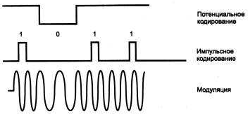

# 1.2.3 Проблемы физической передачи данных по линиям связи

Даже при рассмотрении простейшей сети, состоящей всего из двух машин, можно увидеть многие проблемы, присущие любой вычислительной сети, в том числе проблемы, связанные с физической передачей сигналов по линиям связи, без решения которой невозможен любой вид связи.

В вычислительной технике для представления данных используется двоичный код. Внутри компьютера единицам и нулям данных соответствуют дискретные электрические сигналы. 

Представление данных в виде электрических или оптических сигналов называется *кодированием*. Существуют различные способы кодирования двоичных цифр 1 и 0, например, потенциальный способ, при котором единице соответствует один уровень напряжения, а нулю - другой, или импульсный способ, когда для представления цифр используются импульсы различной или одной полярности.

Аналогичные подходы могут быть использованы для кодирования данных и при передаче их между двумя компьютерами по линиям связи. Однако эти линии связи отличаются по своим электрическим характеристикам от тех, которые существуют внутри компьютера. Главное отличие внешних линий связи от внутренних состоит в их гораздо большей протяженности, 

а также в том, что они проходят вне экранированного корпуса по пространствам, зачастую подверженным воздействию сильных электромагнитных помех. Все это приводит к значительно большим искажениям прямоугольных импульсов (например, «заваливанию» фронтов), чем внутри компьютера. Поэтому для надежного распознавания импульсов на приемном конце линии связи при передаче данных внутри и вне компьютера не всегда можно использовать одни и те же скорости и способы кодирования. Например, медленное нарастание фронта импульса из-за высокой емкостной нагрузки линии требует передачи импульсов с меньшей скоростью (чтобы передний и задний фронты соседних импульсов не перекрывались и импульс успел дорасти до требуемого уровня).

В вычислительных сетях применяют как потенциальное, так и импульсное кодирование дискретных данных,

` `а также специфический способ представления данных, который никогда не используется внутри компьютера, - *модуляцию* (рис. 1.11). При модуляции дискретная информация представляется синусоидальным сигналом той частоты, которую хорошо передает имеющаяся линия связи.

**Рис. 1.11.**Примеры представления дискретной информации Потенциальное или импульсное кодирование применяется на каналах высокого

качества, а модуляция на основе синусоидальных сигналов предпочтительнее в том случае, когда канал вносит сильные искажения в передаваемые сигналы. Обычно модуляция используется в глобальных сетях при передаче данных через аналоговые телефонные каналы связи, которые были разработаны для передачи голоса в аналоговой форме и поэтому плохо подходят для непосредственной передачи импульсов.

На способ передачи сигналов влияет и количество проводов в линиях связи между компьютерами. Для сокращения стоимости линий связи в сетях обычно стремятся к сокращению количества проводов и из-за этого используют не параллельную передачу всех бит одного байта или даже нескольких байт, как это делается внутри компьютера, а последовательную, побитную передачу, требующую всего одной пары проводов.

Еще одной проблемой, которую нужно решать при передаче сигналов, является проблема взаимной *синхронизации* передатчика одного компьютера с приемником другого. 

При организации взаимодействия модулей внутри компьютера эта проблема решается очень просто, так как в этом случае все модули синхронизируются от общего тактового генератора. Проблема синхронизации при связи компьютеров может решаться разными способами, как с помощью обмена специальными тактовыми синхроимпульсами  по отдельной линии, так и с помощью периодической синхронизации заранее обусловленными кодами или импульсами характерной формы, отличающейся от формы импульсов данных. Узел принимает тактовый сигнал, восстанавливает его, а затем пересылает всем передающим узлам (см. рис. 3).

Несмотря на предпринимаемые меры - выбор соответствующей скорости обмена данными, линий связи с определенными характеристиками, способа синхронизации приемника и передатчика, - существует вероятность искажения некоторых бит передаваемых данных. Для повышения надежности передачи данных между компьютерами часто используется стандартный прием - подсчет *контрольной суммы* и передача ее по линиям связи после каждого байта или после некоторого блока байтов. Часто в протокол обмена данными включается как обязательный элемент сигнал- квитанция, который подтверждает правильность приема данных и посылается от получателя отправителю.

Задачи надежного обмена двоичными сигналами, представленными соответствующими электромагнитными сигналами, в вычислительных сетях решает определенный класс оборудования. В локальных сетях это *сетевые адаптеры*, 

а в глобальных сетях - аппаратура передачи данных, к которой относятся, например, устройства, выполняющие модуляцию и демодуляцию дискретных сигналов, - *модемы*. 

Это оборудование кодирует и декодирует каждый информационный бит, синхронизирует передачу электромагнитных сигналов по линиям связи, проверяет правильность передачи  по контрольной сумме и может выполнять некоторые другие операции. Сетевые адаптеры рассчитаны, как правило, на работу с определенной *передающей средой* - коаксиальным кабелем, витой парой, оптоволокном и т. п. Каждый тип передающей среды обладает определенными электрическими характеристиками, влияющими на способ использования данной среды, и определяет скорость передачи сигналов, способ их кодирования и некоторые другие параметры.

