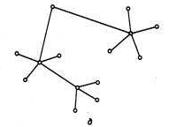

> До сих пор мы рассматривали вырожденную сеть, состоящую всего из двух
> машин.

При объединении в сеть большего числа компьютеров возникает целый
комплекс новых проблем.

# Топология физических связей

В первую очередь необходимо выбрать способ организации физических
связей, то есть _топологию_. Под топологией вычислительной сети
понимается конфигурация графа, вершинам которого соответствуют
компьютеры сети (иногда и другое оборудование, например, концентраторы),
а ребрам - физические связи между ними. Компьютеры, подключенные к сети,
часто называют _станциями_ или _узлами сети_.

{width="5.190476815398076in" height="3.989235564304462in"}

Заметим, что конфигурация _физических связей_ определяется
электрическими соединениями компьютеров между собой и может отличаться
от конфигурации _логических связей_ между узлами сети. Логические связи
представляют собой маршруты передачи данных между узлами сети и
образуются путем соответствующей настройки коммуникационного
оборудования.

Выбор топологии электрических связей существенно влияет на многие
характеристики сети. Например, наличие резервных связей повышает
надежность сети и делает возможным балансирование загрузки отдельных
каналов. Простота присоединения новых узлов, свойственная некоторым
топологиям, делает сеть легко расширяемой.

Экономические соображения часто приводят к выбору топологий, для которых
характерна минимальная суммарная длина линий связи. Рассмотрим
некоторые, наиболее часто встречающиеся топологии.

{width="1.051388888888889in" height="1.3763888888888889in"}
_Полносвязная_ топология (рис. 1.12, а)

соответствует сети, в которой каждый компьютер сети связан со всеми
остальными.

Несмотря на логическую простоту, этот вариант оказывается громоздким и
неэффективным. Действительно, каждый компьютер в сети должен иметь
большое количество коммуникационных портов, достаточное для связи с
каждым из остальных компьютеров сети. Для каждой пары компьютеров должна
быть выделена отдельная электрическая линия связи. Полносвязные
топологии применяются редко, так как не удовлетворяют ни одному из
приведенных выше требований. Чаще этот вид топологии используется в
многомашинных комплексах или глобальных сетях при небольшом количестве
компьютеров.

Все другие варианты основаны на неполносвязных топологиях, когда для
обмена данными между двумя компьютерами может потребоваться
промежуточная передача данных через другие узлы сети.

{width="1.3090277777777777in" height="1.1506944444444445in"}

_Ячеистая_ топология (_mesh_) получается
из полносвязной путем удаления некоторых возможных связей (рис. 1.12,
б).

В сети с ячеистой топологией непосредственно связываются только те
компьютеры, между которыми происходит интенсивный обмен данными, а для
обмена данными между компьютерами, не соединенными прямыми связями,
используются транзитные передачи через промежуточные узлы. Ячеистая
топология допускает соединение большого количества компьютеров и
характерна, как правило, для глобальных сетей.

{width="1.9354166666666666in" height="0.7694444444444445in"}

_Общая шина_(рис. 1.12, в) является очень
распространенной (а до недавнего времени самой распространенной)
топологией для локальных сетей. В этом случае компьютеры подключаются к
одному коаксиальному кабелю по схеме «монтажного ИЛИ». Передаваемая
информация может распространяться в обе стороны. Применение общей шины
снижает стоимость проводки, унифицирует подключение различных модулей,
обеспечивает возможность почти мгновенного широковещательного обращения
ко всем станциям сети. Таким образом, основными преимуществами такой
схемы являются дешевизна и простота разводки кабеля по помещениям. Самый
серьезный недостаток общей шины заключается в ее низкой надежности:
любой дефект кабеля или какого-нибудь из многочисленных разъемов
полностью парализует всю сеть. К сожалению, дефект коаксиального разъема
редкостью не является. Другим недостатком общей шины является ее
невысокая производительность, так как при таком способе подключения в
каждый момент времени только один компьютер может передавать данные в
сеть. Поэтому пропускная способность канала связи всегда делится здесь
между всеми узлами сети.

{width="1.0395833333333333in" height="1.1819444444444445in"}Топология _звезда_ (рис. 1.12, г).

В этом случае каждый компьютер подключается отдельным кабелем к общему
устройству, называемому _концентратором_, который находится в центре
сети. В функции концентратора входит направление передаваемой
компьютером информации одному или всем остальным компьютерам сети.
Главное преимущество этой топологии перед общей шиной - существенно
большая надежность. Любые неприятности с кабелем касаются лишь того
компьютера, к которому этот кабель присоединен, и только неисправность
концентратора может вывести из строя всю сеть. Кроме того, концентратор
может играть роль интеллектуального фильтра информации, поступающей от
узлов в сеть, и при необходимости блокировать запрещенные
администратором передачи.

Еще одной двоякой характеристикой является _высокая сложность и
стоимость центрального адаптера при простоте и дешевизне абонентских._
Существенным ограничением для больших сетей является принципиально
небольшое число абонентов (редко больше 16) и сложность аппаратного и
программного соединения нескольких звезд друг с другом. Помимо этого,
центральный компьютер (если он выступает в роли концентратора) обычно
сильно загружен выполнением собственно управлением обменом по сети, что
часто делает иное его использование невозможным.

Особое внимание разработчиков необходимо нацелить на два варианта
звезды: активную (истинную) и пассивную. У активной звезды в центре есть
абонент, а у пассивной там только производится соединение кабелей, что
фактически дает шину. В любом случае, в «центре» пассивной звезды
обработка информации и управление обменом не ведется.

К недостаткам топологии типа звезда относится более высокая стоимость
сетевого оборудования из-за необходимости приобретения концентратора.
Кроме того, возможности по наращиванию количества узлов в сети
ограничиваются количеством портов концентратора.

{width="2.1666666666666665in" height="1.7534722222222223in"}

Иногда имеет смысл строить сеть с
использованием нескольких концентраторов, иерархически соединенных между
собой связями типа звезда (рис.1.12,д). В настоящее время иерархическая
звезда является самым распространенным типом топологии связей как в
локальных, так и глобальных сетях.

{width="1.1416666666666666in" height="1.1465277777777778in"}
В сетях с _кольцевой_ конфигурацией (рис.1.12, е) данные передаются по кольцу от одного компьютера к другому, как правило, в одном направлении.

Если компьютер распознает данные как «свои», то он копирует их себе во
внутренний буфер. В сети с кольцевой топологией необходимо принимать
специальные меры, чтобы в случае выхода из строя или отключения
какой-либо станции не прервался канал связи между остальными станциями.
Кольцо представляет собой очень удобную конфигурацию для организации
обратной связи - данные, сделав полный оборот, возвращаются к
узлу-источнику.

Поэтому этот узел может контролировать процесс доставки данных адресату.
Часто это свойство кольца используется для тестирования связности сети и
поиска узла, работающего некорректно. Для этого в сеть посылаются
специальные тестовые сообщения. (рис. 1.12.).

Управление обменом может быть любым. Все адаптеры одинаковы, но если
один из них выполняет роль диспетчера, то он значительно сложнее.

{width="1.4246030183727034in" height="1.3836789151356081in"}
{width="1.6660148731408575in"
height="1.4819444444444445in"}

Эта топология не имеет особых ограничений по числу абонентов (более
1000). Так как адаптеры в такой сети производят автоматическое усиление
сигнала, то общая длина кольца может достигать десятков километров. При
этом длина кольца формально ограничена только временем прохождения
сигнала по кольцу и минимальной пропускной способностью (скоростью
приёма/передачи).

В то время как небольшие сети, как правило, имеют типовую топологию -
звезда, кольцо или общая шина, для крупных сетей характерно наличие
произвольных связей между компьютерами. В таких сетях можно выделить
отдельные произвольно связанные фрагменты (подсети), имеющие типовую
топологию, поэтому их называют сетями со _смешанной топологией_ (рис.
1.13).

{width="2.723400043744532in" height="2.145in"}

> **Рис. 1.13.** Смешанная топология

# Одноранговые сети и сети с выделенными серверами

Для организации взаимодействия пользователей и их программ в сети важно
определить, каким образом происходит распределение ресурсов в сети. В
этом отношении существует два подхода к решению задачи распределения
ресурсов.

_Одноранговые сети._ В такой сети (по-английски peer LAN) каждый абонент
является как потребителем (клиент), так и владельцем предоставляемых
ресурсов (сервер). Причем одна и та же машина является одновременно
клиентом у одних и сервером для других. Организация подобного рода
взаимодействия требует написания специальной операционной системы или
операционной оболочки. Наиболее известными программными продуктами
являются (в порядке возникновения): Lantastic фирмы ArtiSoft, Personal
NetWare фирмы Novell, Windows for Workgroups фирмы Microsoft, и т.д. Все
эти продукты предназначены в первую очередь для сети Ethernet (топология
шина), хотя никаких принципиальных трудностей при работе с другими
топологиями и сетевыми стандартами нет. Применение подобной сети
оправдано в небольшой рабочей группе или организации без явной
централизации данных, когда пользователям необходимо получать доступ к
ресурсам других машин эпизодически. При этом функционирование и как
клиента и как сервера требует наличия в памяти компьютера обоих
управляющих модулей, что не всегда удобно.

_Выделенный сервер._ Альтернативный способ распределения ресурсов в сети
— выделение специального компьютера (или нескольких) к которым
обращаются пользователи с целью использования определённого ресурса.

{width="4.384921259842519in" height="3.3126509186351707in"}

Функционирование подобной схемы требует специальной программы управления
доступом на сервере и программы обмена данными у клиента. При этом в
сети может существовать не один, а несколько серверов, каждый из которых
выполняет свои задачи. Типичные примеры:

- Файл-сервер, как централизованный накопитель данных в сети.
  Обработка данных производится на станции клиенте;

- Сервер баз данных. Это важное обобщение файл-сервера, когда
  обработка данных производится в два этапа: первый — обработка
  запроса клиента и формирование выборочных данных; второй — отсылка
  извлеченных данных клиенту для дальнейшей обработки;

<!-- {width="3.6754385389326334in" height="2.122807305336833in"} -->

    

- Принт-сервер. Может реализовываться как отдельная ЭВМ или
  специальный простой микрокомпьютер в виде отдельного
  интеллектуального сетевого устройства.

<!-- {width="2.7305555555555556in" height="1.7543853893263341in"} -->

    

- Коммуникационный сервер. Через него осуществляется выход из локальной сети в глобальные.

- {width="4.140351049868767in" height="1.8596489501312337in"}

- Зеркальный сервер. Это специализированный файл-сервер (или
  сервер БД) осуществляющий автоматическое резервное хранение данных.
  В глобальных сетях использование «зеркалирования» позволяет
  уменьшить трафик для загруженных серверов, позволяя пользователю
  получить требуемые ему данные с географически более близкой ЭВМ.

<!-- {width="5.166666666666667in" height="4.282788713910761in"} -->

    

# Организация совместного использования линий связи

Только в сети с полносвязной топологией для соединения каждой пары
компьютеров имеется отдельная линия связи. Во всех остальных случаях
неизбежно

возникает вопрос о том, как организовать совместное использование линий
связи несколькими компьютерами сети. Как и всегда при разделении
ресурсов, главной целью здесь является удешевление сети.

В вычислительных сетях используют как индивидуальные линии связи между
компьютерами, так и _разделяемые (shared)_, когда одна линия связи
попеременно используется несколькими компьютерами.

<!-- {width="4.864034339457568in" height="3.464708005249344in"} -->

    

В случае применения разделяемых линий связи (часто используется также
термин разделяемая среда передачи данных - shared media) возникает
комплекс проблем, связанных с их совместным использованием, который
включает как чисто электрические проблемы обеспечения нужного качества
сигналов при подключении к одному и тому же проводу нескольких
приемников и передатчиков, так и логические проблемы разделения во
времени доступа к этим линиям.

Классическим примером сети с разделяемыми линиями связи являются сети с
топологией «общая шина», в которых один кабель совместно используется
всеми компьютерами сети. Ни один из компьютеров сети в принципе не может
индивидуально, независимо от всех других компьютеров сети, использовать
кабель, так как при одновременной передаче данных сразу несколькими
узлами сигналы смешиваются и искажаются. В топологиях «кольцо» или
«звезда» индивидуальное использование линий связи, соединяющих
компьютеры, принципиально возможно, но эти кабели часто также
рассматривают как разделяемые для всех компьютеров сети, так что,
например, только один компьютер кольца имеет право в данный момент
времени отправлять по кольцу пакеты другим компьютерам.

Существуют различные способы решения задачи организации совместного
доступа к разделяемым линиям связи. Внутри компьютера проблемы
разделения линий связи между различными модулями также существуют -
примером является доступ к системной шине, которым управляет либо
процессор, либо специальный арбитр шины.

В сетях организация совместного доступа к линиям связи имеет свою
специфику из-за существенно большего времени распространения сигналов по
длинным проводам, к тому же это время для различных пар компьютеров
может быть различным. Из-за этого процедуры согласования доступа к линии
связи могут занимать слишком большой промежуток времени и приводить к
значительным потерям производительности сети.

Несмотря на все эти сложности, в локальных сетях разделяемые линии связи
используются очень часто. Этот подход, в частности, реализован в широко
распространенных классических технологиях Ethernet и Token Ring. Однако
в последние годы наметилась тенденция отказа от разделяемых сред
передачи данных и в локальных сетях. Это связано с тем, что за
достигаемое таким образом удешевление сети приходится расплачиваться
производительностью.

Сеть с разделяемой средой при большом количестве узлов будет работать
всегда медленнее, чем аналогичная сеть с индивидуальными линиями связи,
так как пропускная способность индивидуальной линии связи достается
одному компьютеру, а при ее совместном использовании - делится на все
компьютеры сети.

Часто с такой потерей производительности мирятся ради увеличения
экономической эффективности сети. Не только в классических, но и в
совсем новых технологиях, разработанных для локальных сетей, сохраняется
режим разделяемых линий связи. Например, разработчики технологии Gigabit
Ethernet, принятой в 1998 году в качестве нового стандарта, включили
режим разделения передающей среды в свои спецификации наряду с режимом
работы по индивидуальным линиям связи.

При использовании индивидуальных линий связи в полносвязных топологиях
конечные узлы должны иметь по одному порту на каждую линию связи.

В звездообразных топологиях конечные узлы могут подключаться
индивидуальными линиями связи к специальному устройству - коммутатору.

<!-- {width="2.6295986439195103in" height="1.578325678040245in"} -->

    

В глобальных сетях коммутаторы использовались уже на начальном этапе, а
в локальных сетях - с начала 90-х годов.

Коммутаторы приводят к существенному удорожанию локальной сети, поэтому
пока их применение ограничено, но по мере снижения стоимости коммутации
этот подход, возможно, вытеснит применение разделяемых линий связи.
Необходимо подчеркнуть, что индивидуальными в таких сетях являются
только линии связи между конечными узлами и коммутаторами сети, а связи
между коммутаторами остаются разделяемыми, так как по ним передаются
сообщения разных конечных узлов (рис. 1.14).

<!-- {width="4.915745844269466in" height="2.3333333333333335in"} -->

    

> **Рис. 1.14.** Индивидуальные и разделяемые линии связи в сетях на
> основе коммутаторов В глобальных сетях отказ от разделяемых линий
> связи объясняется техническими

причинами. Здесь большие временные задержки распространения сигналов
принципиально ограничивают применимость техники разделения линии связи.
Компьютеры могут затратить больше времени на переговоры о том, кому
сейчас можно использовать линию связи, чем непосредственно на передачу
данных по этой линии связи. Однако это не относится к линиям связи типа
«коммутатор - коммутатор». В этом случае только два коммутатора борются
за доступ к линии связи, и это существенно упрощает задачу организации
совместного использования линии.

# Способы управления обменом

> _Централизованное управление обменом_ подразумевает, что всем обменом
> в сети руководит один компьютер или специальное устройство.

<!-- >  -->

> 

>   
> 

>
> _Децентрализованное управление обменом_ означает, что все абоненты
> равноправны, хотя и могут иметь приоритеты на захват сети.

<!-- {width="3.5in" height="2.008771872265967in"} -->

# Методы управления обменом

При использовании локальной сети все абоненты работают самостоятельно и
могут обращаться к ней в произвольные моменты. Поэтому для разрешения и
предотвращения конфликтов между ними (_арбитража)_ сети необходимо
использовать различные методы управления доступом. В противном случае
возможно искажение передаваемой информации. Так как эти методы
существенно зависят от топологии сети, рассмотрим их отдельно.

# Топология звезда

Будем рассматривать «истинную», то есть активную звезду.

<!-- {width="2.355262467191601in" height="1.9429833770778653in"} -->

В данной топологии конфликт возможен тогда, когда больше одного абонента
решают начать передачу одновременно. Обычно центральный абонент может
производить обмен данными только с одним обычным абонентом, поэтому
необходимо выбрать только одного, ведущего передачу. Существуют два
подхода к решению.

_Активный центр. _

<!-- {width="1.8790419947506563in" height="1.626940069991251in"} -->

Центральный абонент (ЦА) _рассылает запросы_ (управляющие пакеты) всем
периферийным абонентам. Первый абонент желающий начать передачу посылает
ответ и непосредственно за ним начинает передавать данные. После
окончания обмена ЦА продолжает опрос по кругу. При этом возникает так
называемый _географический приоритет,_ когда первыми могут быть
обслужены абоненты, ближайшие к закончившему передачу. ЦА при этом типе
обмена передает когда захочет.

_Пассивный центр. _

<!-- {width="1.8123075240594926in" height="1.7629101049868767in"} -->

ЦА _«слушает» по очереди_ всех абонентов. Те абоненты, которые хотят
начать передачу периодически посылают запросы и ждут на них ответа.
Когда ЦА принял запрос, он разрешает передачу (посылает подтверждающий
управляющий пакет) и тот абонент совершает передачу данных. Система
приоритетов при этом та же, что описана выше.

> Использование центрального абонента - ЦА _полностью устраняет
> возможности конфликтов_ и _дает гарантированное время доступа._ Однако
> серьезными недостатками является надежность (отказоустойчивость ЦА),
> недостаточная гибкость (жесткий алгоритм арбитража) и низкая скорость
> управления (передает значительно меньше абонентов, чем всего
> подключено).

# Топология шина

Чаще реализуется _децентрализованное управление. _

<!-- {width="4.109648950131233in" height="2.349087926509186in"} -->

При этом все абоненты равноправны и решение о начале передачи
принимается абонентом _исходя из анализа состояния сети._ При этом
возникает конкуренция на захват, и, следовательно, искажения
передаваемых пакетов из-за их наложения. Для разрешения таких конфликтов
имеется множество сценариев. Иной раз выбор ставится от скорости
передачи данных в сети, длины шины, её трафика. Возможно использование
дополнительной, управляющей шины.

> Использование кода NRZ (NRZ- (non return to zero)
> код ([_англ._](https://ru.wikipedia.org/wiki/%D0%90%D0%BD%D0%B3%D0%BB%D0%B8%D0%B9%D1%81%D0%BA%D0%B8%D0%B9_%D1%8F%D0%B7%D1%8B%D0%BA) код
> без возвращения к нулю) для медленных сетей позволяет использовать
> _децентрализованный кодовый приоритетный арбитраж._ Его суть в
> _обнаружении столкновения_ и _прекращения передачи всеми абонентам
> кроме одного. _
>
> 

<!-- {width="6.2105260279965in" height="2.4122812773403326in"} -->

> При этой существенной проблемой является даже выяснение факта
> занятости сети. Поэтому любой пакет начинается стартовым битом
> (отличным от пассивного состояния сети), имеет фиксированную длину.
> Эта технология позволяет обнаружить начало пакета в незанятой сети и
> подождать время, необходимое для передачи пакета. Такого механизма
> достаточно для корректного начала передачи пакета, но не для
> устранения возможных искажений.

Для обнаружения искажения в начале пакета все абоненты передают свой
адрес с побитовым контролем того, что есть в сети на самом деле. Если
обнаруживается расхождение между реальным и «полученным» адресом, то
передача прекращается. Для обычной схемотехнической реализации такого
протокола _продолжит передачу тот абонент, в номере которого больше
единичных битов._ Существенной проблемой остался только выбор
длительности бита, гарантирующий обнаружение коллизии.

> Описанный выше метод арбитража характеризуется высокой надежностью, но
> низкой скоростью передачи данных. При этом все _абоненты имеют
> собственные приоритеты (число единичных бит в номере)_ и
> высокоприоритетные абоненты могут надолго занимать сеть, что не
> позволяет гарантировать хоть какое-то время отклика.
>
> _Второй метод арбитража,_ используемый для шины — _децентрализованный
> временной приоритетный арбитраж._ Основная его идея - это _свести к
> минимуму вероятность столкновений._ При большой нагрузке на сеть
> накапливается большое число нереализованных заявок, которые вызывают
> _попытки передачи сразу после освобождения сети._ Чтобы избежать
> этого, каждый абонент при обнаружении что сеть занята начинает отсчет
> уникального временного интервала, пропорционального своему сетевому
> адресу.

При этом методе абонент с нулевым номером начинает передачу сразу,
абонент с первым номером через время t~a~, второй 2t~a~ и так далее.

<!-- {width="3.171052055993001in" height="1.6622812773403324in"} -->

Предлагаемый метод вновь _не гарантирует фиксированного времени отклика_
и приводит к длительному ожиданию абонентов с малыми приоритетами. Ясно,
что работоспособность такой схемы на практике существенно зависит от
выбора величины _t~a~._ Данный метод допускает существенно более высокие
скорости передачи информации, но при увеличении длины и числа абонентов
задержки заметно растут и могут более чем вдвое превышать время передачи
стандартного пакета 1 Кбайт. Выбор схемы кодирования несущественен.

_Третий метод_ является развитием предыдущего и называется CSMA/CD, что
переводится как метод доступа с контролем несущей и обнаружением
коллизий.

Называется он CSMA/CD (Carrier-Sense Multiple Access/Collision
Detection) или по-русски МДКН/ОК — метод доступа с контролем несущей и
обнаружением коллизий (столкновений).

Его идеей является _уравнивание абонентов в правах_ и описывается
следующим алгоритмом:

- Абонент желающий начать передачу ждет освобождения сети и начинает
  > передачу

> _без дополнительного ожидания;_

- Одновременно с передачей абонент _контролирует состояние сети._ Если

  > столкновений не обнаружено, передача продолжается до конца;

- При возникновении коллизии абонент _усиливает её,_ продолжая

  > передавать некоторое время, чтобы другие абоненты гарантированно
  > обнаружили коллизию, а затем отключается. Аналогично поступают и
  > другие абоненты.

- После прекращения передачи абонент \*выдерживает случайный промежуток

  > времени* и повторяет попытку передачи, контролируя
  > возможные коллизии. Время задержки определяется как *t~wait~ =
  > Nt~a~,\* где N — случайное число.

- При обнаружении повторного столкновения изменяется время ожидания
  > t~w~_ait._ В простейшем случае оно удваивается, или выбирается
  > исходя из предыдущего трафика сети.

<!-- {width="3.7668077427821522in" height="2.0916294838145233in"} -->

> Очевидно что и данный метод _не дает гарантированного времени
> доступа,_ хотя и практически полностью устраняя коллизии для малой и
> средней загруженности сети.

Кроме того, _все абоненты действительно равноправны,_ так как выбор
времени ожидания для каждого случаен. Использование этого метода в сети
Ethernet выгодно только при 30% её загрузке и максимальном числе
абонентов 100, а лучше не более 50-ти.

При большем количестве абонентов необходимо использовать более
совершенные механизмы для контроля коллизий.

# Топология кольцо

Важнейшей характеристикой этой топологии является её замкнутость, что
гарантирует возвращение пакета к его отправителю.

<!-- {width="2.7711100174978127in" height="1.8987215660542431in"} -->

В нём нет двунаправленной передачи, как в шине. Для кольца существуют
два специфичных метода управления доступом, главная особенность которых
— _гарантированное время реакции._ Это время зависит от длины кольца,
скорости передачи данных и числа абонентов. Рассмотрим первый из этих
методов.

> _Маркерный метод доступа._ Этот метод относится к _децентрализованным
> детерминированным,_ что исключает одновременность передачи и
> гарантирует отсутствие конфликтов. Идея состоит в том, что по кольцу
> _циркулирует специальный управляющий пакет,_ называемый _маркером_ и
> определяющий фактически время начала возможного пакета.
>
> 

<!-- {width="3.7192979002624673in" height="2.1885968941382328in"} -->

> Метод доступа работает в следующей последовательности (передача пакета
> от нижнего абонента верхнему):

- Абонент, желающий передать _ждет свободный маркер_ (помеченный в

  > специальном поле как свободный). Получив такой маркер, адаптер
  > _помечает его как занятый,_ добавляет к нему пакет и отправляет
  > связку маркер+пакет дальше по кольцу.

- Каждый абонент получающий этот «паровоз» _проверяет,_ не ему ли

  > он предназначен. Если не ему, ретранслирует дальше по кольцу.

- Распознав предназначенный ему пакет адаптер \*помечает его как

  > принятый\* и отправляет дальше.

- Передающий абонент получает «паровоз» назад и освобождает маркер,
  > посылая его в сеть. При этом он по состоянию бита знает о
  > получении/неполучении пакета.

Используемый метод имеет уже встреченный ранее _географический
приоритет._ Если посмотреть внимательно, то маркерный метод очень похож
на опрос из центра, хотя его как такового и нет. Единственной задачей
одного из абонентов (адаптеров) является слежение за маркером, чтобы он
не пропал, так как это приведет к прекращению обмена. Наличие такого,
хоть и примитивного центра снижает надежность маркерной схемы. В
качестве дополнения отметим, что логическая реализация кольца с маркером
возможна как для топологии шина, так и звезда.

_Метод слотов (кольцевых сегментов)._ Основное отличие от маркерной
схемы в том, что _передача разрешена одновременно нескольким абонентам._
Вместо одного маркера в сети циркулирует несколько (2-8) слотов,
выполняющих по сути ту же функцию — временных меток. Слоты идут по
кольцу часто, с малым временным интервалом. Каждый слот при этом может
быть либо занят, либо свободен. Абоненту для передачи собственно данных
необходимо разбить её на малые пакеты (слоты) и загружать
последовательно приходящие свободные слоты последовательными частями
пакета. При возвращении слота с признаком подтверждения слот
освобождается отправителем и передается дальше. Отметим, что
_последовательные слоты совершенно необязательно содержат
последовательные части пакета_ одному адресату. Они могут выбираться
получателем из нескольких приходящих слотов. Как и в маркерном методе
необходим некоторый центр, следящий за целостностью слотов.

_Регистровый метод._ Данный метод заключается в том, что передача пакета
в сеть производится абонентом, если сеть свободна, а если в это время
ему поступает другой пакет, то он временно записывает в регистр (буфер)
для последующей обработки и ретрансляции. Несмотря на многие
преимущества, этот метод управления широкого распространения не получил.

<!-- {width="4.074561461067367in" height="2.422411417322835in"} -->

# Адресация компьютеров

Еще одной новой проблемой, которую нужно учитывать при объединении трех
и более компьютеров, является проблема их адресации. К адресу узла сети
и схеме его назначения можно предъявить несколько требований.

- Адрес должен уникально идентифицировать компьютер в сети
  любого масштаба.

- Схема назначения адресов должна сводить к минимуму ручной труд
  администратора и вероятность дублирования адресов.

- Адрес должен иметь иерархическую структуру, удобную для построения
  больших сетей. Эту проблему хорошо иллюстрируют международные
  почтовые адреса, которые позволяют почтовой службе, организующей
  доставку писем между странами, пользоваться только названием страны
  адресата и не учитывать название его города, а тем более улицы. В
  больших сетях, состоящих из многих тысяч узлов, отсутствие иерархии
  адреса может привести к большим издержкам - конечным узлам и
  коммуникационному оборудованию придется оперировать с таблицами
  адресов, состоящими из тысяч записей.

- Адрес должен быть удобен для пользователей сети, а это значит, что
  он должен иметь символьное представление например, Servers или
  [www.cisco.com.](http://www.cisco.com/)

- Адрес должен иметь по возможности компактное представление, чтобы не
  перегружать память коммуникационной аппаратуры - сетевых адаптеров,
  маршрутизаторов и т. п.

Нетрудно заметить, что эти требования противоречивы - например, адрес,
имеющий иерархическую структуру, скорее всего будет менее компактным,
чем неиерархический (такой адрес часто называют «плоским», то есть не
имеющим структуры). Символьный же адрес скорее всего потребует больше
памяти, чем адрес- число.

Так как все перечисленные требования трудно совместить в рамках
какой-либо одной схемы адресации, то на практике обычно используется
сразу несколько схем, так что компьютер одновременно имеет несколько
адресов-имен. Каждый адрес используется в той ситуации, когда
соответствующий вид адресации наиболее удобен. А чтобы не возникало
путаницы и компьютер всегда однозначно определялся своим адресом,
используются специальные вспомогательные протоколы, которые по адресу
одного типа могут определить адреса других типов.

> Наибольшее распространение получили три схемы адресации узлов.

- _Аппаратные (hardware) адреса_. Эти адреса предназначены для сети
  небольшого или среднего размера, поэтому они не имеют
  иерархической структуры. Типичным представителем адреса такого типа
  является адрес сетевого адаптера локальной сети. Такой адрес обычно
  используется только аппаратурой, поэтому его стараются сделать по
  возможности компактным и записывают в виде двоичного или
  шестнадцатеричного значения, например 0081005е24а8. При задании
  аппаратных адресов обычно не требуется выполнение ручной работы, так
  как они либо встраиваются в аппаратуру компанией-изготовителем, либо
  генерируются автоматически при каждом новом запуске оборудования,
  причем уникальность адреса в пределах сети
  обеспечивает оборудование. Помимо отсутствия иерархии, использование
  аппаратных адресов связано еще с одним недостатком - при замене
  аппаратуры, например, сетевого адаптера, изменяется и
  адрес компьютера. Более того, при установке нескольких сетевых
  адаптеров у компьютера появляется несколько адресов, что не очень
  удобно для пользователей сети.

- _Символьные адреса_ или _имена_. Эти адреса предназначены для
  запоминания людьми и поэтому обычно несут смысловую нагрузку.
  Символьные адреса легко использовать как в небольших, так и
  крупных сетях. Для работы в больших сетях символьное имя может иметь
  сложную иерархическую структуру, например ftp- archl.ucl.ac.uk. Этот
  адрес говорит о том, что данный компьютер поддерживает ftp- архив в
  сети о дного из колледжей Лондонского университета (University
  College

> London - ucl) и эта сеть относится к академической ветви (ас) Internet
> Великобритании (United Kingdom - uk). При работе в пределах сети
> Лондонского университета такое длинное символьное имя явно избыточно и
> вместо него удобно пользоваться кратким символьным именем, на роль
> которого хорошо подходит самая младшая составляющего полного имени, то
> есть имя ftp-archl.

- _Числовые составные адреса_. Символьные имена удобны для людей, но
  из-за переменного формата и потенциально большой длины их передача
  по сети не очень экономична. Поэтому во многих случаях для работы в
  больших сетях в качестве адресов узлов используют числовые составные
  адреса фиксированного и компактного форматов. Типичным
  представителями адресов этого типа являются IP- и IPX-адреса. В них
  поддерживается двухуровневая иерархия, адрес делится на старшую
  часть - номер сети и младшую - номер узла. Такое деление позволяет
  передавать сообщения между сетями только на основании номера сети, а
  номер узла используется только после доставки сообщения в нужную
  сеть; точно так же, как название улицы используется почтальоном
  только после того, как письмо доставлено в нужный город. В последнее
  время, чтобы сделать маршрутизацию в крупных сетях более
  эффективной, предлагаются более сложные варианты числовой адресации,
  в соответствии с которыми адрес имеет три и более составляющих.
  Такой подход, в частности, реализован в новой версии протокола IPv6,
  предназначенного для работы в сети Internet.

В современных сетях для адресации узлов применяются, как правило,
одновременно все три приведенные выше схемы. Пользователи адресуют
компьютеры символьными именами, которые автоматически заменяются в
сообщениях, передаваемых по сети, на числовые номера. С помощью этих
числовых номеров сообщения передаются из одной сети в другую, а после
доставки сообщения в сеть назначения вместо числового номера
используется аппаратный адрес компьютера. Сегодня такая схема характерна
даже для небольших автономных сетей, где, казалось бы, она явно
избыточна - это делается для того, чтобы при включении этой сети в
большую сеть не нужно было менять состав операционной системы.

Проблема установления соответствия между адресами различных типов,
которой занимается _служба разрешения имен_, может решаться как
полностью централизованными, так и распределенными средствами. В случае
централизованного подхода в сети выделяется один компьютер (сервер
имен), в котором хранится таблица соответствия друг другу имен различных
типов, например символьных имен и числовых номеров. Все остальные
компьютеры обращаются к серверу имен, чтобы по символьному имени найти
числовой номер компьютера, с которым необходимо обменяться данными.

При другом, распределенном подходе, каждый компьютер сам решает задачу
установления соответствия между именами. Например, если пользователь
указал для узла назначения числовой номер, то перед началом передачи
данных компьютер-отправитель посылает всем компьютерам сети сообщение
(такое сообщение называется широковещательным) с просьбой опознать это
числовое имя. Все компьютеры, получив это сообщение, сравнивают заданный
номер со своим собственным. Тот компьютер, у которого обнаружилось
совпадение, посылает ответ, содержащий его аппаратный адрес, после чего
становится возможным отправка сообщений по локальной сети.

Распределенный подход хорош тем, что не предполагает выделения
специального компьютера, который к тому же часто требует ручного задания
таблицы соответствия имен. Недостатком распределенного подхода является
необходимость широковещательных сообщений - такие сообщения перегружают
сеть, так как они

требуют обязательной обработки всеми узлами, а не только узлом
назначения. Поэтому распределенный подход используется только в
небольших локальных сетях. В крупных сетях распространение
широковещательных сообщений по всем ее сегментам становится практически
нереальным, поэтому для них характерен централизованный подход.

Наиболее известной службой централизованного разрешения имен является
служба

Domain Name System (DNS) сети Internet.
