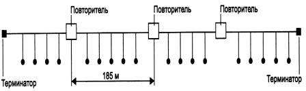
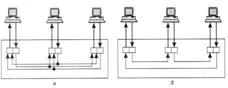
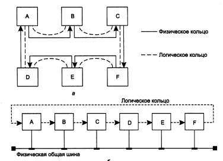
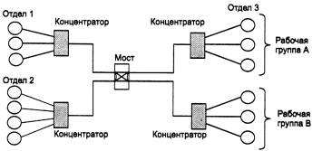
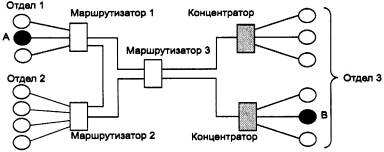

**Структуризация как средство построения больших сетей**

В сетях с небольшим (10-30) количеством компьютеров чаще всего используется одна из типовых топологий - общая шина, кольцо, звезда или полносвязная сеть. 

Все перечисленные топологии обладают свойством однородности, то есть все компьютеры в такой сети имеют одинаковые права в отношении доступа к другим компьютерам (за исключением центрального компьютера при соединении звезда). 

Такая однородность структуры делает простой процедуру наращивания числа компьютеров, облегчает обслуживание и эксплуатацию сети.

Однако при построении больших сетей однородная структура связей превращается из преимущества в недостаток. В таких сетях использование типовых структур порождает различные ограничения, важнейшими из которых являются:

- ограничения на длину связи между узлами;
- ограничения на количество узлов в сети;
- ограничения на интенсивность трафика, порождаемого узлами сети.

Например, технология Ethernet на тонком коаксиальном кабеле позволяет использовать кабель длиной не более 185 метров, к которому можно подключить не более 30 компьютеров. Однако, если компьютеры интенсивно обмениваются информацией между собой, иногда приходится снижать число подключенных к кабелю компьютеров до 20, а то и до 10, чтобы каждому компьютеру доставалась приемлемая доля общей пропускной способности сети.

Для снятия этих ограничений используются специальные методы структуризации сети и специальное структурообразующее оборудование - повторители, концентраторы, мосты, коммутаторы, маршрутизаторы. Оборудование такого рода также называют коммуникационным, имея в виду, что с помощью него отдельные сегменты сети взаимодействуют между собой.

# **Физическая структуризация сети**

Простейшее из коммуникационных устройств - *повторитель (repeater)* - используется для физического соединения различных сегментов кабеля локальной сети с целью увеличения общей длины сети. 

Повторитель передает сигналы, приходящие из одного сегмента сети, в другие ее сегменты (рис. 1.16). Повторитель позволяет преодолеть ограничения на длину линий связи за счет улучшения качества передаваемого сигнала - восстановления его мощности и амплитуды, улучшения фронтов и т. п.

**Рис. 1.16.** Повторитель позволяет увеличить длину сети Ethernet

Концентраторы характерны практически для всех базовых технологий локальных сетей - Ethernet, ArcNet, Token Ring, FDDI, Fast Ethernet, Gigabit Ethernet, l00VG-AnyLAN.

Нужно подчеркнуть, что в работе концентраторов любых технологий много общего

\- они повторяют сигналы, пришедшие с одного из своих портов, на других своих портах. Разница состоит в том, на каких именно портах повторяются входные сигналы. Так, концентратор Ethernet повторяет входные сигналы на всех своих портах, кроме того, с которого сигналы поступают (рис. 1.17, а)

. А концентратор Token Ring (рис. 1.175, б) повторяет входные сигналы, поступающие с некоторого порта, только на одном порту - на том, к которому подключен следующий в кольце компьютер (рис. 1.17)

**Рис. 1.17.** Концентраторы различных технологий

**ВНИМАНИЕ** Концентратор всегда изменяет физическую топологию сети, но при этом оставляет без изменения ее логическую топологию.

Напомним, что под физической топологией понимается конфигурация связей, образованных отдельными частями кабеля, 

а под логической - конфигурация информационных потоков между компьютерами сети. Во многих случаях физическая и логическая топологии сети совпадают. 

Например, сеть, представленная на рис. 1.18, а, имеет физическую топологию кольцо. Компьютеры этой сети получают доступ к кабелям  кольца за счет передачи друг другу специального кадра - маркера, причем этот маркер также передается последовательно от компьютера к компьютеру в том же порядке, в котором компьютеры образуют физическое кольцо, то есть компьютер А передает маркер компьютеру В, компьютер В - компьютеру С и т. д.

**Рис. 1.18.** Логическая и физическая топологии сети

Сеть, показанная на рис. 1.18, б, демонстрирует пример несовпадения физической и логической топологии. Физически компьютеры соединены по топологии общая шина.

Доступ же к шине происходит не по алгоритму случайного доступа, применяемому в технологии Ethernet, а путем передачи маркера в кольцевом порядке: от компьютера А - компьютеру В, от компьютера В - компьютеру С и т. д. Здесь порядок передачи маркера уже не повторяет физические связи, а определяется логическим конфигурированием драйверов сетевых адаптеров. Ничто не мешает настроить сетевые адаптеры и их драйверы так, чтобы компьютеры образовали кольцо в другом порядке, например: В, А, С... При этом физическая структура сети никак не изменяется (рис. 1.18.)

Другим примером несовпадения физической и логической топологий сети является уже рассмотренная сеть на рис. 1.17, а. Концентратор Ethernet поддерживает в сети физическую топологию звезда. Однако логическая топология сети осталась без изменений

\- это общая шина. Так как концентратор повторяет данные, пришедшие с любого порта, на всех остальных портах, то они появляются одновременно на всех физических сегментах

сети, как и в сети с физической общей шиной. Логика доступа к сети совершенно не меняется: все компоненты алгоритма случайного доступа - определение незанятости среды, захват среды, распознавание и отработка коллизий - остаются в силе.

Физическая структуризация сети с помощью концентраторов полезна не только для увеличения расстояния между узлами сети, но и для повышения ее надежности.

Например, если какой-либо компьютер сети Ethernet с физической общей шиной из-за сбоя начинает непрерывно передавать данные по общему кабелю, то вся сеть выходит из строя, и для решения этой проблемы остается только один выход - вручную отсоединить сетевой адаптер этого компьютера от кабеля. В сети Ethernet, построенной с использованием концентратора, эта проблема может быть решена автоматически - концентратор отключает свой порт, если обнаруживает, что присоединенный к нему узел слишком долго монопольно занимает сеть. Концентратор может блокировать некорректно работающий узел и в других случаях, выполняя роль некоторого управляющего узла.

# **Логическая структуризация сети**

Физическая структуризация сети полезна во многих отношениях, однако в ряде случаев, обычно относящихся к сетям большого и среднего размера, невозможно обойтись без логической структуризации сети. Наиболее важной проблемой, не решаемой путем физической структуризации, остается проблема перераспределения передаваемого трафика между различными физическими сегментами сети.

В большой сети естественным образом возникает неоднородность информационных потоков: сеть состоит из множества подсетей рабочих групп, отделов, филиалов предприятия и других административных образований. Очень часто наиболее интенсивный обмен данными наблюдается между компьютерами, принадлежащими к одной подсети, и только небольшая часть обращений происходит к ресурсам компьютеров, находящихся вне локальных рабочих групп. (До недавнего времени такое соотношение трафиков не подвергалось сомнению, и был даже сформулирован эмпирический закон «80/20», в соответствии с которым в каждой подсети 80 % трафика является внутренним и только 20 % - внешним.) Сейчас характер нагрузки сетей во многом изменился, широко внедряется технология intranet, на многих предприятиях имеются централизованные хранилища корпоративных данных, активно используемые

всеми сотрудниками предприятия. Все это не могло не повлиять на распределение информационных потоков. И теперь не редки ситуации, когда интенсивность внешних обращений выше интенсивности обмена между «соседними» машинами. Но независимо от того, в какой пропорции распределяются внешний и внутренний трафик, для повышения эффективности работы сети неоднородность информационных потоков необходимо учитывать.

Сеть с типовой топологией (шина, кольцо, звезда), в которой все физические сегменты рассматриваются в качестве одной разделяемой среды, оказывается неадекватной структуре информационных потоков в большой сети. Например, в сети с общей шиной взаимодействие любой пары компьютеров занимает ее на все время обмена, поэтому при увеличении числа компьютеров в сети шина становится узким местом.

Компьютеры одного отдела вынуждены ждать, когда окончит обмен пара компьютеров другого отдела, и это при том, что необходимость в связи между компьютерами двух разных отделов возникает гораздо реже и требует совсем небольшой пропускной способности.

Этот случай иллюстрирует рис. 1.19, а. Здесь показана сеть, построенная с использованием концентраторов. Пусть компьютер А, находящийся в одной подсети с компьютером В, посылает ему данные. Несмотря на разветвленную физическую структуру сети, концентраторы распространяют любой кадр по всем ее сегментам.

Поэтому кадр, посылаемый компьютером А компьютеру В, хотя и не нужен компьютерам отделов 2 и 3, в соответствии с логикой работы концентраторов поступает на эти сегменты тоже. И до тех пор, пока компьютер В не получит адресованный ему кадр, ни один из компьютеров этой сети не сможет передавать данные.

Такая ситуация возникает из-за того, что логическая структура данной сети осталась однородной - она никак не учитывает увеличение интенсивности трафика внутри отдела и предоставляет всем парам компьютеров равные возможности по обмену информацией (рис. 1.19, б).(рис. 1.19.)

Решение проблемы состоит в отказе от идеи единой однородной разделяемой среды. Например, в рассмотренном выше примере желательно было бы сделать так, чтобы кадры, которые передают компьютеры отдела 1, выходили бы за пределы этой части сети в том и только в том случае, если эти кадры направлены какому-либо компьютеру из других отделов. С другой стороны, в сеть каждого из отделов должны попадать те и только те кадры, которые адресованы узлам этой сети. При такой организации работы сети ее производительность существенно повыситься, так как компьютеры одного отдела не будут простаивать в то время, когда обмениваются данными компьютеры других отделов.

Нетрудно заметить, что в предложенном решении мы отказались от идеи общей разделяемой среды в пределах всей сети, хотя и оставили ее в пределах каждого отдела. Пропускная способность линий связи между отделами не должна совпадать с пропускной способностью среды внутри отделов. Если трафик между отделами составляет только 20

% трафика внутри отдела (как уже отмечалось, эта величина может быть другой), то и пропускная способность линий связи и коммуникационного оборудования, соединяющего отделы, может быть значительно ниже внутреннего трафика сети отдела.

**Рис. 1.19.**Противоречие между логической структурой сети и структурой информационных потоков

**ВНИМАНИЕ** Распространение трафика, предназначенного для компьютеров некоторого сегмента сети, только в пределах этого сегмента, называется *локализацией* трафика.

*Логическая структуризация* сети - это процесс разбиения сети на сегменты с локализованным трафиком.

Для логической структуризации сети используются такие коммуникационные устройства, как мосты, коммутаторы, маршрутизаторы и шлюзы.

*Мост (bridge)* делит разделяемую среду передачи сети на части (часто называемые логическими сегментами), передавая информацию из одного сегмента в другой только в том случае, если такая передача действительно необходима, то есть если адрес компьютера назначения принадлежит другой подсети. Тем самым мост изолирует трафик одной подсети от трафика другой, повышая общую производительность передачи данных в сети. Локализация трафика не только экономит пропускную способность, но и уменьшает возможность несанкционированного доступа к данным, так как кадры не выходят за пределы своего сегмента и их сложнее перехватить злоумышленнику.

На (рис. 1.20) показана сеть, которая была получена из сети с центральным концентратором (см. рис. 1.19) путем его замены на мост. Сети 1-го и 2-го отделов состоят из отдельных логических сегментов, а сеть отдела 3 - из двух логических сегментов.

Каждый логический сегмент построен на базе концентратора и имеет простейшую

физическую структуру, образованную отрезками кабеля, связывающими компьютеры с портами концентратора.

**Рис. 1.20.** Логическая структуризация сети с помощью моста

Мосты используют для локализации трафика аппаратные адреса компьютеров. Это затрудняет распознавание принадлежности того или иного компьютера к определенному логическому сегменту - сам адрес не содержит никакой информации по этому поводу.

Поэтому мост достаточно упрощенно представляет деление сети на сегменты - он запоминает, через какой порт на него поступил кадр данных от каждого компьютера сети, и в дальнейшем передает кадры, предназначенные для этого компьютера, на этот порт.

Точной топологии связей между логическими сегментами мост не знает. Из-за этого применение мостов приводит к значительным ограничениям на конфигурацию связей сети

\- сегменты должны быть соединены таким образом, чтобы в сети не образовывались замкнутые контуры.

*Коммутатор (switch, switching hub)* по принципу обработки кадров ничем не отличается от моста. Основное его отличие от моста состоит в том, что он является своего рода коммуникационным мультипроцессором, так как каждый его порт оснащен специализированным процессором, который обрабатывает кадры по алгоритму моста независимо от процессоров других портов. За счет этого общая производительность коммутатора обычно намного выше производительности традиционного моста, имеющего один процессорный блок. Можно сказать, что коммутаторы - это мосты нового поколения, которые обрабатывают кадры в параллельном режиме.

Ограничения, связанные с применением мостов и коммутаторов - по топологии связей, а также ряд других, - привели к тому, что в ряду коммуникационных устройств появился еще один тип оборудования - *маршрутизатор (router)*. Маршрутизаторы более надежно и более эффективно, чем мосты, изолируют трафик отдельных частей сети друг от друга. Маршрутизаторы образуют логические сегменты посредством явной адресации, поскольку используют не плоские аппаратные, а составные числовые адреса. В этих адресах имеется поле номера сети, так что все компьютеры, у которых значение этого поля одинаково, принадлежат к одному сегменту, называемому в данном случае *подсетью (subnet)*.

Кроме локализации трафика маршрутизаторы выполняют еще много других полезных функций. Так, маршрутизаторы могут работать в сети с замкнутыми контурами, при этом они осуществляют выбор наиболее рационального маршрута из нескольких возможных. Сеть, представленная на (рис. 1.21), отличается от своей предшественницы (см. рис. 1.120) тем, что между подсетями отделов 1 и 2 проложена дополнительная связь, которая может использоваться как для повышения производительности сети, так и для повышения ее надежности.

Другой очень важной функцией маршрутизаторов является их способность связывать в единую сеть подсети, построенные с использованием разных сетевых технологий, например Ethernet и Х.25.

**Рис. 1.21.**Логическая структуризация сети с помощью маршрутизаторов

Кроме перечисленных устройств отдельные части сети может соединять *шлюз (gateway)*. Обычно основной причиной, по которой в сети используют шлюз, является необходимость объединить сети с разными типами системного и прикладного программного обеспечения, а не желание локализовать трафик. Тем не менее шлюз обеспечивает и локализацию трафика в качестве некоторого побочного эффекта.

Крупные сети практически никогда не строятся без логической структуризации.

Для отдельных сегментов и подсетей характерны типовые однородные топологии базовых технологий, и для их объединения всегда используется оборудование, обеспечивающее локализацию трафика, - мосты, коммутаторы, маршрутизаторы и шлюзы.
