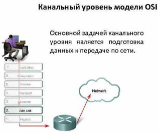

::: {.WordSection1}
[{#Рисунок 2 width="436" height="543"}]{lang="RU"} {#section style="margin-top:3.4pt;text-indent:-121.65pt"}
=======================================================================================================

[Физический уровень]{lang="RU"} {#физический-уровень style="margin-top:3.4pt"}
===============================

**[ ]{lang="RU" style="font-size:
13.0pt"}**

*[Физический уровень (Physical layer]{lang="RU" style="color:red"}*[)
имеет дело с передачей битов по физическим[
]{style="letter-spacing:.05pt"}каналам связи, ]{lang="RU"
style="color:red"}[таким, например, как коаксиальный кабель, витая пара,
оптоволоконный[ ]{style="letter-spacing:.05pt"}кабель или цифровой
территориальный канал. К этому уровню имеют отношение[
]{style="letter-spacing:.05pt"}характеристики физических сред передачи
данных, такие как полоса пропускания,[
]{style="letter-spacing:.05pt"}помехозащищенность, волновое
сопротивление и другие. На этом же уровне[
]{style="letter-spacing:.05pt"}определяются характеристики электрических
сигналов, передающих дискретную[
]{style="letter-spacing:.05pt"}информацию, например, крутизна фронтов
импульсов, уровни напряжения или тока[
]{style="letter-spacing:.05pt"}передаваемого[
]{style="letter-spacing:-.15pt"}сигнала, тип[ ]{style="letter-spacing:
-.2pt"}кодирования,[ ]{style="letter-spacing:-.15pt"}скорость[
]{style="letter-spacing:-.05pt"}передачи[
]{style="letter-spacing:-.05pt"}сигналов.[
]{style="letter-spacing:-.1pt"}Кроме[
]{style="letter-spacing:-.2pt"}этого,[
]{style="letter-spacing:-.1pt"}здесь[
]{style="letter-spacing:-2.85pt"}стандартизуются[
]{style="letter-spacing:
-.05pt"}типы[ ]{style="letter-spacing:-.05pt"}разъемов[
]{style="letter-spacing:-.05pt"}и назначение[ ]{style="letter-spacing:
-.2pt"}каждого контакта.]{lang="RU"}

[{#Рисунок 8
width="301"
height="206"}{#Рисунок 9
width="296" height="202"}]{lang="RU"}

[{#Рисунок 10
width="326"
height="201"} {#Рисунок 11
width="301" height="210"}]{lang="RU"}

[Функции физического уровня реализуются во всех устройствах,
подключенных к[ ]{style="letter-spacing:-2.85pt"}сети. *Со [стороны
компьютера функции физического уровня выполняются сетевым[
]{style="letter-spacing:.05pt"}адаптером[
]{style="letter-spacing:-.05pt"}или последовательным
портом.]{style="color:red"}*]{lang="RU" style="font-size:12.0pt"}

[Примером[ ]{style="letter-spacing:.3pt"}протокола[
]{style="letter-spacing:.3pt"}физического[
]{style="letter-spacing:.5pt"}уровня[
]{style="letter-spacing:.35pt"}может[
]{style="letter-spacing:.4pt"}служить[
]{style="letter-spacing:.4pt"}спецификация[ ]{style="letter-spacing:
.4pt"}l0-Base-T[ ]{style="letter-spacing:-2.85pt"}технологии Ethernet,[
]{style="letter-spacing:.05pt"}которая определяет в качестве
используемого кабеля[ ]{style="letter-spacing:.05pt"}неэкранированную
витую пару категории 3 с волновым сопротивлением 100 Ом, разъем[
]{style="letter-spacing:.05pt"}RJ-45,[
]{style="letter-spacing:.05pt"}максимальную длину физического сегмента
100 метров, манчестерский код для[
]{style="letter-spacing:.05pt"}представления данных в кабеле, а также
некоторые другие характеристики среды и[
]{style="letter-spacing:.05pt"}электрических[
]{style="letter-spacing:.05pt"}сигналов.]{lang="RU"}

[ ]{lang="RU" style="font-size:
19.0pt"}

[Канальный уровень]{lang="RU"} {#канальный-уровень style="margin-left:121.7pt"}
==============================

[На[ ]{style="letter-spacing:-.2pt"}физическом[
]{style="letter-spacing:-.05pt"}уровне[
]{style="letter-spacing:-.05pt"}просто[
]{style="letter-spacing:-.1pt"}пересылаются[
]{style="letter-spacing:-.1pt"}биты.[
]{style="letter-spacing:-.15pt"}При[
]{style="letter-spacing:-.05pt"}этом[
]{style="letter-spacing:-.15pt"}*не[
]{style="letter-spacing:-.15pt"}учитывается,[ ]{style="letter-spacing:
-.1pt"}*что[ ]{style="letter-spacing:-2.85pt"}в некоторых сетях, в
которых линии связи используются (разделяются) попеременно[
]{style="letter-spacing:.05pt"}несколькими парами взаимодействующих
компьютеров, физическая *среда передачи[
]{style="letter-spacing:.05pt"}может быть занята.* [Поэтому одной из
задач канального уровня *(Data Link layer*)[
]{style="letter-spacing:.05pt"}является[
]{style="letter-spacing:-.05pt"}проверка[
]{style="letter-spacing:-.05pt"}доступности[
]{style="letter-spacing:.05pt"}среды[
]{style="letter-spacing:-.05pt"}передачи]{style="color:red"}.]{lang="RU"}

[{#Рисунок 12
width="315"
height="266"}{#Рисунок 13
width="311"
height="226"}{#Рисунок 4
width="507" height="333"}]{lang="RU"}

[Другой задачей канального уровня является *[реализация механизмов
обнаружения и[ ]{style="letter-spacing:
-2.85pt"}коррекции ошибок. ]{style="color:red"}*[Для этого на канальном
уровне биты группируются в наборы,[ ]{style="letter-spacing:
.05pt"}называемые *кадрами (frames).* ]{style="color:red"}Канальный
уровень обеспечивает корректность передачи[
]{style="letter-spacing:.05pt"}каждого кадра, помещая специальную
последовательность бит в начало и конец каждого[
]{style="letter-spacing:.05pt"}кадра, для его выделения, а также
[вычисляет контрольную сумму]{style="color:red"}, обрабатывая все байты[
]{style="letter-spacing:.05pt"}кадра определенным способом и добавляя
контрольную сумму к кадру. Когда кадр[
]{style="letter-spacing:.05pt"}приходит по сети, получатель снова
вычисляет контрольную сумму полученных данных и[
]{style="letter-spacing:-2.85pt"}[сравнивает результат с контрольной
суммой из кадра]{style="color:red"}. Если они совпадают, кадр считается[
]{style="letter-spacing:-2.9pt"}правильным и принимается. Если же
контрольные суммы не совпадают, то фиксируется[ ]{style="letter-spacing:
.05pt"}ошибка.[ ]{style="letter-spacing:.05pt"}Канальный[
]{style="letter-spacing:.2pt"}уровень[
]{style="letter-spacing:.05pt"}*[может[
]{style="letter-spacing:.05pt"}не только[
]{style="letter-spacing:.05pt"}обнаруживать[ ]{style="letter-spacing:
.15pt"}ошибки,[ ]{style="letter-spacing:.05pt"}но[
]{style="letter-spacing:.05pt"}и[
]{style="letter-spacing:.1pt"}исправлять[
]{style="letter-spacing:.05pt"}их за счет повторной передачи
поврежденных кадров]{style="color:red"}.* Необходимо отметить, что
функция исправления ошибок не является обязательной для канального
уровня, поэтому в[ ]{style="letter-spacing:
.05pt"}некоторых[ ]{style="letter-spacing:.05pt"}протоколах этого[
]{style="letter-spacing:.1pt"}уровня[ ]{style="letter-spacing:
-.05pt"}она[ ]{style="letter-spacing:-.05pt"}отсутствует.]{lang="RU"}

[В протоколах канального уровня, используемых в локальных сетях,
заложена[ ]{style="letter-spacing:-2.85pt"}определенная структура связей
между компьютерами и способы их адресации. Хотя[
]{style="letter-spacing:.05pt"}*[канальный уровень и обеспечивает
доставку кадра между любыми двумя узлами[
]{style="letter-spacing:.05pt"}локальной сети, ]{style="color:red"}*[он
это делает *только в сети с совершенно определенной топологией[
]{style="letter-spacing:-2.85pt"}связей,* ]{style="color:red"}именно той
топологией, для которой он был разработан. К таким типовым[
]{style="letter-spacing:.05pt"}топологиям, поддерживаемым протоколами
канального уровня локальных сетей,[
]{style="letter-spacing:.05pt"}относятся [общая шина, кольцо и звезда, а
также структуры, полученные из них с[
]{style="letter-spacing:.05pt"}помощью[
]{style="letter-spacing:-.05pt"}мостов[
]{style="letter-spacing:-.05pt"}и[
]{style="letter-spacing:.05pt"}коммутаторов.]{style="color:red"}]{lang="RU"
style="font-size:12.0pt"}

[ ]{lang="RU" style="font-size:12.0pt"}

[{#Рисунок 5
width="526" height="373"}]{lang="RU"}
:::

[\
]{lang="RU"
style="font-size:12.0pt;font-family:\"Times New Roman\",serif"}

::: {.WordSection2}
*[В локальных сетях ]{lang="RU"}*[протоколы канального уровня
используются компьютерами,[ ]{style="letter-spacing:-2.85pt"}мостами,[
]{style="letter-spacing:-.05pt"}коммутаторами[ ]{style="letter-spacing:
.05pt"}и[ ]{style="letter-spacing:.05pt"}маршрутизаторами.]{lang="RU"}

[{#Рисунок 7
width="503" height="303"}]{lang="RU"}

*[В компьютерах ]{lang="RU" style="color:red"}*[функции канального
уровня реализуются совместными усилиями[
]{style="letter-spacing:-2.85pt"}сетевых[
]{style="letter-spacing:.05pt"}адаптеров[
]{style="letter-spacing:-.05pt"}и[ ]{style="letter-spacing:.05pt"}их
драйверов.]{lang="RU"}

*[В глобальных сетях]{lang="RU" style="font-size:12.0pt;color:red"}[,
]{lang="RU" style="font-size:12.0pt"}*[которые редко обладают регулярной
топологией, канальный[ ]{style="letter-spacing:-2.85pt"}уровень часто
обеспечивает обмен сообщениями *только между двумя соседними[
]{style="letter-spacing:.05pt"}компьютерами,[
]{style="letter-spacing:-.05pt"}*соединенными[ ]{style="letter-spacing:
.05pt"}индивидуальной[ ]{style="letter-spacing:.05pt"}линией
связи.]{lang="RU" style="font-size:
12.0pt"}

[{#Рисунок 6
width="467" height="352"}]{lang="RU"}

[В целом канальный уровень представляет собой весьма мощный и
законченный[ ]{style="letter-spacing:.05pt"}набор функций по пересылке
сообщений между узлами сети. В некоторых случаях[
]{style="letter-spacing:.05pt"}протоколы канального уровня оказываются
самодостаточными транспортными[
]{style="letter-spacing:.05pt"}средствами и могут допускать работу
поверх них непосредственно протоколов[
]{style="letter-spacing:.05pt"}прикладного уровня или приложений, без
привлечения средств сетевого и транспортного[
]{style="letter-spacing:-2.85pt"}уровней.]{lang="RU"}

[Тем не менее для обеспечения качественной транспортировки сообщений в
сетях[ ]{style="letter-spacing:-2.85pt"}любых топологий и технологий
функций канального уровня оказывается недостаточно,[
]{style="letter-spacing:.05pt"}поэтому в модели OSI[
]{style="letter-spacing:.05pt"}решение этой задачи возлагается на два
следующих уровня ---[ ]{style="letter-spacing:.05pt"}сетевой[
]{style="letter-spacing:1.1pt"}и[
]{style="letter-spacing:.1pt"}транспортный.]{lang="RU"}

[Сетевой уровень]{lang="RU"}
============================

**[ ]{lang="RU" style="font-size:
18.5pt"}**

*[Сетевой уровень (Network layer]{lang="RU" style="color:red"}*[) служит
для образования единой транспортной[
]{style="letter-spacing:-2.85pt"}системы, объединяющей несколько
сетей]{lang="RU" style="color:red"}[, причем эти сети могут
использовать[ ]{style="letter-spacing:.05pt"}совершенно различные
принципы передачи сообщений между конечными узлами и[
]{style="letter-spacing:.05pt"}обладать произвольной структурой связей.
Функции сетевого уровня достаточно[
]{style="letter-spacing:.05pt"}разнообразны.[
]{style="letter-spacing:-.1pt"}Начнем[
]{style="letter-spacing:-.1pt"}их[
]{style="letter-spacing:.05pt"}рассмотрение[ ]{style="letter-spacing:
-.15pt"}на[ ]{style="letter-spacing:-.1pt"}примере[
]{style="letter-spacing:-.1pt"}объединения[ ]{style="letter-spacing:
-.1pt"}локальных[ ]{style="letter-spacing:.05pt"}сетей.]{lang="RU"}

[{#Рисунок 14
width="482" height="305"}]{lang="RU"}

[Протоколы канального уровня локальных сетей обеспечивают доставку
данных[ ]{style="letter-spacing:.05pt"}между любыми узлами только в сети
с соответствующей типовой топологией, например,[
]{style="letter-spacing:.05pt"}топологией иерархической звезды. Это
очень жесткое ограничение, которое не позволяет[
]{style="letter-spacing:-2.85pt"}строить сети с развитой структурой,
например, сети, объединяющие несколько сетей[
]{style="letter-spacing:.05pt"}предприятия в единую сеть, или
высоконадежные сети, в которых существуют[
]{style="letter-spacing:.05pt"}избыточные связи между узлами. Можно было
бы усложнять протоколы канального[ ]{style="letter-spacing:.05pt"}уровня
для поддержания петлевидных избыточных связей, но принцип разделения[
]{style="letter-spacing:.05pt"}обязанностей между[
]{style="letter-spacing:-.15pt"}уровнями[
]{style="letter-spacing:.05pt"}приводит к[ ]{style="letter-spacing:
-.1pt"}другому[ ]{style="letter-spacing:-.3pt"}решению.]{lang="RU"}

*[Чтобы с одной стороны сохранить простоту процедур передачи данных для[
]{style="letter-spacing:-2.85pt"}типовых топологий, а с другой допустить
использование произвольных топологий,[
]{style="letter-spacing:.05pt"}вводится[
]{style="letter-spacing:-.1pt"}дополнительный сетевой[
]{style="letter-spacing:.1pt"}уровень.]{lang="RU"
style="font-size:12.0pt"}*

[{#Рисунок 15
width="324" height="261"}]{lang="RU"}

[На[ ]{style="letter-spacing:-.2pt"}сетевом[
]{style="letter-spacing:.1pt"}уровне[
]{style="letter-spacing:-.05pt"}сам[
]{style="letter-spacing:-.05pt"}термин[
]{style="letter-spacing:-.05pt"}*сеть[
]{style="letter-spacing:-.05pt"}*наделяют[
]{style="letter-spacing:-.2pt"}специфическим[ ]{style="letter-spacing:
-.15pt"}значением.[ ]{style="letter-spacing:-.1pt"}В[
]{style="letter-spacing:-.2pt"}данном[
]{style="letter-spacing:-2.85pt"}случае под сетью понимается
*совокупность компьютеров, соединенных между собой в[
]{style="letter-spacing:.05pt"}соответствии с одной из стандартных
типовых топологий и использующих для передачи[
]{style="letter-spacing:-2.85pt"}данных[
]{style="letter-spacing:-.1pt"}один из протоколов[
]{style="letter-spacing:-.1pt"}канального[
]{style="letter-spacing:-.1pt"}уровня,* определенный для[
]{style="letter-spacing:-.05pt"}этой[
]{style="letter-spacing:.05pt"}топологии.]{lang="RU"
style="font-size:12.0pt"}

*[Внутри сети доставка данных обеспечивается соответствующим канальным[
]{style="letter-spacing:.05pt"}уровнем, ]{lang="RU"
style="font-size:12.0pt;color:red"}*[а вот *доставкой данных между
сетями занимается сетевой уровень,* ]{lang="RU"
style="font-size:12.0pt;color:red"}[который и[
]{style="letter-spacing:-2.85pt"}поддерживает возможность правильного
выбора маршрута передачи сообщения даже в[
]{style="letter-spacing:.05pt"}том случае, когда структура связей между
составляющими сетями имеет характер,[
]{style="letter-spacing:.05pt"}отличный от принятого в протоколах
канального уровня. Сети соединяются между собой[
]{style="letter-spacing:.05pt"}специальными устройствами, называемыми
*маршрутизаторами.[ ]{style="letter-spacing:3.0pt"}[Маршрутизатор
]{style="color:red"}*[---[ ]{style="letter-spacing:.05pt"}*это[
]{style="letter-spacing:-.15pt"}устройство,[ ]{style="letter-spacing:
-.1pt"}которое[ ]{style="letter-spacing:-.15pt"}собирает[
]{style="letter-spacing:-.1pt"}информацию[ ]{style="letter-spacing:
-.05pt"}о[ ]{style="letter-spacing:-.1pt"}топологии[
]{style="letter-spacing:-.15pt"}межсетевых[ ]{style="letter-spacing:
-.1pt"}соединений[ ]{style="letter-spacing:-.1pt"}и[
]{style="letter-spacing:-2.85pt"}на[ ]{style="letter-spacing:-.1pt"}ее[
]{style="letter-spacing:-.1pt"}основании[
]{style="letter-spacing:-.1pt"}пересылает[
]{style="letter-spacing:-.1pt"}пакеты[
]{style="letter-spacing:-.1pt"}сетевого[
]{style="letter-spacing:.05pt"}уровня[ ]{style="letter-spacing:-.15pt"}в
сеть назначения.[
]{style="letter-spacing:-.15pt"}*]{style="color:red"}]{lang="RU"
style="font-size:12.0pt"}

[{#Рисунок 16
width="467" height="299"}]{lang="RU"}

[Чтобы[ ]{style="letter-spacing:-.1pt"}передать сообщение от
отправителя, находящегося в одной сети, получателю, находящемуся в[
]{style="letter-spacing:.05pt"}другой сети, нужно совершить некоторое
количество транзитных передач между сетями,[
]{style="letter-spacing:.05pt"}или *[хопов ]{style="color:red"}*[(от
*hop* --- *прыжок*), каждый раз выбирая подходящий маршрут. Таким
образом,[ ]{style="letter-spacing:-2.85pt"}*маршрут представляет собой
последовательность маршрутизаторов, через которые[
]{style="letter-spacing:
.05pt"}проходит[
]{style="letter-spacing:-.1pt"}пакет.*]{style="color:red"}]{lang="RU"
style="font-size:12.0pt"}

[{#Рисунок 18
width="173" height="159"}]{lang="RU"}

*[Проблема выбора наилучшего пути называется маршрутизацией]{lang="RU"
style="color:red"}[, ]{lang="RU"}*[и ее решение[
]{style="letter-spacing:-2.85pt"}является одной из главных задач
сетевого уровня. Эта проблема осложняется тем, что[
]{style="letter-spacing:.05pt"}самый[
]{style="letter-spacing:-.05pt"}короткий[
]{style="letter-spacing:-.2pt"}путь[ ]{style="letter-spacing:-.05pt"}не[
]{style="letter-spacing:-.15pt"}всегда[
]{style="letter-spacing:-.15pt"}самый[
]{style="letter-spacing:-.05pt"}лучший.[
]{style="letter-spacing:-.15pt"}Часто[
]{style="letter-spacing:-.1pt"}критерием[
]{style="letter-spacing:-.15pt"}при[
]{style="letter-spacing:-.2pt"}выборе[
]{style="letter-spacing:-.1pt"}маршрута[
]{style="letter-spacing:-2.85pt"}является время передачи данных по этому
маршруту; оно зависит от пропускной[
]{style="letter-spacing:.05pt"}способности каналов связи и интенсивности
трафика, которая может изменяться с[ ]{style="letter-spacing:
.05pt"}течением[ ]{style="letter-spacing:-.1pt"}времени. [Некоторые[
]{style="letter-spacing:-.05pt"}алгоритмы[
]{style="letter-spacing:-.1pt"}маршрутизации[ ]{style="letter-spacing:
-.1pt"}пытаются приспособиться к изменению нагрузки, в то время как
другие принимают решения на[ ]{style="letter-spacing:.05pt"}основе[
]{style="letter-spacing:-.2pt"}средних[
]{style="letter-spacing:-.05pt"}показателей[
]{style="letter-spacing:-.05pt"}за[
]{style="letter-spacing:-.2pt"}длительное[ ]{style="letter-spacing:
-.15pt"}время]{style="color:red"}.[
]{style="letter-spacing:-.15pt"}Выбор[
]{style="letter-spacing:-.1pt"}маршрута[
]{style="letter-spacing:-.2pt"}может[
]{style="letter-spacing:-.15pt"}осуществляться[
]{style="letter-spacing:-2.85pt"}и по другим[ ]{style="letter-spacing:
-.05pt"}критериям, например, надежности[ ]{style="letter-spacing:
-.15pt"}передачи.]{lang="RU"}

[В общем случае функции сетевого уровня шире, чем функции передачи
сообщений[ ]{style="letter-spacing:-2.9pt"}по связям с нестандартной
структурой, которые мы сейчас рассмотрели на примере[
]{style="letter-spacing:.05pt"}объединения нескольких локальных сетей.
[Сетевой уровень решает также задачи[ ]{style="letter-spacing:
.05pt"}*согласования разных технологий, упрощения адресации в крупных
сетях* и *создания[ ]{style="letter-spacing:.05pt"}надежных[
]{style="letter-spacing:-.1pt"}и гибких[
]{style="letter-spacing:-.1pt"}барьеров[
]{style="letter-spacing:-.05pt"}на[ ]{style="letter-spacing:-.05pt"}пути
нежелательного[ ]{style="letter-spacing:-.05pt"}трафика[
]{style="letter-spacing:-.05pt"}между[
]{style="letter-spacing:-.1pt"}сетями*]{style="color:red"}*.*]{lang="RU"
style="font-size:12.0pt"}

[Сообщения сетевого уровня принято называть *пакетами (packets).*
]{lang="RU" style="color:red"}[При[
]{style="letter-spacing:.05pt"}организации доставки пакетов на сетевом
уровне используется понятие «номер сети». В[
]{style="letter-spacing:.05pt"}этом случае адрес получателя состоит из
старшей части --- *номера сети* и младшей ---[
]{style="letter-spacing:.05pt"}*номера узла* в этой сети. Все узлы одной
сети должны иметь одну и ту же старшую часть[
]{style="letter-spacing:-2.9pt"}адреса, поэтому термину «сеть» на
сетевом уровне можно дать и другое, более[
]{style="letter-spacing:.05pt"}формальное определение: [сеть --- это
совокупность узлов, сетевой адрес которых[
]{style="letter-spacing:.05pt"}содержит[
]{style="letter-spacing:-.05pt"}один[ ]{style="letter-spacing:-.1pt"}и[
]{style="letter-spacing:
.05pt"}тот же[ ]{style="letter-spacing:-.2pt"}номер
сети.]{style="color:red"}]{lang="RU"}

[На сетевом уровне определяются два вида протоколов. [Первый вид ---
*сетевые[ ]{style="letter-spacing:.05pt"}протоколы (routed protocols*)
--- реализуют продвижение пакетов через сеть]{style="color:red"}. Именно
эти[ ]{style="letter-spacing:-2.85pt"}протоколы обычно имеют в виду,
когда говорят о протоколах сетевого уровня. [Однако[
]{style="letter-spacing:.05pt"}часто к сетевому уровню относят и другой
вид протоколов, называемых протоколами[
]{style="letter-spacing:.05pt"}обмена маршрутной информацией или просто
*протоколами маршрутизации (routing[
]{style="letter-spacing:.05pt"}protocols*). С помощью этих протоколов
*маршрутизаторы собирают информацию о[
]{style="letter-spacing:.05pt"}топологии межсетевых соединений.*
]{style="color:red"}Протоколы сетевого уровня реализуются про-[
]{style="letter-spacing:.05pt"}граммными модулями операционной системы,
а также программными и аппаратными[
]{style="letter-spacing:.05pt"}средствами маршрутизаторов.]{lang="RU"
style="font-size:12.0pt"}

[На сетевом уровне работают протоколы еще одного типа, которые отвечают
за[ ]{style="letter-spacing:.05pt"}*отображение адреса узла,
используемого на сетевом уровне, в локальный адрес сети*]{lang="RU"
style="font-size:12.0pt;color:red"}*[.[
]{style="letter-spacing:.05pt"}]{lang="RU"
style="font-size:12.0pt"}*[Такие протоколы часто называют *протоколами
разрешения адресов* --- *Address Resolution[
]{style="letter-spacing:-2.85pt"}Protocol,* ARP.[
]{style="letter-spacing:.05pt"}Иногда их относят не к сетевому уровню, а
к канальному, хотя тонкости[
]{style="letter-spacing:.05pt"}классификации не[
]{style="letter-spacing:
-.2pt"}изменяют[ ]{style="letter-spacing:-.1pt"}их[
]{style="letter-spacing:.1pt"}сути.]{lang="RU" style="font-size:12.0pt"}

[{#Рисунок 17
width="453" height="332"}]{lang="RU"}

[Примерами протоколов сетевого уровня являются протокол межсетевого[
]{style="letter-spacing:
.05pt"}взаимодействия IP[ ]{style="letter-spacing:.05pt"}стека TCP/IP[
]{style="letter-spacing:.05pt"}и протокол межсетевого обмена пакетами
IPX стека[ ]{style="letter-spacing:-2.85pt"}Novell.]{lang="RU"}

[ ]{lang="RU" style="font-size:18.0pt"}

[Транспортный[ ]{style="letter-spacing:-.05pt"}уровень]{lang="RU"}
==================================================================

**[ ]{lang="RU" style="font-size:
17.5pt"}**

[На[ ]{style="letter-spacing:-.2pt"}пути[
]{style="letter-spacing:-.05pt"}от[
]{style="letter-spacing:-.1pt"}отправителя[ ]{style="letter-spacing:
-.25pt"}к[ ]{style="letter-spacing:-.05pt"}получателю[
]{style="letter-spacing:-.1pt"}пакеты[
]{style="letter-spacing:-.15pt"}могут[
]{style="letter-spacing:-.1pt"}быть[
]{style="letter-spacing:-.05pt"}искажены[
]{style="letter-spacing:-.15pt"}или[
]{style="letter-spacing:.05pt"}утеряны.]{lang="RU"}

[Хотя некоторые приложения имеют собственные средства обработки ошибок,
существуют[ ]{style="letter-spacing:-2.9pt"}и такие, которые[
]{style="letter-spacing:
-.1pt"}предпочитают сразу[ ]{style="letter-spacing:-.25pt"}иметь дело с[
]{style="letter-spacing:-.05pt"}надежным[
]{style="letter-spacing:-.1pt"}соединением.]{lang="RU"}

*[Транспортный уровень (Transport layer]{lang="RU" style="color:red"}*[)
обеспечивает приложениям или верхним[
]{style="letter-spacing:.05pt"}уровням стека --- прикладному и
сеансовому --- передачу данных с той степенью[
]{style="letter-spacing:.05pt"}надежности, которая им[
]{style="letter-spacing:-.05pt"}требуется]{lang="RU"
style="color:red"}[. ]{lang="RU"}

[{#Рисунок 20
width="430" height="326"}]{lang="RU"}

[Модель[ ]{style="letter-spacing:.1pt"}OSI[
]{style="letter-spacing:.65pt"}определяет пять[
]{style="letter-spacing:.05pt"}классов сервиса,[
]{style="letter-spacing:.05pt"}предоставляемых[ ]{style="letter-spacing:
-.1pt"}транспортным[ ]{style="letter-spacing:-.1pt"}уровнем.[
]{style="letter-spacing:-.15pt"}Эти[
]{style="letter-spacing:-.15pt"}виды[
]{style="letter-spacing:-.2pt"}сервиса[
]{style="letter-spacing:-.2pt"}отличаются[
]{style="letter-spacing:-.15pt"}качеством[
]{style="letter-spacing:-.2pt"}пред[
]{style="letter-spacing:-2.85pt"}ставляемых[
]{style="letter-spacing:.15pt"}услуг:]{lang="RU"}

[•[    ]{style="font:7.0pt \"Times New Roman\""}]{lang="RU"
style="font-size:12.0pt"}[срочностью,]{lang="RU"
style="font-size:12.0pt"}

[•[    ]{style="font:7.0pt \"Times New Roman\""}]{lang="RU"
style="font-size:12.0pt"}[возможностью[
]{style="letter-spacing:-.15pt"}восстановления[ ]{style="letter-spacing:
-.1pt"}прерванной[ ]{style="letter-spacing:-.05pt"}связи,]{lang="RU"
style="font-size:12.0pt"}

[•[   ]{style="font:7.0pt \"Times New Roman\""}]{lang="RU"
style="font-size:12.0pt;line-height:98%"}[наличием средств
мультиплексирования нескольких соединений между различными[
]{style="letter-spacing:-2.9pt"}прикладными протоколами[
]{style="letter-spacing:.05pt"}через общий[
]{style="letter-spacing:.05pt"}транспортный протокол,]{lang="RU"
style="font-size:12.0pt;line-height:98%"}

[•[   ]{style="font:7.0pt \"Times New Roman\""}]{lang="RU"
style="font-size:12.0pt"}[а главное --- способностью к обнаружению и
исправлению ошибок передачи, таких[ ]{style="letter-spacing:
-2.85pt"}как искажение, потеря и[
]{style="letter-spacing:.05pt"}дублирование[
]{style="letter-spacing:-.05pt"}пакетов.]{lang="RU"
style="font-size:12.0pt"}

[{#Рисунок 19
width="432" height="235"}]{lang="RU"}

[Выбор класса сервиса транспортного уровня определяется, с одной
стороны, тем, в[ ]{style="letter-spacing:-2.85pt"}какой степени задача
обеспечения надежности решается самими приложениями и[
]{style="letter-spacing:.05pt"}протоколами более высоких, чем
транспортный, уровней, а с другой стороны, этот выбор[
]{style="letter-spacing:
.05pt"}зависит от того, насколько надежной является система
транспортировки данных в сети,[
]{style="letter-spacing:.05pt"}обеспечиваемая уровнями, расположенными
ниже транспортного --- сетевым, канальным[
]{style="letter-spacing:.05pt"}и физическим. ]{lang="RU"}

[Так, например, если качество каналов передачи связи очень высокое и[
]{style="letter-spacing:.05pt"}вероятность возникновения ошибок, не
обнаруженных протоколами более низких[
]{style="letter-spacing:.05pt"}уровней, невелика, то разумно
воспользоваться одним из облегченных сервисов[
]{style="letter-spacing:.05pt"}транспортного уровня, не обремененных
многочисленными проверками, квитированием [([квитировать - подтверждение
приёма-передачи структурной единицы
информации]{style="background:white"}) ]{style="color:red"}и
[ ]{style="letter-spacing:
-2.85pt"}другими приемами повышения надежности. Если же транспортные
средства нижних[ ]{style="letter-spacing:.05pt"}уровней изначально очень
ненадежны, то целесообразно обратиться к наиболее развитому[
]{style="letter-spacing:-2.85pt"}сервису транспортного уровня, который
работает, используя максимум средств для[
]{style="letter-spacing:.05pt"}обнаружения и устранения ошибок, --- с
помощью *предварительного установления[
]{style="letter-spacing:.05pt"}логического соединения, контроля доставки
сообщений по контрольным суммам* и[
]{style="letter-spacing:.05pt"}*циклической[
]{style="letter-spacing:-.05pt"}нумерации[ ]{style="letter-spacing:
-.05pt"}пакетов,[ ]{style="letter-spacing:-.05pt"}установления
тайм-аутов[ ]{style="letter-spacing:-.05pt"}доставки[
]{style="letter-spacing:.05pt"}*и[
]{style="letter-spacing:.05pt"}т.п.]{lang="RU"}

[Как правило, *все протоколы, начиная с транспортного уровня и выше,[
]{style="letter-spacing:.05pt"}реализуются программными средствами*
конечных узлов сети --- компонентами их[
]{style="letter-spacing:.05pt"}сетевых операционных систем]{lang="RU"
style="font-size:12.0pt;color:red"}[. В качестве примера транспортных
протоколов можно[ ]{style="letter-spacing:-2.85pt"}привести[
]{style="letter-spacing:.35pt"}протоколы[
]{style="letter-spacing:.2pt"}TCP[ ]{style="letter-spacing:1.4pt"}и[
]{style="letter-spacing:
.35pt"}UDP[ ]{style="letter-spacing:1.4pt"}стека[
]{style="letter-spacing:.25pt"}TCP/IP[ ]{style="letter-spacing:1.4pt"}и[
]{style="letter-spacing:.35pt"}протокол[
]{style="letter-spacing:.3pt"}SPX[ ]{style="letter-spacing:1.3pt"}стека[
]{style="letter-spacing:.25pt"}Novell.]{lang="RU"
style="font-size:12.0pt"}

*[Протоколы нижних четырех уровней обобщенно называют сетевым[
]{style="letter-spacing:.05pt"}транспортом или транспортной подсистемой,
]{lang="RU" style="font-size:12.0pt;color:red"}*[так как они полностью
решают задачу[ ]{style="letter-spacing:-2.85pt"}транспортировки
сообщений с заданным уровнем качества в составных сетях с[
]{style="letter-spacing:.05pt"}произвольной[ ]{style="letter-spacing:
-.1pt"}топологией[ ]{style="letter-spacing:-.1pt"}и[
]{style="letter-spacing:-.1pt"}различными[ ]{style="letter-spacing:
-.2pt"}технологиями.[ ]{style="letter-spacing:-.15pt"}Остальные[
]{style="letter-spacing:-.2pt"}*три[
]{style="letter-spacing:-.15pt"}верхних[
]{style="letter-spacing:-.05pt"}уровня[
]{style="letter-spacing:-2.85pt"}решают задачи предоставления прикладных
сервисов* на основании имеющейся[
]{style="letter-spacing:.05pt"}транспортной подсистемы.]{lang="RU"
style="font-size:12.0pt"}

[ ]{lang="RU" style="font-size:18.5pt"}

[Сеансовый[ ]{style="letter-spacing:-.05pt"}уровень]{lang="RU"}
===============================================================

*[Сеансовый уровень (Session layer]{lang="RU" style="color:red"}*[)
]{lang="RU" style="color:red"}[обеспечивает управление диалогом:
фиксирует,[ ]{style="letter-spacing:.05pt"}какая из сторон является
активной в настоящий момент, предоставляет средства[
]{style="letter-spacing:.05pt"}синхронизации. ]{lang="RU"}

[{#Рисунок 21
width="501" height="320"}]{lang="RU"}

[Последние позволяют вставлять контрольные точки в длинные передачи,[
]{style="letter-spacing:.05pt"}чтобы в случае отказа можно было
вернуться назад к последней контрольной точке, а не[
]{style="letter-spacing:.05pt"}начинать все с начала. На практике
немногие приложения используют сеансовый уровень,[
]{style="letter-spacing:-2.9pt"}и он редко реализуется в виде отдельных
протоколов, хотя функции этого уровня часто[
]{style="letter-spacing:.05pt"}объединяют[
]{style="letter-spacing:-.05pt"}с[
]{style="letter-spacing:-.1pt"}функциями прикладного[
]{style="letter-spacing:.1pt"}уровня[ ]{style="letter-spacing:.05pt"}и
реализуют[ ]{style="letter-spacing:
-.05pt"}в[ ]{style="letter-spacing:-.05pt"}одном[
]{style="letter-spacing:-.1pt"}протоколе.]{lang="RU"}

[ ]{lang="RU"}

[Представительный[ ]{style="letter-spacing:-.1pt"}уровень]{lang="RU"} {#представительный-уровень style="margin-top:.05in;margin-right:121.7pt;margin-bottom:0in;margin-left:
121.6pt;margin-bottom:.0001pt"}
=====================================================================

*[Представительный уровень (Presentation layer) ]{lang="RU"
style="color:red"}*[имеет дело с формой[
]{style="letter-spacing:.05pt"}представления передаваемой по сети
информации, не меняя при этом ее содержания. За[
]{style="letter-spacing:.05pt"}счет уровня представления информация,
передаваемая прикладным уровнем одной[
]{style="letter-spacing:.05pt"}системы, всегда понятна прикладному
уровню другой системы. С помощью средств[
]{style="letter-spacing:.05pt"}данного уровня протоколы прикладных
уровней могут преодолеть синтаксические[
]{style="letter-spacing:.05pt"}различия в представлении данных или же
различия в кодах символов, например, кодов[
]{style="letter-spacing:.05pt"}ASCII[ ]{style="letter-spacing:.05pt"}и
EBCDIC.[ ]{style="letter-spacing:.05pt"}[На этом уровне может
выполняться *шифрование и дешифрование[
]{style="letter-spacing:.05pt"}данных,* ]{style="color:red"}благодаря
которому секретность обмена данными обеспечивается сразу для всех[
]{style="letter-spacing:-2.85pt"}прикладных[
]{style="letter-spacing:.05pt"}служб.]{lang="RU"}

[{#Рисунок 22
width="444" height="311"}]{lang="RU"}

[ ]{lang="RU"}

[{#Рисунок 23
width="447" height="338"}]{lang="RU"}

[Примером[ ]{style="letter-spacing:-.15pt"}такого[
]{style="letter-spacing:-.05pt"}протокола[
]{style="letter-spacing:-.15pt"}является[
]{style="letter-spacing:-.05pt"}протокол[
]{style="letter-spacing:-.25pt"}*Secure[
]{style="letter-spacing:-.1pt"}Socket[
]{style="letter-spacing:-.1pt"}Layer[
]{style="letter-spacing:.05pt"}*(SSL),[
]{style="letter-spacing:-.15pt"}который[
]{style="letter-spacing:-2.85pt"}обеспечивает секретный обмен
сообщениями для протоколов прикладного уровня стека[
]{style="letter-spacing:.05pt"}TCP/IP.]{lang="RU"}

[ ]{lang="RU" style="font-size:18.0pt"}

[Прикладной уровень]{lang="RU"} {#прикладной-уровень style="margin-left:121.7pt"}
===============================

*[Прикладной уровень ]{lang="RU" style="color:red"}*[( *Application
layer)* ]{lang="RU" style="color:red"}[--- это в действительности просто
набор[ ]{style="letter-spacing:.05pt"}разнообразных протоколов, с
помощью которых пользователи сети получают доступ к[
]{style="letter-spacing:.05pt"}разделяемым ресурсам, таким как файлы,
принтеры или гипертекстовые Web-страницы, а[
]{style="letter-spacing:.05pt"}также организуют свою совместную работу,
например, с помощью протокола электронной[
]{style="letter-spacing:-2.85pt"}почты. Единица данных, которой
оперирует прикладной уровень, обычно называется[
]{style="letter-spacing:.05pt"}*[сообщением[
]{style="letter-spacing:.1pt"}(message).]{style="color:red"}*]{lang="RU"}

[{#Рисунок 24
width="459" height="335"}]{lang="RU"}

[Существует очень большое разнообразие служб прикладного уровня.
Приведем в[ ]{style="letter-spacing:.05pt"}качестве примера хотя бы
несколько наиболее распространенных реализации файловых[
]{style="letter-spacing:.05pt"}служб:[
]{style="letter-spacing:-.1pt"}NCP[ ]{style="letter-spacing:-.05pt"}в[
]{style="letter-spacing:-.15pt"}операционной[
]{style="letter-spacing:-.05pt"}системе[
]{style="letter-spacing:-.15pt"}Novell[
]{style="letter-spacing:-.1pt"}NetWare,[
]{style="letter-spacing:-.1pt"}SMB[ ]{style="letter-spacing:-.2pt"}в[
]{style="letter-spacing:-.15pt"}Microsoft Windows[
]{style="letter-spacing:
-.1pt"}NT,[ ]{style="letter-spacing:-.1pt"}NFS,[
]{style="letter-spacing:-2.85pt"}FTP,[
]{style="letter-spacing:-.05pt"}входящие[
]{style="letter-spacing:-.05pt"}в[ ]{style="letter-spacing:-.05pt"}стек[
]{style="letter-spacing:.05pt"}TCP/IP.]{lang="RU"}

**[Протокол прикладного уровня]{lang="RU"
style="font-size:10.5pt;font-family:\"Arial\",sans-serif;color:#202122;
background:white"}**[ [(]{.lang}]{lang="RU"
style="font-size:10.5pt;font-family:\"Arial\",sans-serif;color:#202122;
background:white"}[[[англ.]{style="font-size:10.5pt;font-family:\"Arial\",sans-serif;
color:#0645AD;background:white"}](https://ru.wikipedia.org/wiki/%D0%90%D0%BD%D0%B3%D0%BB%D0%B8%D0%B9%D1%81%D0%BA%D0%B8%D0%B9_%D1%8F%D0%B7%D1%8B%D0%BA "Английский язык")]{lang="RU"}[[ ]{lang="RU"
style="font-size:10.5pt;font-family:\"Arial\",sans-serif;color:#202122;
background:white"}]{.lang}[[Application]{lang="EN"
style="font-size:10.5pt;font-family:\"Arial\",sans-serif;color:#202122;
background:white"}]{.lang}[[ ]{lang="EN"
style="font-size:10.5pt;font-family:\"Arial\",sans-serif;color:#202122;
background:white"}]{.lang}[[layer]{lang="EN"
style="font-size:10.5pt;font-family:\"Arial\",sans-serif;color:#202122;
background:white"}]{.lang}[[)]{lang="RU"
style="font-size:10.5pt;font-family:\"Arial\",sans-serif;color:#202122;
background:white"}]{.lang}[ --- протокол верхнего (7-го)
уровня ]{lang="RU" style="font-size:10.5pt;
font-family:\"Arial\",sans-serif;color:#202122;background:white"}[[[сетевой
модели OSI]{style="font-size:10.5pt;font-family:\"Arial\",sans-serif;
color:#0645AD;background:white"}](https://ru.wikipedia.org/wiki/%D0%A1%D0%B5%D1%82%D0%B5%D0%B2%D0%B0%D1%8F_%D0%BC%D0%BE%D0%B4%D0%B5%D0%BB%D1%8C_OSI "Сетевая модель OSI")]{lang="RU"}[,
обеспечивает взаимодействие сети и пользователя. Уровень разрешает
приложениям пользователя иметь доступ к сетевым службам, таким, как
обработчик запросов к базам данных, доступ к файлам, пересылке
электронной почты. Также отвечает за передачу служебной информации,
предоставляет приложениям информацию об ошибках и формирует запросы
к ]{lang="RU"
style="font-size:10.5pt;font-family:\"Arial\",sans-serif;color:#202122;
background:white"}[[[уровню
представления]{style="font-size:10.5pt;font-family:
\"Arial\",sans-serif;color:#0645AD;background:white"}](https://ru.wikipedia.org/wiki/%D0%9F%D1%80%D0%B5%D0%B4%D1%81%D1%82%D0%B0%D0%B2%D0%B8%D1%82%D0%B5%D0%BB%D1%8C%D1%81%D0%BA%D0%B8%D0%B9_%D1%83%D1%80%D0%BE%D0%B2%D0%B5%D0%BD%D1%8C "Представительский уровень")]{lang="RU"}[.
Пример: ]{lang="RU"
style="font-size:10.5pt;font-family:\"Arial\",sans-serif;color:#202122;
background:white"}[[[HTTP]{style="font-size:
10.5pt;font-family:\"Arial\",sans-serif;color:#0645AD;background:white"}](https://ru.wikipedia.org/wiki/HTTP "HTTP")]{lang="RU"}[, ]{lang="RU"
style="font-size:10.5pt;font-family:\"Arial\",sans-serif;color:#202122;
background:white"}[[[POP3]{style="font-size:
10.5pt;font-family:\"Arial\",sans-serif;color:#0645AD;background:white"}](https://ru.wikipedia.org/wiki/POP3 "POP3")]{lang="RU"}[, ]{lang="RU"
style="font-size:10.5pt;font-family:\"Arial\",sans-serif;color:#202122;
background:white"}[[[SMTP]{style="font-size:
10.5pt;font-family:\"Arial\",sans-serif;color:#0645AD;background:white"}](https://ru.wikipedia.org/wiki/SMTP "SMTP")]{lang="RU"}[.]{lang="RU"
style="font-size:10.5pt;font-family:\"Arial\",sans-serif;color:#202122;
background:white"}

[ ]{lang="RU" style="font-size:18.0pt"}

[Сетезависимые[ ]{style="letter-spacing:-.15pt"}и[ ]{style="letter-spacing:-.05pt"}сетенезависимые[ ]{style="letter-spacing:-.1pt"}уровни]{lang="RU"} {#сетезависимые-и-сетенезависимые-уровни style="margin-left:121.7pt"}
=====================================================================================================================================================

[Функции всех уровней модели OSI могут быть отнесены к одной из двух
групп:[ ]{style="letter-spacing:-2.85pt"}либо к функциям, зависящим от
конкретной технической реализации сети, либо к[
]{style="letter-spacing:.05pt"}функциям,[
]{style="letter-spacing:-.05pt"}ориентированным[
]{style="letter-spacing:
-.05pt"}на[ ]{style="letter-spacing:-.05pt"}работу[
]{style="letter-spacing:-.25pt"}с[
]{style="letter-spacing:-.05pt"}приложениями.]{lang="RU"}

[{#Рисунок 25
width="453" height="388"}]{lang="RU"}

[ ]{lang="RU" style="font-size:
10.0pt"}

[ ]{lang="RU" style="font-size:12.5pt"}

[Рис.[ ]{style="letter-spacing:-.15pt"}1.23:[
]{style="letter-spacing:-.1pt"}Сетезависимые[
]{style="letter-spacing:-.15pt"}и[
]{style="letter-spacing:-.1pt"}сетенезависимые[
]{style="letter-spacing:.05pt"}уровни[
]{style="letter-spacing:-.1pt"}модели[
]{style="letter-spacing:-.05pt"}OSI]{lang="RU"}

[ ]{lang="RU"}

[Три нижних уровня --- физический, канальный и сетевой --- являются[
]{style="letter-spacing:.05pt"}*сетезависимыми*]{lang="RU"
style="color:red"}*[, ]{lang="RU"}*[то есть протоколы этих уровней тесно
связаны с технической[ ]{style="letter-spacing:.05pt"}реализацией[
]{style="letter-spacing:-.15pt"}сети[ ]{style="letter-spacing:-.15pt"}и[
]{style="letter-spacing:-.25pt"}используемым[ ]{style="letter-spacing:
-.25pt"}коммуникационным[ ]{style="letter-spacing:-.2pt"}оборудованием.[
]{style="letter-spacing:-.2pt"}Например,[
]{style="letter-spacing:-2.85pt"}переход на оборудование FDDI означает
полную смену протоколов физического и[
]{style="letter-spacing:-2.85pt"}канального[ ]{style="letter-spacing:
.05pt"}уровней[ ]{style="letter-spacing:.05pt"}во[
]{style="letter-spacing:.1pt"}всех[ ]{style="letter-spacing:.2pt"}узлах[
]{style="letter-spacing:.05pt"}сети.]{lang="RU"}

[Три верхних уровня --- прикладной, представительный и сеансовый ---[
]{style="letter-spacing:.05pt"}ориентированы на приложения и *мало
зависят от технических особенностей построения[
]{style="letter-spacing:-2.9pt"}сети.* ]{lang="RU" style="color:red"}[На
протоколы этих уровней не влияют какие бы то ни было изменения в
топологии[ ]{style="letter-spacing:.05pt"}сети,[
]{style="letter-spacing:-.05pt"}замена[
]{style="letter-spacing:-.05pt"}оборудования[
]{style="letter-spacing:-.05pt"}или[
]{style="letter-spacing:.05pt"}переход[
]{style="letter-spacing:-.05pt"}на[
]{style="letter-spacing:-.05pt"}другую сетевую[
]{style="letter-spacing:-.05pt"}технологию.]{lang="RU"}

*[Транспортный уровень является промежуточным, ]{lang="RU"
style="color:red"}*[он скрывает все детали[ ]{style="letter-spacing:
.05pt"}функционирования нижних уровней от верхних.]{lang="RU"
style="color:red"}[ Это позволяет разрабатывать[
]{style="letter-spacing:.05pt"}приложения, не зависящие от технических
средств непосредственной транспортировки[
]{style="letter-spacing:.05pt"}сообщений.[ ]{style="letter-spacing:
.05pt"}На рис.[ ]{style="letter-spacing:.05pt"}1.23[
]{style="letter-spacing:.1pt"}показаны[
]{style="letter-spacing:.15pt"}уровни[
]{style="letter-spacing:.1pt"}модели[
]{style="letter-spacing:.15pt"}OSI,[ ]{style="letter-spacing:1.0pt"}на[
]{style="letter-spacing:.05pt"}которых[
]{style="letter-spacing:.15pt"}работают[
]{style="letter-spacing:.05pt"}различные[
]{style="letter-spacing:-2.85pt"}элементы[ ]{style="letter-spacing:
-.1pt"}сети.]{lang="RU"}

[Компьютер с установленной на нем сетевой ОС взаимодействует с другим[
]{style="letter-spacing:.05pt"}компьютером с помощью протоколов всех
семи уровней. Это взаимодействие[
]{style="letter-spacing:.05pt"}компьютеры осуществляют опосредовано
через различные коммуникационные[
]{style="letter-spacing:.05pt"}устройства: концентраторы, модемы, мосты,
коммутаторы, маршрутизаторы,[
]{style="letter-spacing:.05pt"}мультиплексоры. В зависимости от типа
коммуникационное устройство может работать[
]{style="letter-spacing:-2.9pt"}либо только на физическом уровне
(повторитель), либо на физическом и канальном[
]{style="letter-spacing:.05pt"}(мост), либо на физическом, канальном и
сетевом, иногда захватывая и транспортный[
]{style="letter-spacing:.05pt"}уровень (маршрутизатор). На рис. 1.24
показано соответствие функций различных[ ]{style="letter-spacing:
.05pt"}коммуникационных[ ]{style="letter-spacing:.2pt"}устройств[
]{style="letter-spacing:.05pt"}уровням[
]{style="letter-spacing:-.05pt"}модели[
]{style="letter-spacing:.15pt"}OSI.]{lang="RU"}

[{#Рисунок 1
width="507" height="382"}]{lang="RU"}

[Рис.[ ]{style="letter-spacing:-.15pt"}1.24:[
]{style="letter-spacing:-.1pt"}Соответствие[
]{style="letter-spacing:-.3pt"}функций[
]{style="letter-spacing:-.05pt"}различных[
]{style="letter-spacing:.05pt"}устройств[
]{style="letter-spacing:-.15pt"}сети уровням[ ]{style="letter-spacing:
-.15pt"}модели[ ]{style="letter-spacing:-.05pt"}OSI]{lang="RU"}

[ ]{lang="RU" style="font-size:11.5pt"}

[Модель[ ]{style="letter-spacing:.05pt"}OSI[
]{style="letter-spacing:.85pt"}представляет[ ]{style="letter-spacing:
.05pt"}хотя[ ]{style="letter-spacing:-.15pt"}и[
]{style="letter-spacing:.1pt"}очень[
]{style="letter-spacing:.1pt"}важную, но[
]{style="letter-spacing:.05pt"}только[ ]{style="letter-spacing:
.05pt"}одну[ ]{style="letter-spacing:-.4pt"}из[
]{style="letter-spacing:.1pt"}многих[
]{style="letter-spacing:.15pt"}моделей[
]{style="letter-spacing:-2.85pt"}коммуникаций. Эти модели и связанные с
ними стеки протоколов могут отличаться[
]{style="letter-spacing:.05pt"}количеством уровней, их функциями,
форматами сообщений, службами,[ ]{style="letter-spacing:
.05pt"}поддерживаемыми на[ ]{style="letter-spacing:-.05pt"}верхних[
]{style="letter-spacing:.15pt"}уровнях, и[ ]{style="letter-spacing:
-.1pt"}прочими параметрами.]{lang="RU"}
:::
