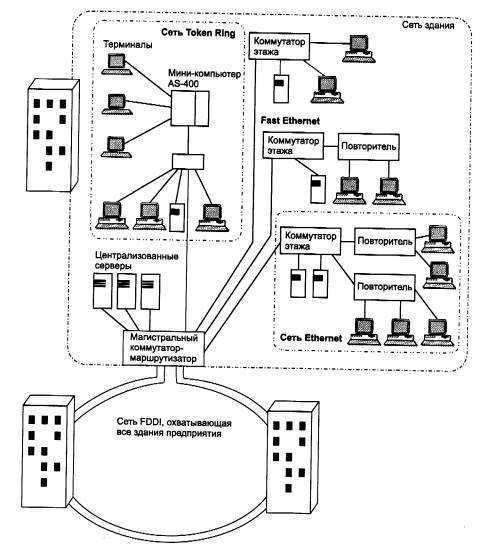

# 1.5.2 Сети кампусов

*Сети кампусов* получили свое название от английского слова campus - студенческий городок. Именно на территории университетских городков часто возникала необходимость объединения нескольких мелких сетей в одну большую сеть. Сейчас это название не связывают со студенческими городками, а используют для обозначения сетей любых предприятий и организаций. 

Главными особенностями сетей кампусов являются следующие (рис. 1.27). Сети этого типа объединяют множество сетей различных отделов одного предприятия в пределах отдельного здания или в пределах одной территории, покрывающей площадь в несколько квадратных километров. При этом глобальные соединения в сетях кампусов не используются. Службы такой сети включают взаимодействие между сетями отделов, доступ к общим базам данных предприятия, доступ к общим факс-серверам, высокоскоростным модемам и высокоскоростным принтерам. В результате сотрудники каждого отдела предприятия получают доступ к некоторьм файлам и ресурсам сетей других отделов. Важной службой, предоставляемой сетями кампусов, стал доступ к корпоративным базам данных независимо от того, на каких типах компьютеров они располагаются. 

**Рис. 1.27.**Пример сети кампуса  

Именно на уровне сети кампуса возникают проблемы интеграции неоднородного аппаратного и программного обеспечения. Типы компьютеров, сетевых операционных систем, сетевого аппаратного обеспечения могут отличаться в каждом отделе. Отсюда вытекают сложности управления сетями кампусов. Администраторы должны быть в этом случае более квалифицированными, а средства оперативного управления сетью - более совершенными. 
