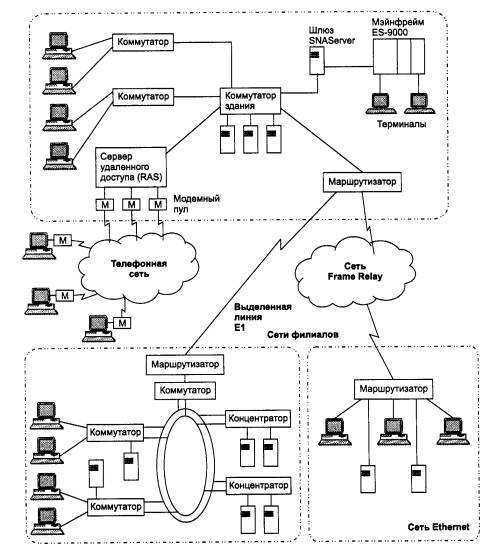

# 1.5.3 Корпоративные сети

*Корпоративные сети* называют также сетями масштаба предприятия, что соответствует дословному переводу термина «enterprise-wide networks», используемого в англоязычной литературе для обозначения этого типа сетей. Сети масштаба предприятия (корпоративные сети) объединяют большое количество компьютеров на всех территориях отдельного предприятия. Они могут быть сложно связаны и покрывать город, регион или даже континент. Число пользователей и компьютеров может измеряться тысячами, а число серверов - сотнями, расстояния между сетями отдельных территорий могут оказаться такими, что становится необходимым использование глобальных связей (рис. 1.28). Для соединения удаленных локальных сетей и отдельных компьютеров в корпоративной сети применяются разнообразные телекоммуникационные средства, в том числе телефонные каналы, радиоканалы, спутниковая связь. Корпоративную сеть можно представить в виде «островков локальных сетей», плавающих в телекоммуникационной среде. 

**Рис. 1.28.** Пример корпоративной сети 

Непременным атрибутом такой сложной и крупномасштабной сети является высокая степень гетерогенности - нельзя удовлетворить потребности тысяч пользователей с помощью однотипных программных и аппаратных средств. В корпоративной сети обязательно будут использоваться различные типы компьютеров - от мэйнфреймов до персоналок, несколько типов операционных систем и множество различных приложений. 

Неоднородные части корпоративной сети должны работать как единое целое, предоставляя пользователям по возможности прозрачный доступ ко всем необходимым ресурсам. 

Появление корпоративных сетей - это хорошая иллюстрация известного философского постулата о переходе количества в качество. При объединении отдельных сетей крупного предприятия, имеющего филиалы в разных городах и даже странах, в единую сеть многие количественные характеристики объединенной сети превосходят некоторый критический порог, за которым начинается новое качество. В этих условиях существующие методы и подходы к решению традиционных задач сетей меньших масштабов для корпоративных сетей оказались непригодными. На первый план вышли такие задачи и проблемы, которые в сетях рабочих групп, отделов и даже кампусов либо имели второстепенное значение, либо вообще не проявлялись. Примером может служить простейшая (для небольших сетей) задача - ведение учетных данных о пользователях сети. 

Наиболее простой способ ее решения - помещение учетных данных каждого пользователя в локальную базу учетных данных каждого компьютера, к ресурсам которого пользователь должен иметь доступ. При попытке доступа эти данные извлекаются из локальной учетной базы и на их основе доступ предоставляется или не предоставляется. Для небольшой сети, состоящей из 5-10 компьютеров и примерно такого же количества пользователей, такой способ работает очень хорошо. Но если в сети насчитывается несколько тысяч пользователей, каждому из которых нужен доступ к нескольким десяткам серверов, то, очевидно, это решение становится крайне неэффективным. Администратор должен повторить несколько десятков раз операцию занесения учетных данных пользователя. Сам пользователь также вынужден повторять процедуру логического входа каждый раз, когда ему нужен доступ к ресурсам нового сервера. Хорошее решение этой проблемы для крупной сети - использование централизованной справочной службы, в базе данной которой хранятся учетные записи всех пользователей сети. Администратор один раз выполняет операцию занесения данных пользователя в эту базу, а пользователь один раз выполняет процедуру логического входа, причем не в отдельный сервер, а в сеть целиком. 

При переходе от более простого типа сетей к более сложному - от сетей отдела к корпоративной сети - сеть должна быть все более надежной и отказоустойчивой, при этом требования к ее производительности также существенно возрастают. По мере увеличения масштабов сети увеличиваются и ее функциональные возможности. По сети циркулирует все возрастающее количество данных, и сеть должна обеспечивать их безопасность и защищенность наряду с доступностью. Соединения, обеспечивающие взаимодействие, должны быть более прозрачными. При каждом переходе на следующий уровень сложности компьютерное оборудование сети становится все более разнообразным, а географические расстояния увеличиваются, делая достижение целей более сложным; более проблемным и дорогостоящим становится управление такими соединениями. 
