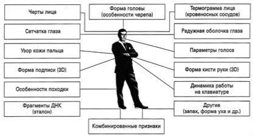
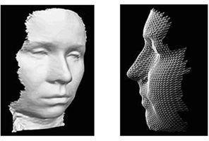
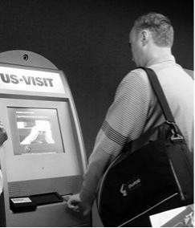

# 3.1 От чего надо защищаться в первую очередь

**Средства защиты**

Во-первых, это вирусы (Virus, Worm) и всевозможные виды практически

бесполезной информации (обычно рекламы), принудительно рассылаемой абонентам электронной почты (Spam). По различным данным в 2013 году вирусным атакам было подвержено от 80 до 85 процентов компаний во всем мире. И эта цифра продолжает расти.

Далее следует назвать вредоносные программы типа "троянский конь" (Trojan Horse), которые могут быть незаметно для владельца установлены на его компьютер и также незаметно функционировать на нем. Простые варианты "троянского коня" выполняют какую-либо одну функцию — например, кражу паролей, но есть и более

"продвинутые" экземпляры, которые реализуют широкий спектр функций для удаленного управления компьютером, включая просмотр содержимого каталогов, перехват всех вводимых с клавиатуры команд, кражу или искажение данных и информации, изменение файлов и содержания полей баз данных.

Другим распространенным типом атак являются действия, направленные на выведение из строя того или иного узла сети. Эти атаки получили название "отказ в обслуживании" (Denial of Service — DoS), и на сегодняшний день известно более сотни различных вариантов этих действий. Выше отмечалось, что выведение из строя узла сети на несколько часов может привести к очень серьезным последствиям. Например,

выведение из строя сервера платежной системы банка приведет к невозможности осуществления платежей и, как следствие, к большим прямым и косвенным финансовым и рейтинговым потерям.

Атаки и угрозы такого типа являются наиболее частыми, однако существуют и другие угрозы, которые могут привести к серьезным последствиям. Например, система

обнаружения атак RealSecure обнаруживает более 1000 различных событий, влияющих на безопасность и относящихся к внешним атакам. Американская организация US-CERT (<http://www.vnunet.com/vnunet/news/2143314/security-industry-gathers>), занимающаяся проблемами в области компьютерной безопасности, предложила использовать

стандартные названия для интернет-червей и других вредоносных программ. Члены US- CERT назвали свою программу "Общая классификация вредоносных программ" (CME). Цель программы — не вводить пользователей в заблуждение, используя разные названия для одних и тех же вирусов. Например, червь W32.Zotob.E по классификации Symantec в классификации McAfee называется W32/IRCbot.worm!MS05-039, а Trend Micro называет эту программу WORM\_RBOT.CBQ.

Сейчас многие вирусы получают свои названия на основании описания или информации, включенной в код программы их создателями. В новой системе вирусы будут использовать номера CME. Первый вирус получит название CME-1.

Подобная система классификации уже существует для описания уязвимостей в программном обеспечении. Общий идентификатор уязвимостей включает себя порядковый номер и год, в котором уязвимость была выявлена. В идентификатор вирусов не включат дату, потому что пользователи часто неправильно воспринимают эту

информацию. Они считают, что уязвимость с ранней датой менее опасна, чем уязвимость, выявленная позже.

Инициаторы предложения о CME допускают использование и старых вирусных имен, но надеются, что их система улучшит обмен информацией между антивирусными разработчиками и антивирусным сообществом в целом. Проект уже поддержали Computer Associates, McAfee, Microsoft, Symantec и F-Secure.
#
# **Как надо защищаться?**

Общие методики защиты от вирусов в обязательном порядке являются обязательной составной частью политики информационной безопасности предприятия. В соответствующих разделах политики следует обязательно прописывать принципы антивирусной защиты, применяемые стандарты и нормативные документы,

определяющие порядок действий пользователя при работе в локальной и внешних сетях, его полномочия, применяемые антивирусные средства. Наборы обязательных правил могут быть достаточно разнообразны, однако можно сформулировать в общем виде следующие правила для пользователей:

- проверять на вирусы все диски CD-RW, ZIP-диски, побывавшие на другом компьютере, все приобретенные не в фирменных магазинах CD и флешки;
- использовать антивирусные программы известных проверенных фирм, регулярно (в идеале — ежедневно) обновлять их базы;
- не выгружать резидентную часть (монитор) антивирусной программы из оперативной памяти компьютера;
- использовать только программы и данные, полученные из надежных источников — чаще всего вирусами бывают заражены пиратские копии программ;
- никогда не открывать файлы, прикрепленные к электронным письмам, пришедшим от неизвестных отправителей, и не заходить на сайты, рекламируемые через спам-рассылки (по данным Лаборатории Касперского, в настоящее время около 90% вирусов распространяются именно таким образом).

Аналогично можно сформулировать несколько общих требований к хорошей антивирусной программе. Такая программа должна:

- обеспечивать эффективную защиту в режиме реального времени — резидентная часть (монитор) программы должна постоянно находиться в оперативной памяти компьютера и производить проверку всех файловых операций (при создании, редактировании, копировании файлов, запуске их на исполнение), сообщений электронной почты, данных и программ, получаемых из Internet;
- позволять проверять все содержимое локальных дисков "по требованию", запуская проверку вручную или автоматически по расписанию или привключении компьютера;
- защищать компьютер даже от неизвестных вирусов — программа должна включать в себя технологии поиска неизвестных вирусов, основанные на принципах эвристического анализа;
- уметь проверять и лечить архивированные файлы;
- давать возможность регулярно (желательно ежедневно) обновлять антивирусные базы (через Internet, с дискет или CD).

Антивирусное программное обеспечение активно разрабатывается во многих странах. Так например, ученые из Национальной лаборатории Sandia (Sandia Corporation) в Ливерморе, Калифорния, запустили более миллиона ядер (kernel) операционной системы Linux в виртуальной среде.

Эксперимент должен помочь в исследовании поведения ботнетов — сетей из миллионов зараженных вредоносным программным обеспечением компьютеров, используемых для разнообразных атак, например, спам-рассылок или DDoS-атак

(Distributed Denial of Service). Один из участников проекта Рон Минник (Ron Minnich) объясняет, что реальные сети трудно поддаются анализу из-за географического распределения входящих в них узлов по всему миру. Однако, используя технологию виртуальных машин на суперкомпьютерном кластере Thunderbird, команде ученых удалось запустить виртуальную систему, сравнимую по масштабам с современными ботнетами. Минник с коллегами рассчитывают, что этот исследовательский проект поможет не только понять принципы работы вредоносных сетей, составленных из множества ПК, но попытаться разработать методики их обезвреживания.

В настоящее время в России используются главным образом два проверенных качественных антивирусных пакета: Dr.WEB и "Антивирус Касперского". Каждая из этих продуктов имеет свою линейку, ориентированную на разные сферы применения — для использования на локальных компьютерах, для малого и среднего бизнеса, для крупных корпоративных клиентов, для защиты локальных сетей, для почтовых, файловых серверов, серверов приложений. Оба продукта, безусловно, отвечают всем вышеперечисленным требованиям. Материалы по этим пакетам можно найти на сайтах указанных компаний.

# **Современные средства биометрической идентификации**

В настоящее время всё наряду с указанными выше средствами защиты информации в системах и сетях шире применяются биометрические системы безопасности. По данным аналитической компании Frost&Sullivan, общий объем продаж биометрического

оборудования в Америке в 2000 году не превысил 86,8 млн. долларов, вырос в 2001 году до 160,3 млн. долларов и превысил в 2012 году 9 миллиардов долларов. В настоящее время рынок таких устройств перевалил за десятки миллиардов долларов в год.

Биометрические технологии идентификации имеют ряд преимуществ перед традиционными средствами. Под биометрией понимают методы автоматической

идентификации человека и подтверждения личности, основанные на физиологических или поведенческих характеристиках.

Наиболее часто применяются три основных биометрических метода — это распознавание человека по отпечаткам пальцев, по радужной оболочке глаза и по изображению лица. По информации консалтинговой компании International Biometric Group из Нью-Йорка, наиболее распространенной технологией стало сканирование отпечатков пальцев.

Отмечается, что из 127 млн. долларов, вырученных от продажи биометрических устройств, 44% приходится на дактилоскопические сканеры. Системы распознавания черт лица занимают второе место по уровню спроса, который составляет 14%, далее следуют устройства распознавания по форме ладони (13%), по голосу (10%) и радужной оболочке глаза (8%). Устройства верификации подписи в этом списке составляют 2%.

**Рис.** Система биометрических параметров для идентификации личности

Преимущества биометрических систем безопасности очевидны. Уникальные человеческие качества хороши тем, что их трудно подделать, трудно оставить фальшивый отпечаток пальца при помощи своего собственного или сделать радужную оболочку своего глаза похожей на чью-то другую.

В отличие от бумажных идентификаторов (паспорт, водительское удостоверение или иное удостоверение личности), от пароля или персонального идентификационного номера (ПИН), биометрические характеристики невозможно забыть или потерять. Кроме того, в силу своей уникальности они используются для предотвращения воровства или мошенничества.

Методы распознавания по изображению лица могут работать с двухмерным или с трехмерным изображением (так называемые 2D- и 3D-фото). Стоит отметить, что

идентификация человека по чертам лица — одно из самых динамично развивающихся направлений в биометрической индустрии. Привлекательность данного метода основана на том, что он наиболее близок к тому, как люди обычно идентифицируют друг друга.

Распространение мультимедийных технологий, благодаря которому все чаще можно встретить видеокамеры, установленные на городских улицах и площадях, на вокзалах, в аэропортах и других местах скопления людей, определило развитие этого направления.

Распознавание лица предусматривает выполнение любой из следующих функций: аутентификация (установление подлинности "один в один") или идентификация (поиск соответствия "один из многих"). Система автоматически оценивает качество изображения для опознания лица и, если необходимо, способна его улучшить. Она также создает изображение лица из сегментов данных, генерирует цифровой код или внутренний

шаблон, уникальный для каждого индивидуума.

**Рис.** Трёхмерное изображение лица в системе идентификации человека

Трехмерная фотография — новейшая биометрическая технология, созданная отечественными разработчиками около пяти лет назад. Трехмерное фото, занимая всего 5 Кбайт, может быть записано в биометрический паспорт; оно увеличивает точность

идентификации личности и повышает надежность автоматической сверки документов. Эксперты отмечают, что уровень распознавания трехмерной фотографии составляет более 90%, тогда как у двухмерного изображения этот показатель редко превышает 50%.

Биометрические технологии призваны обеспечить повышение надежности и

эффективности сверки документов, предназначены для электронного документирования (логирования) всех сверок, а также для эффективной и надежной идентификации личности человека в широком спектре ситуаций.

**Рис.** Один из авторов книги (В.И.Кияев) проходит биометрический контроль в аэропорту Сан-Франциско

При решении этой задачи возможны два сценария: двойная или тройная

верификация. Двойная верификация подразумевает сверку биометрического шаблона, записанного в электронном паспорте или визе, с биометрическими характеристиками проверяемого субъекта.

Тройная верификация, в свою очередь, предполагает дополнительную сверку двух указанных характеристик с шаблоном, хранящимся в общегосударственном регистре

биометрических данных. При этом сценарии любая попытка подделки документа становится бессмысленной, поскольку тройная верификация выявит несоответствие с шаблоном, записанным в государственный регистр при выдаче документа.

Еще одна задача, связанная в основном с выдачей паспорта или визы, заключается в проверке того факта, что аналогичный документ не выдавался ранее гражданину с теми же биометрическими данными, но проходившему под другим именем, а также в сверке

биометрических данных гражданина с базами данных оперативных и специальных служб. И в том и в другом случае решение задачи предполагает использование биометрических методов в режиме идентификации, при этом размер баз данных может быть очень

большим.

Для решения первой задачи (двойной и тройной верификации) допускается использовать любой из трех методов (по фотографии лица, по отпечаткам пальцев или радужной оболочке), которые дают приемлемую точность. Для решения второй задачи (идентификации гражданина по большой базе данных) необходимы комбинированные методы.

По мнению экспертов, наиболее обоснованное решение при внедрении

биометрических методов — это первичный сбор и занесение в единый государственный регистр, а также в электронные идентификационные документы как дактилоскопической информации (с двух пальцев), так и двух изображений лица (двухмерного и трехмерного). При этом для решения задачи верификации, подразумевающей сверку документов при пересечении гражданами границ, достаточно комбинированного (2D + 3D) метода распознавания лица. Этот бесконтактный метод обеспечивает максимальную измеряемость биометрической характеристики (иными словами, максимальную скорость верификации и прохода), следовательно, он не замедлит, а ускорит прохождение

пассажиропотока через точки контроля.

Точность 3D- и тем более комбинированного метода высока и отвечает всем требованиям в режиме верификации, а также в режиме идентификации с не очень

большими (до 10 тыс. человек) оперативными базами данных (пример - список лиц, объявленных в розыск). Кроме того, использование обычной двухмерной фотографии — во-первых, общепринятая практика, во-вторых, позволяет оператору принять окончательное решение или провести визуальное сравнение с несколькими наиболее похожими индивидуумами из базы данных. Благодаря этому можно увеличить размер

базы данных для оперативной идентификации до нескольких сотен тысяч человек.

Использование дактилоскопической информации предполагается только в момент проверки личности, до выдачи документа, а также при необходимости задержания

гражданина и предъявлении обвинений. Это позволяет повысить уровень защиты данных, ограничив круг лиц, имеющих право доступа к записанной в паспорте

дактилоскопической информации, только сотрудниками соответствующих правоохранительных служб.

В июле 2005 году Федеральное агентство по техническому регулированию и метрологии РФ направило в Международный подкомитет по стандартизации в области биометрии при ISO официальное предложение, касающееся изменения международного стандарта в области биометрии. Суть предлагаемой поправки заключается во включении

трехмерного цифрового изображения лица, наряду с обычной двухмерной фотографией, в формат данных, предназначаемый для хранения, обмена и использования при автоматическом распознавании личности. После утверждения проекта, под цифровым изображением лица будут понимать формат данных, включающий как обычную

двухмерную, так и трехмерную фотографию. Немного ранее, в феврале 2005 года, по инициативе компании A4Vision, поддержанной, в частности, Oracle, Motorola, Unisys, Logitech, аналогичная поправка к национальному стандарту была одобрена в США.

Заметим, что компания A4Vision ([http://www.a4vision.com](http://www.a4vision.com/)), основанная нашими соотечественниками, первой разработала технологию трехмерного распознавания лиц и, выйдя на рынок США, инициировала процедуру изменения американского стандарта.
