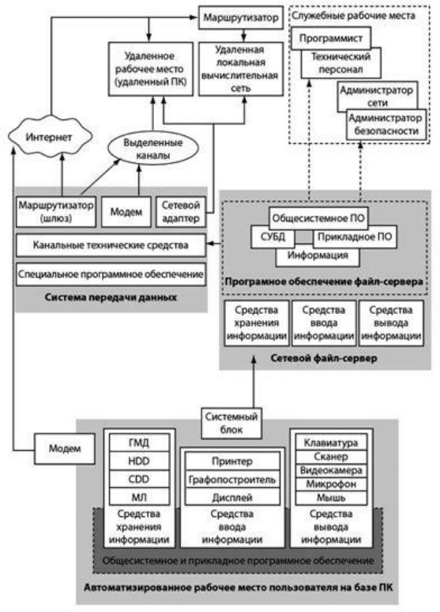
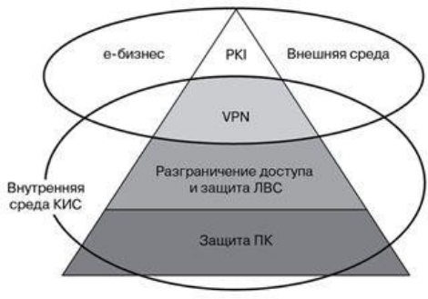

# 3.2 Технологии и инструменты обеспечения безопасности информации

**Технологи и инструменты обеспечения БИ**

*Средства защиты информации* для разных структур более многообразны, среди них можно выделить следующие средства:

- управления обновлениями программных компонент АСЗ;
- межсетевого экранирования;
- построения VPN;
- контроля доступа;
- обнаружения вторжений и аномалий;
- резервного копирования и архивирования;
- централизованного управления безопасностью;
- предотвращения вторжений на уровне серверов;
- аудита и мониторинга средств безопасности;
- контроля деятельности сотрудников в сети Интернет;
- анализа содержимого почтовых сообщений;
- анализа защищенности информационных систем;
- защиты от спама;
- защиты от атак класса "Отказ в обслуживании" (DoS-атаки);
- контроля целостности;
- инфраструктура открытых ключей;
- усиленной аутентификации и прочие.

На основании политики информационной безопасности и указанных средств защиты информации (СЗИ) разрабатываются конкретные процедуры защиты, включающие распределение ответственности за их выполнение. Процедуры безопасности также важны, как и политики безопасности. Если политики безопасности определяют

ЧТО должно быть защищено, то процедуры определяют КАК защитить информационные ресурсы компании и КТО конкретно должен разрабатывать, внедрять данные процедуры и контролировать их *исполнение*.

***Технологическая модель подсистемы информационной безопасности***

Современные распределенные корпорации, имеющие подразделения на разных        континентах, имеют сложную техническую, инженерную и информационную инфраструктуру. Создание информационной сети такой корпорации и её эффективная защита являются чрезвычайно сложной концептуальной и технологической задачей.

Первоначальное решение, характерное для последнего десятилетия прошлого века, использовать для формирования сети телефонные линии быстро привело к нагромождению коммуникаций и к невозможности эффективной защиты. Последующее создание и сопровождение собственных корпоративных сетей для обеспечения

информационного обмена данными на базе таких линий связи стало обходиться в миллионы долларов.

Быстрое развитие технологий Internet, образование, рост и развитие "всемирной паутины" позволили создать достаточно дешевые и надежные коммуникации. Однако техническая надежность связи вовсе не означала безопасности корпоративных сетей, имеющих выходы в Интернет. Общие принципы построения Интернет и его использование как общедоступной сети с публичными сервисами привели к тому, что стало очень трудно обеспечить надежную защиту от проникновения в корпоративные и государственные

сети, построенные на базе протоколов TCP/IP и Internet -приложений — Web, FTP, e-mail и т.д.

Целевое назначение любой корпоративной информационной системы (КИС) состоит в обеспечении пользователей необходимой информацией в режиме "On Line" и адекватном информационном сопровождении деятельности предприятия.

Базисом КИС является общесистемное программное обеспечение, которое включает операционную систему и программные оболочки, программы общего и прикладного назначения: автоматизированные рабочие места (АРМ) и Web-сервисы общего и специального назначения, СУБД и управление интегрированными вычислительными и мультимедийными приложениями, а также доступом в локальные и внешние сети.

**Рис.** Схема корпоративной информационной системы, включающей локальные сети и выход в Internet

Физически нижний уровень КИС базируется на серверах, рабочих станциях, персональных компьютерах различного назначения и коммуникационных устройствах, а также на программном обеспечении, реализующем работу перечисленных устройств. 

В связи с этим подсистема ИБ начинается с защиты именно этого программно-аппаратного оборудования. С этой целью можно использовать известные защитные средства операционных систем, антивирусные пакеты, средства и устройства аутентификации пользователя, средства криптографической защиты паролей и данных прикладного уровня. Все эти средства образуют базу для реализации первого уровня технологической модели подсистемы ИБ.

**Рис.** Четырехуровневая технологическая модель подсистемы информационной безопасности

Второй физический уровень КИС — рабочие станции, серверы и персональные компьютеры объединятся в локальные сети, которые организуют внутреннее Intranet- пространство предприятия и могут быть иметь выходы во внешнее Internet-пространство. В этом случае речь идет о средствах информационной защиты (СЗИ) второго уровня — уровня защиты локальных сетей, который обычно включает:

- средства безопасности сетевых ОС;
- средства аутентификации пользователей (User Authentication Facilities — UAF);
- средства физического и программного разграничения доступа к распределенным и разделяемым информационным ресурсам;
- средства защиты домена локальной сети (Local Area Network Domain — LAND);
- средства промежуточного доступа (Proxy Server) и межсетевые экраны (Firewall);
- средства организации виртуальных локальных подсетей (Virtual Local Area Network — VLAN);
- средства обнаружения атаки и уязвимостей в системе защиты локальных сетей.

Следующий уровень реализации корпоративной информационной системы КИС — объединение нескольких локальных сетей географически распределенного предприятия в общую корпоративную Intranet-сеть через открытую сеть на базе современных технологий поддержки и сопровождения таких сетей (Quality of Service — QoS) с использованием открытой среды Internet в качестве коммутационной среды.

В этом случае на третьем уровне защиты КИС используются технологии защищенных виртуальных сетей (Virtual Private Networks — VPN). VPN-технологии часто интегрируются со средствами первого и второго уровней. Такой защищенный VPN-канал

` `может простираться не только до маршрутизаторов доступа и пограничных Fairwall'лов, но и до серверов и рабочих станций локальной сети.

Четвертый уровень защиты КИС — организация защищенного межкорпоративного обмена в среде электронного бизнеса (eBusiness). Методологической и технологической основой такой защиты являются методы и технологии управления публичными ключами и сертификатами криптографической защиты (Public Key Infrastructure — PKI). Суть этих технологий состоит в реализации двух глобальных функций: генерации и корректном распространении ключей и сертификатов, и отслеживании их жизненного цикла. 

Базой для  реализации средств защиты будут электронная цифровая подпись (Electronic Digital Signature — EDS) и VPN-технологии.

Отметим, что два нижних уровня защиты являются достаточно традиционными, так как они предназначены для обеспечения безопасности конкретной физически реализованной КИС. 

Верхние два уровня относятся к обеспечению безопасности передачи данных и электронного бизнеса, который осуществляется уже не в физическом, а в виртуальном пространстве, при этом VPN-технологии обеспечивают защищенный обмен данными в межкорпоративном пространстве, а PKI-технологии обеспечивают VPN- устройства ключами и сертификатами. В настоящее время на рынке имеется достаточное число технических и программных решений для защиты данных, информации, систем и сетей. Ниже рассмотрены некоторые базовые технологии на примере криптографической защиты данных, технологий межсетевых экранов, защищенных VPN-каналов связи, антивирусных и биометрических методов.

***Технологии криптографической защиты информации***

Криптография - это совокупность технических, математических, алгоритмических и программных методов преобразования данных (шифрование данных), которая делает их бесполезными для любого пользователя, у которого нет ключа для расшифровки.

Криптографические преобразования обеспечивают решение следующих базовых задач        защиты - конфиденциальности (невозможности прочитать данные и извлечь полезную информацию) и целостности (невозможность модифицировать данные для изменения смысла или внесения ложной информации).

Технологии криптографии позволяют реализовать следующие процессы информационной защиты:

- идентификация (отождествление) объекта или субъекта сети или информационной системы;
- аутентификация (проверка подлинности) объекта или субъекта сети;
- контроль/разграничение доступа к ресурсам локальной сети или внесетевым сервисам;
- обеспечение и контроль целостности данных.

В соответствии с политиками безопасности используемые технологии криптографии и специализированное программно-аппаратное обеспечение для защиты

данных и документов, шифрования файлов и дисков реализуют следующие аспекты информационной защиты:

- шифруемые электронные письма и соединения VPN скрывают передаваемые данные от вирусов и сканеров содержимого; шифрование дисков не должно затруднять автоматическое резервное сохранение данных или управление файлами;
- сетевой администратор может не иметь права доступа к защищаемым файлам, содержащим конфиденциальную информацию, если это вызвано производственной необходимостью;
- когда сотрудник покидает предприятие, у его работодателя должна быть возможность

доступа к зашифрованным данным, связанным с производственной деятельностью этого сотрудника;

- надежность шифрования и доступа должна быть обеспечена на длительное время;
- если при шифровании применяется метод открытого ключа, то помимо программного обеспечения необходимо построение инфраструктуры управления ключами или сертификатами;
- в случае попытки взлома системы или утечки секретной информации систему можно быстро перенастроить;
- широкое применение шифрования возможно лишь при условии простоты его обслуживания.

***Межсетевые экраны***

Межсетевой экран (брандмауэр, Firewall) — программно-аппаратная система

межсетевой защиты, которая отделяет одну часть сети от другой и реализует набор правил для прохождения данных из одной части в другую. 

Границей является раздел между локальной корпоративной сетью и внешними Internet-сетями или различными частями локальной распределенной сети. Экран фильтрует текущий трафик, пропуская одни пакеты информации и отсеивая другие.

Межсетевой экран (МЭ) является одним из основных компонентов защиты сетей. Наряду с Internet-протоколом межсетевого обмена (Internet Security Protocol — IPSec) МЭ является одним из важнейших средств защиты, осуществляя надежную аутентификацию пользователей и защиту от НСД. 

Отметим, что большая часть проблем с информационной   безопасностью сетей связана с "прародительской" зависимостью коммуникационных решений от ОС UNIX — особенности открытой платформы и среды программирования UNIX сказались на реализации протоколов обмена данными и политики информационной        безопасности. Вследствие этого ряд Internet-служб и совокупность сетевых протоколов (Transmission Control Protocol/Internet Protocol — TCP/IP) имеет "бреши" в защите.

К числу таких служб и протоколов относятся:

- служба сетевых имен (Domain Name Server — DNS);
- доступ к всемирной паутине WWW;
- программа электронной почты Send Mail;
- служба эмуляции удаленного терминала Telnet;
- простой протокол передачи электронной почты (Simple Mail Transfer Protocol — SMTP);
- протокол передачи файлов (File Transfer Protocol);
- графическая оконная система X Windows.

Настройки межсетевого экрана - МЭ, т.е. решение пропускать или отсеивать пакеты информации, зависят от топологии распределенной сети и принятой политики информационной безопасности. В связи с этим политика реализации межсетевых экранов определяет правила доступа к ресурсам внутренней сети. 

Эти правила базируются на двух общих  принципах — запрещать всё, что не разрешено в явной форме, и разрешать всё, что не запрещено в явной форме. Использование первого принципа дает меньше возможностей пользователям и охватывает жёстко очерченную область сетевого взаимодействия.

Политика, основанная на втором принципе, является более мягкой, но во многих случаях она менее желательна, так как она предоставляет пользователям больше возможностей "обойти" МЭ и использовать запрещенные сервисы через нестандартные порты (User Data Protocol — UDP), которые не запрещены политикой безопасности.

Функциональные возможности МЭ охватывают следующие разделы реализации информационной безопасности:

- настройку правил фильтрации;
- администрирование доступа во внутренние сети;
- фильтрацию на сетевом уровне;
- фильтрацию на прикладном уровне;
- средства сетевой аутентификации;
- ведение журналов и учет.

Программно-аппаратные компоненты МЭ можно отнести к одной из трёх категорий: фильтрующие маршрутизаторы, шлюзы сеансового уровня и шлюзы уровня приложений. Эти компоненты МЭ — каждый отдельно и в различных комбинациях — отражают базовые возможности МЭ и отличают их один от другого.

Фильтрующий маршрутизатор (Filter Router — FR) фильтрует IP-пакеты по параметрам полей заголовка пакета: IP-адрес отправителя, IP-адрес адресата, TCP/UDP- порт отправителя и TCP/UDP-порт адресата. Фильтрация направлена на безусловное

блокирование соединений с определенными хостами и/или портами — в этом случае реализуется политика первого типа.

Формирование правил фильтрации является достаточно сложным делом, к тому же обычно отсутствуют стандартизированные средства тестирования правил и корректности их исполнения. Возможности FR по реализации эффективной защиты ограничены, так как на сетевом уровне эталонной модели OSI обычно он проверяет только IP-заголовки пакетов. К достоинствам применения FR можно отнести невысокую стоимость, гибкость формирования правил, незначительную задержку при передаче пакетов. 

Недостатки FR достаточно серьезны, о них следует сказать более подробно:

- отсутствует аутентификация конкретного пользователя;
- указанную выше аутентификацию по IP-адресу можно "обойти" путем замещения

информации пользователя информацией злоумышленника, использующего нужный IP- адрес;

- внутренняя сеть "видна" из внешней сети;
- правила фильтрации сложны в описании и верификации, они требуют высокой квалификации администратора и хорошего знания протоколов TCP/UDP;
- нарушение работы ФМ приводит к полной незащищенности всех компьютеров, которые находятся за этим МЭ.

***Антивирусная защита***

Формы организации вирусных атак весьма разнообразны, но в целом практически их можно "разбросать" по следующим категориям:

- удаленное проникновение в компьютер — программы, которые получают неавторизованный доступ к другому компьютеру через Internet (или локальную сеть);
- локальное проникновение в компьютер — программы, которые получают неавторизованный доступ к компьютеру, на котором они впоследствии работают;
- удаленное блокирование компьютера — программы, которые через Internet (или сеть) блокируют работу всего удаленного компьютера или отдельной программы на нем;
- локальное блокирование компьютера — программы, которые блокируют работу компьютера, на котором они работают;
- сетевые сканеры — программы, которые осуществляют сбор информации о сети, чтобы определить, какие из компьютеров и программ, работающих на них, потенциально уязвимы к атакам;
- сканеры уязвимых мест программ — программы, проверяют большие группы компьютеров в Интернет в поисках компьютеров, уязвимых к тому или иному конкретному виду атаки;
- "вскрыватели" паролей — программы, которые обнаруживают легко угадываемые пароли в зашифрованных файлах паролей;
- сетевые анализаторы (sniffers) — программы, которые слушают сетевой трафик; часто в них имеются возможности автоматического выделения имен пользователей, паролей и номеров кредитных карт из трафика;
- модификация передаваемых данных или подмена информации;
- подмена доверенного объекта распределённой вычислительной сети (работа от его имени) или ложный объект распределённой ВС (РВС).
- "социальная инженерия" — несанкционированный доступ к информации иначе, чем взлом программного обеспечения. Цель — ввести в заблуждение сотрудников (сетевых или системных администраторов, пользователей, менеджеров) для получения паролей к системе или иной информации, которая поможет нарушить безопасность системы.

К вредоносному программному обеспечению относятся сетевые черви, классические файловые вирусы, троянские программы, хакерские утилиты и прочие программы, наносящие заведомый вред компьютеру, на котором они запускаются на выполнение, или другим компьютерам в сети.

***Сетевые черви***

Основным признаком, по которому типы червей различаются между собой, является способ распространения червя — каким способом он передает свою копию на удаленные компьютеры. Другими признаками различия КЧ между собой являются способы запуска копии червя на заражаемом компьютере, методы внедрения в систему, а также полиморфизм, "стелс" и прочие характеристики, присущие и другим типам вредоносного программного обеспечения (вирусам и троянским программам).

Пример — E-mail-Worm — почтовые черви. К данной категории червей относятся те из них, которые для своего распространения используют электронную почту. При этом червь отсылает либо свою копию в виде вложения в электронное письмо, либо ссылку на свойфайл, расположенный на каком-либо сетевом ресурсе (например, URL на зараженный файл, расположенный на взломанном или хакерском веб-сайте). В первом случае код червя активизируется при открытии (запуске) зараженного вложения, во втором — при открытии ссылки на зараженный файл. В обоих случаях эффект одинаков — активизируется код червя.

Для отправки зараженных сообщений почтовые черви используют различные способы. Наиболее распространены:

- прямое подключение к SMTP-серверу, используя встроенную в код червя почтовую библиотеку;
- использование сервисов MS Outlook;
- использование функций Windows MAPI.

Различные методы используются почтовыми червями для поиска почтовых адресов, на которые будут рассылаться зараженные письма. Почтовые черви:

- рассылают себя по всем адресам, обнаруженным в адресной книге MS Outlook;
- считывает адреса из адресной базы WAB;
- сканируют "подходящие" файлы на диске и выделяет в них строки, являющиеся адресами электронной почты;
- отсылают себя по всем адресам, обнаруженным в письмах в почтовом ящике (при этом некоторые почтовые черви "отвечают" на обнаруженные в ящике письма).

Многие черви используют сразу несколько из перечисленных методов.

Встречаются также и другие способы поиска адресов электронной почты. Другие виды червей: IM-Worm — черви, использующие Internet-пейджеры, IRC-Worm — черви в IRC- каналах, Net-Worm — прочие сетевые черви.

***Классические компьютерные вирусы***

К данной категории относятся программы, распространяющие свои копии по ресурсам локального компьютера с целью: последующего запуска своего кода при каких- либо действиях пользователя или дальнейшего внедрения в другие ресурсы компьютера.

В отличие от червей, вирусы не используют сетевых сервисов для проникновения на другие компьютеры. Копия вируса попадает на удалённые компьютеры только в том случае, если зараженный объект по каким-либо не зависящим от функционала вируса причинам оказывается активизированным на другом компьютере, например:

- при заражении доступных дисков вирус проник в файлы, расположенные на сетевом ресурсе;
- вирус скопировал себя на съёмный носитель или заразил файлы на нем;
- пользователь отослал электронное письмо с зараженным вложением.

Некоторые вирусы содержат в себе свойства других разновидностей вредоносного программного обеспечения, например, бэкдор-процедуру или троянскую компоненту уничтожения информации на диске.

Многие табличные и графические редакторы, системы проектирования, текстовые процессоры имеют свои макроязыки (макросы) для автоматизации выполнения повторяющихся действий. Эти макроязыки часто имеют сложную структуру и развитый набор команд. Макро-вирусы являются программами на макроязыках, встроенных в такие системы обработки данных. Для своего размножения вирусы этого класса используют возможности макроязыков и при их помощи переносят себя из одного зараженного файла (документа или таблицы) в другие.

***Скрипт-вирусы***

Следует отметить также скрипт-вирусы, являющиеся подгруппой файловых вирусов. Данные вирусы, написаны на различных скрипт-языках (VBS, JS, BAT, PHP и т.д.). Они либо заражают другие скрипт-программы (командные и служебные файлы MS Windows или Linux), либо являются частями многокомпонентных вирусов. Также, данные вирусы могут заражать файлы других форматов (например, HTML), если в них возможно выполнение скриптов.

***Троянские программы***

В данную категорию входят программы, осуществляющие различные несанкционированные пользователем действия: сбор информации и её передачу злоумышленнику, ее разрушение или злонамеренную модификацию, нарушение работоспособности компьютера, использование ресурсов компьютера в неблаговидных целях. Отдельные категории троянских программ наносят ущерб удаленным компьютерам и сетям, не нарушая работоспособность зараженного компьютера (например, троянские программы, разработанные для массированных DoS-атак на удалённые ресурсы сети).

Троянские программы многообразны и различаются между собой по тем действиям, которые они производят на зараженном компьютере:

- Backdoor — троянские утилиты удаленного администрирования.
- Trojan-PSW — воровство паролей.
- Trojan-AOL — семейство троянских программ, "ворующих" коды доступа к сети AOL (America Online). Выделены в особую группу по причине своей многочисленности.
- Trojan-Clicker — Internet-кликеры. Семейство троянских программ, основная функция которых — организация несанкционированных обращений к Internet-ресурсам (обычно к Web-страницам). Достигается это либо посылкой соответствующих команд браузеру, либо заменой системных файлов, в которых указаны "стандартные" адреса Internet- ресурсов (например, файл hosts в MS Windows).
- Trojan-Downloader — доставка прочих вредоносных программ.
- Trojan-Dropper — инсталляторы прочих вредоносных программ. Троянские программы этого класса написаны в целях скрытной инсталляции других программ и практически всегда используются для "подсовывания" на компьютер-жертву вирусов или других троянских программ.
- Trojan-Proxy — троянские прокси-сервера. Семейство троянских программ, скрытно осуществляющих анонимный доступ к различным интернет-ресурсам. Обычно используются для рассылки спама.
- Trojan-Spy — шпионские программы. Данные троянцы осуществляют электронный шпионаж за пользователем зараженного компьютера: вводимая с клавиатуры

информация, снимки экрана, список активных приложений и действия пользователя с ними сохраняются в какой-либо файл на диске и периодически отправляются

злоумышленнику. Троянские программы этого типа часто используются для кражи  информации пользователей различных систем онлайновых платежей и банковских систем.

- Trojan — прочие троянские программы. В данной категории также присутствуют "многоцелевые" троянские программы, например, те из них, которые одновременно шпионят за пользователем и предоставляют proxy-сервис удаленному злоумышленнику.
- Trojan ArcBomb — "бомбы" в архивах. Представляют собой архивы, специально оформленные таким образом, чтобы вызывать нештатное поведение архиваторов при попытке разархивировать данные — зависание или существенное замедление работы компьютера или заполнение диска большим количеством "пустых" данных. Особенно опасны "архивные бомбы" для файловых и почтовых серверов, если на сервере используется какая-либо система автоматической обработки входящей информации — "архивная бомба" может просто остановить работу сервера.
- Trojan-Notifier — оповещение об успешной атаке. Троянцы данного типа предназначены для сообщения своему "хозяину" о зараженном компьютере. При этом на адрес "хозяина" отправляется информация о компьютере, например, IP-адрес компьютера, номер открытого порта, адрес электронной почты и т. п. Отсылка осуществляется различными способами: электронным письмом, специально оформленным обращением к веб- странице "хозяина", ICQ-сообщением. Данные троянские программы используются в многокомпонентных троянских наборах для извещения своего "хозяина" об успешной инсталляции троянских компонент в атакуемую систему.

***Хакерские утилиты и прочие вредоносные программы***

К данной категории относятся:

- утилиты автоматизации создания вирусов, червей и троянских программ (конструкторы);
- программные библиотеки, разработанные для создания вредоносного ПО;
- хакерские утилиты скрытия кода зараженных файлов от антивирусной проверки (шифровальщики файлов);
- "злые шутки", затрудняющие работу с компьютером;
- программы, сообщающие пользователю заведомо ложную информацию о своих действиях в системе;
- прочие программы, тем или иным способом намеренно наносящие прямой или косвенный ущерб конкретному или некоторым удалённым компьютерам.

К прочим вредоносным относятся разнообразные программы, которые не представляют угрозы непосредственно компьютеру, на котором исполняются, а разработаны для

создания других вирусов или троянских программ, организации DoS-атак на удаленные сервера, взлома других компьютеров и т. п.

К таким программам можно отнести известные:

- DoS, DdoS — сетевые атаки;
- Exploit, HackTool — взломщики удаленных компьютеров. Хакерские утилиты данного класса предназначены для проникновения в удаленные компьютеры с целью

дальнейшего управления ими (используя методы троянских программ типа "backdoor") или для внедрения во взломанную систему других вредоносных программ.

- Flooder — "замусоривание" сети. Данные хакерские утилиты используются для

"забивания мусором" (бесполезными сообщениями) каналов интернета — IRC-каналов, компьютерных пейджинговых сетей, электронной почты и т. д.

- Constructor — конструкторы вирусов и троянских программ. Конструкторы вирусов и троянских программ — это утилиты, предназначенные для изготовления новых компьютерных вирусов и "троянцев". Известны конструкторы вирусов для DOS,

Windows и макро-вирусов. Они позволяют генерировать исходные тексты вирусов, объектные модули, и/или непосредственно зараженные файлы.

- Nuker — фатальные сетевые атаки. Утилиты, отправляющие специально оформленные запросы на атакуемые компьютеры в сети, в результате чего атакуемая система прекращает работу. Используют уязвимости в программном обеспечении и операционных системах, в результате чего сетевой запрос специального вида вызывает критическую ошибку в атакуемом приложении.
- Bad-Joke, Hoax — злые шутки, введение пользователя в заблуждение. К ним относятся программы, которые не причиняют компьютеру какого-либо прямого вреда, однако выводят сообщения о том, что такой вред уже причинен, либо будет причинен при каких-либо условиях, либо предупреждают пользователя о несуществующей опасности.

К "злым шуткам" относятся, например, программы, которые "пугают" пользователя сообщениями о форматировании диска (хотя никакого форматирования на самом деле не происходит), детектируют вирусы в незараженных файлах, выводят странные вирусоподобные сообщения и т. д. — в зависимости от чувства юмора автора такой программы.

- FileCryptor, PolyCryptor — скрытие от антивирусных программ. Хакерские утилиты, использующиеся для шифрования других вредоносных программ с целью скрытия их содержимого от антивирусной проверки.
- PolyEngine — полиморфные генераторы. Полиморфные генераторы не являются вирусами в прямом смысле этого слова, поскольку в их алгоритм не закладываются функции размножения, т. е. открытия, закрытия и записи в файлы, чтения и записи секторов и т. д. Главной функцией подобного рода программ является шифрование тела вируса и генерация соответствующего расшифровщика.
- VirTool — утилиты, предназначенные для облегчения написания компьютерных вирусов и для их изучения в хакерских целях.
